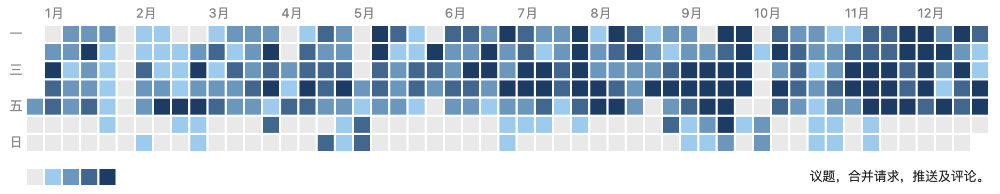
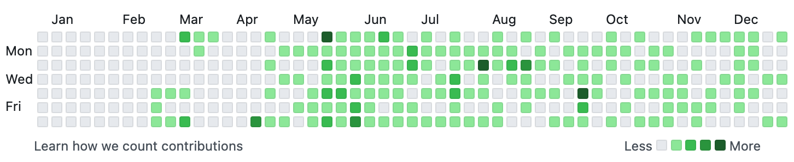
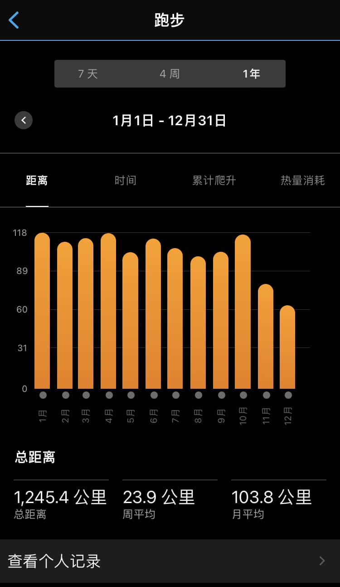
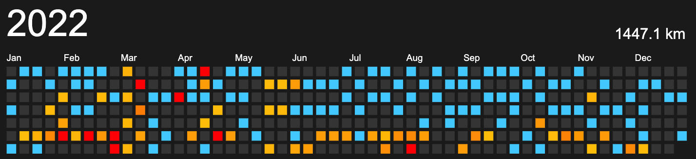
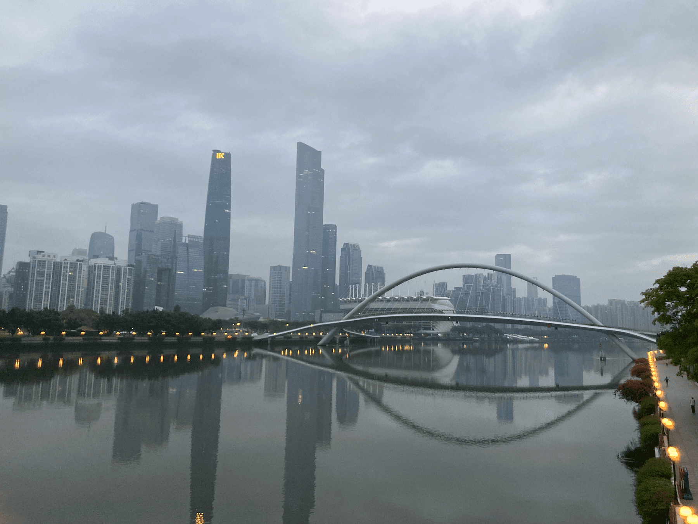
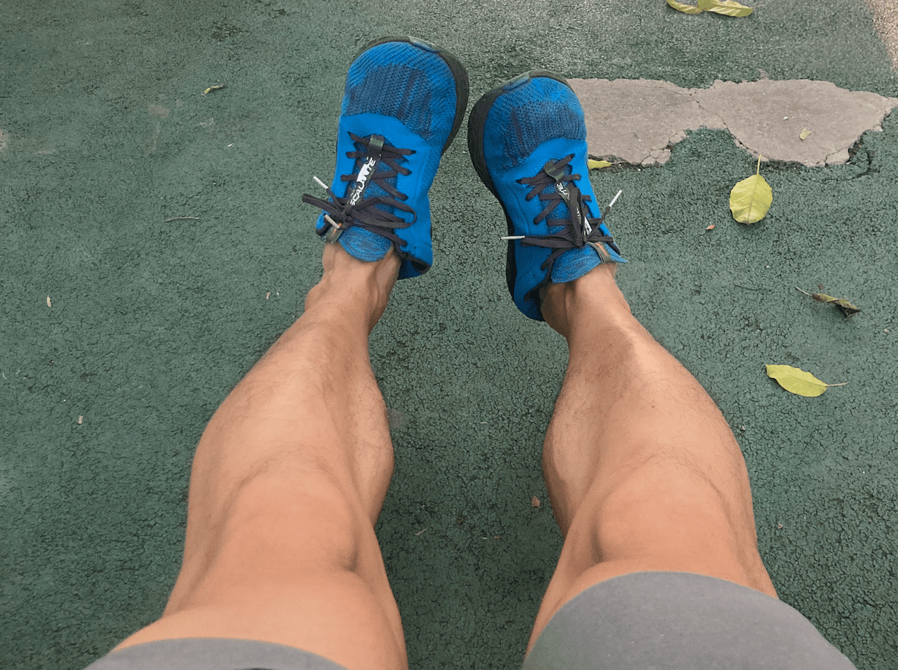
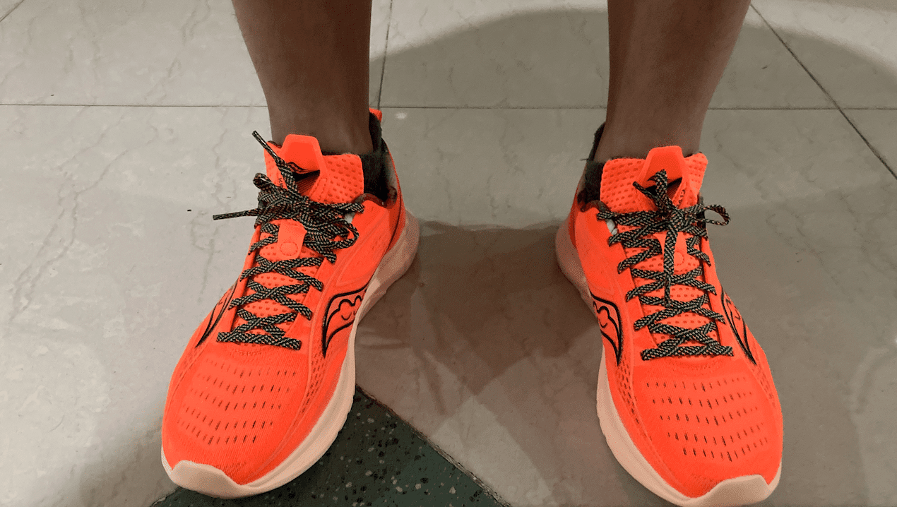
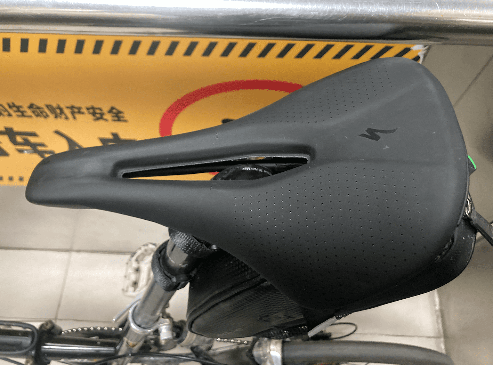
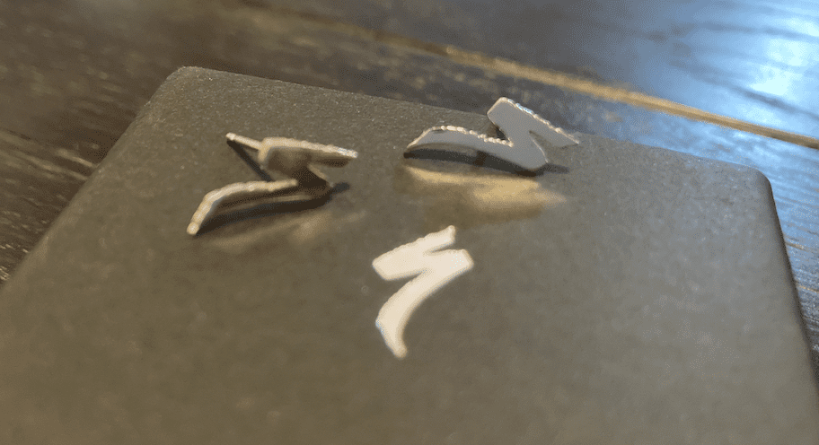

又到年底了，今年的总结写到博客里吧。

## 工作

除了日常需求、优化和支撑，今年还搞了：

1. GitOps改造及推广
2. 一个老的分布式DAG调度服务全面迁移到K8s，逐步推广摆脱虚拟机部署（任务实例执行部分）
3. Helm Chart发布改造
4. MDS(Modern Data Stack)探索与实践、推广
5. Quarkus传教

基本是一个现代化的过程吧。

其中 `MDS` 目前国内基本还没别的公司在用，我司用到的一些技术栈的Youtube可以关注下：

- [dbt](https://www.youtube.com/@dbt-labs)
- [Airbyte](https://www.youtube.com/@AirbyteHQ)，更新频率挺高
- [Dagster](https://www.youtube.com/@dagster7097)，质量不错
- [Cube.js](https://www.youtube.com/@cube8910/videos)

## 开源社区

今年参与了贡献的一些项目：

- [microsoft/api-guidelines](https://github.com/microsoft/api-guidelines)
- [quarkusio/cn.quarkus.io](https://github.com/quarkusio/cn.quarkus.io)
- [apache/skywalking-java](https://github.com/apache/skywalking-java)
- [quarkiverse/quarkus-openapi-generator](https://github.com/quarkiverse/quarkus-openapi-generator)
- [airbytehq/airbyte](https://github.com/airbytehq/airbyte)

总体来说比较水。

今年Vertx中文社区基本没怎么弄了，文档翻译更新不多也不怎么参与了，还是顺手打个广告吧： [Vert.x 中文站](https://vertx-china.github.io) 。

## 跑步

    

11、12月连100km都没守住，结合时代背景，原因很显然了：

- 11月初天天下雨没怎么跑，到月中开始广州（事实上）封城了，跑不了
- 12月阳了，且康复期也大幅减量了

不过平均下来每个月还是保住了100km。

锻炼身体多少也有些作用吧，阳了的时候除了第一天酸痛、第二三天鼻塞，基本没其他症状了，也没发烧过。

2022年跑了4次半马（或以上），路线基本还是那些，小区绕圈，天河公园，珠江沿岸（3桥、5桥）：

静息心率基本在 38-42左右徘徊。

跑鞋基本在用 `Altra Escalante 2.0`，到10月份基本损耗完了，里程1000km了，鞋底也磨得差不多了，就用回一段时间老 `Vibram FiveFinger V-Run`；其实这双 `V-Run` 的里程也是接近1000km了。终于撑到双11，搞了 `Hoka one one Rincon 3` 和 `Saucony Kinvara 13` 。

Saucony的熊猫背心也是挺有意思的，穿着也舒服，很干爽：

    

## 其他

2022看的书（有记录的完整看完的）：

- 强风吹拂
- 凤凰架构
- Reactive in Java
- 独角兽项目

6月份[换了 Macbook Pro 14" M1](../换电脑了/)。

书包换了 `Osprey Radial` ，挺适合通勤的。

折叠车换了 `闪电Power Arc Expert`，超舒服的。比较有意思的是，买了这玩意过了打半个月，商家也没通知忽然给我送了一个闪电logo的耳钉。

