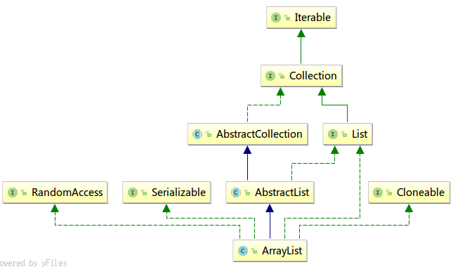

# ArrayList源码阅读笔记
## 继承结构
  
## 成员变量
```java
transient Object[] elementData;
```
存储List数据，用了transient关键字避免被持久化。  
```java
private int size;
```
List长度。    
在父类AbstractList中modCount成员变量：
```java
private static final int MAX_ARRAY_SIZE = Integer.MAX_VALUE - 8;
```
有些JVM会在数组保留一些头部信息，为了防止报内存不足Error，在int最大值的基础上预留8个元素。
```java
protected transient int modCount = 0;
```
表示已从结构上修改此列表的次数。从结构上修改是指更改列表的大小，或者打乱列表，从而使正在进行的迭代产生错误的结果。此字段由iterator和listiterator方法返回的迭代器和列表迭代器实现使用。如果意外更改了此字段中的值，则迭代器（或列表迭代器）将抛出```ConcurrentModificationException```来响应next、remove、previous、set或add操作。子类是否使用此字段是可选的。如果子类希望提供快速失败迭代器（和列表迭代器），则它只需在其 add(int,e)和remove(int)方法（以及它所重写的、导致列表结构上修改的任何其他方法）中增加此字段，否则可以忽略此字段。对add(int, e)或remove(int)的单个调用向此字段添加的数量不得超过 1，否则迭代器（和列表迭代器）将抛出虚假的 ```ConcurrentModificationException```。

## 构造方法
```java
ArrayList(int initialCapacity)
```
initialCapacity大于0的话elementData赋值为对应长度的Object数组；为0的话赋值为EMPTY_ELEMENTDATA（空数组）；负数的情况抛```IllegalArgumentException```异常。  
```java
ArrayList()
```
默认构造方法，elementData赋值为DEFAULTCAPACITY_EMPTY_ELEMENTDATA（空数组）。  
```java
ArrayList(Collection<? extends E> c)
```
c先转成数组赋值给elementData，如果长度不为0且数组不为Object数组，则通过``` Arrays.copyOf()```转换为Object数组；如果长度为0则c先转成数组赋值给elementData，如果长度不为0且数组不为Object数组，则通过重新赋值为EMPTY_ELEMENTDATA（空数组）。  

## 常规方法
```java
void trimToSize();
```
modCount++后，调用```Arrays.copyOf()```将elementData复制到size大小的数组里并赋值给elementData。这样是因为容量常常会大于实际元素的数量。内存紧张时，可以调用该方法删除预留的位置，调整容量为元素实际数量。  
```java
void ensureCapacity(int minCapacity);
```
如果数组为空，容量预取0，否则去默认值(DEFAULT_CAPACITY = 10)；若参数大于预设的容量，则使用该参数调用私有方法```void ensureCapacityInternal(int minCapacity)```设置数组容量；后者会在当前数组长度不足时调用```grow()```进行扩容。  
```java
private void grow(int minCapacity);
```
容量为：当前容量增加一半、及minCapacity中的较大者。如果超过数组最大长度则调用```hugeCapacity(int minCapacity)```处理，抛出错误。最后调用```Arrays.copyOf()```复制旧数据到新数组并赋值给element。  

```java
public int size(); //返回size属性
public boolean isEmpty() ; //size是否为0
public boolean contains(Object o); //调用indexOf()是否大于等于0。
public int indexOf(Object o); //下面详解
public int lastIndexOf(Object o);//
```
indexOf()查找元素索引，遍历数组逐个对比（如果o为null则直接判断```== null```，否则调用```o.equals()```进行判断），返回第一次找到的索引值，找不到则返回-1。lastIndexOf()与之类似，只是遍历的方向相反。  

```java
public Object clone();
```
调用```Arrays.copyOf()```进行浅拷贝，每个元素只拷贝引用。  

```java
public Object[] toArray();
public <T> T[] toArray(T[] a);
```
前者转换为Object数组，调用```Arrays.copyOf()```方法。  
后者转换为指定类型的数组，返回的数组容量由参数和本数组中较大值确定；如果a参数的长度小于当前size，则调用带Class参数的```Arrays.copyOf()```方法进行复制并返回；否则a的长度足够，则调用```System.arraycopy()```将elementData复制到a，并将第一个实际没有数据的设为null（a[size]）。  

## 增删改查方法
```java
public E get(int index);
```
调用```rangeCheck(index);```检查下标是否越界后（越界则抛出```IndexOutOfBoundsException```异常），直接从elementData数组根据下标拿值，速度比较快。  
```java
public E set(int index, E element);
```
调用```rangeCheck(index);```检查下标是否越界后，读取索引对应的旧值，然后改为新值，并将旧的值返回；注意用到泛型。  

```java
public boolean add(E e);
public void add(int index, E element);
```
前者调用```ensureCapacityInternal(size + 1)```确认是否需要扩容后，直接设定数组对应下标的值。  
后者先调用```rangeCheckForAdd()```确认index参数是否越界，然后同样调用```ensureCapacityInternal(size+1)```确认是否需要扩容，将index之后的元素通过```System.arraycopy()```方法复制到index+1位置之后，最后将element赋值到下标为index处。  
P.S.： System.arraycopy()的参数：src:源数组； srcPos:源数组要复制的起始位置； dest:目的数组； destPos:目的数组放置的起始位置； length:复制的长度。  

```java
public boolean addAll(Collection<? extends E> c);
public boolean addAll(int index, Collection<? extends E> c);
```
前者先调用```c.toArray()```将参数c转换为数组，然后进行扩容的判断，接着调用```System.arraycopy()```将数组的内容复制到elementData后面，并修改size的值，最后c的长度不为0则返回true，为零则返回false。  
后者先判断index是否越界及是否需要扩容，然后计算需要移动的元素个数并调用```System.arraycopy()```移动index以后的元素，接着调用```System.arraycopy()```将c转换的数组复制到index后面，最后修改size的值，根据c的长度返回true/false。  

```java
public E remove(int index);
public boolean remove(Object o);
protected void removeRange(int fromIndex, int toIndex);
```
前者按下标进行删除，先检查下标越界后，读取index对应的旧值，计算index下标往后的（需要移动的）元素个数，调用```System.arraycopy()```进行移动，随后将原来最后一位改为null（方便GC回收），最后将旧值返回。  
中者基本逻辑与前者类似，只是移动数组元素的范围不一样，而且需要遍历将数组尾部多个元素（toIndex - fromIndex个）赋值为null。  
后者删除指定对象，遍历数组，找到与o相等的元素（o为null则判断```==null```，否则调用```o.equals()```判断相等），调用```fastRemove()```删除，并返回true；如果找不到对应相等的元素，则返回false。```private void fastRemove(int index)```方法的实现与```E remove(int index);```基本一直，区别嘛，方法如其名，快就快在不需要进行越界判定，及不需要返回旧值，直接删除。  

```java
public void clear();
```
清空List，遍历数组将每个元素赋值为null，最后将size设为0.  

```java
public boolean removeAll(Collection<?> c); //batchRemove(c, false);
public boolean retainAll(Collection<?> c); //batchRemove(c, true);
/**
 * @param complement true时从数组保留指定集合中元素的值，为false时从数组删除指定集合中元素的值。
 * @return 数组中重复的元素都会被删除(而不是仅删除一次或几次)，有任何删除操作都会返回true
 */
private boolean batchRemove(Collection<?> c, boolean complement) {
        final Object[] elementData = this.elementData;
        int r = 0, w = 0;
        boolean modified = false;
        try {
            //遍历数组，并检查这个集合是否包含对应的值，移动要保留的值到数组前面，w最后值为要保留的元素的数量
            //简单点：若保留，就将相同元素移动到前段；若删除，就将不同元素移动到前段
            for (; r < size; r++)
                if (c.contains(elementData[r]) == complement)
                    elementData[w++] = elementData[r];
        }finally {
            //确保异常抛出前的部分可以完成期望的操作，而未被遍历的部分会被接到后面
            //r!=size表示可能出错了：c.contains(elementData[r])抛出异常
            if (r != size) {
                System.arraycopy(elementData, r,elementData, w,size - r);
                w += size - r;
            }
            //如果w==size：表示全部元素都保留了，所以也就没有删除操作发生，所以会返回false；反之，返回true，并更改数组
            //而w!=size的时候，即使try块抛出异常，也能正确处理异常抛出前的操作，因为w始终为要保留的前段部分的长度，数组也不会因此乱序
            if (w != size) {
                for (int i = w; i < size; i++)
                    elementData[i] = null;
                modCount += size - w;//改变的次数
                size = w;   //新的大小为保留的元素的个数
                modified = true;
            }
        }
        return modified;
    }
```
前两个方法调用后面的```batchRemove()```方法（具体看上面的注释），第一个方法删除c里面的元素，第二个方法保留c里面的元素，有任何删除操作都会返回true，返回false表示没有删除任一元素。不难看出```batchRemove()```方法的时间复杂度是```O(n^2)```，大致逻辑是遍历数组，根据complement条件判断要保留的元素依次复制到数组的前面，w保存要保留的最大下标，如果期间发生异常则将未处理的元素都保留，遍历后将w之后的元素设置为null等待GC。  

## IO方法
```java
private void writeObject(java.io.ObjectOutputStream s);
private void readObject(java.io.ObjectInputStream s);
```
前者将List序列化到输出流，先写入size，再逐个元素写入，写入过程数组被更改会抛出ConcurrentModificationException异常。  
后者读取输入流反序列化到List，先从输入流读取一个int，判断这个int作为size的话是否需要扩容，然后从输入流中读取Object从下标0开始逐个写入到elementData数组中（就是说读取的数量小于原来size的话，读取最后的下标之后的元素不会变动）。  

## 迭代器方法
```java
public ListIterator<E> listIterator(int index); //new ListItr(index);开始位置为指定参数
public ListIterator<E> listIterator(); //return new ListItr(0);开始位置为0
public Iterator<E> iterator(); //return new Itr();
```
迭代器方法分别返回ListItr和Itr内部类的实例，而ListItr继承了Itr。  
### 迭代器类Itr
```java
private class Itr implements Iterator<E> {}
```

#### 成员变量
```java
int cursor;       //游标，下一个元素的索引，默认初始化为0
int lastRet = -1; //上次返回的元素的位置
int expectedModCount = modCount;//迭代过程不运行修改数组，否则就抛出异常
```
#### Iterator接口方法
```java
public boolean hasNext();
}
```
返回cursor != size;，如果游标到了size那也就是没有下一个了。  
```java
public E next();
```
先调用```checkForComodification()```检查是否被修改过，然后判断如果游标已经越界则抛出```NoSuchElementException```异常，否则lastRet改为游标值，游标前进，返回原来游标指向的元素。  
```java
public void remove();
```
lastRet < 0时抛```IllegalStateException```异常，然后检查是否被修改过，随后调用```ArrayList.remove(int index)```移除元素，游标后退，lastRet重设为-1，expectedModCount赋值为新的modCount。  
基本上ArrayList采用size来维护自已状态，而Iterator采用cursor维护自已状态。当size出现变化时，cursor并不一定能够得到同步，除非这种变化是Iterator主动导致的，比如调用remove()方法导致ArrayList列表发生变化时，迭代器会更新cursor来同步这一变化，但其他方式导致的ArrayList变化Iterator无法感知，ArrayList也不会主动通知Iterator们。Iterator为了防止状态不一致可能引发的后果经常做checkForComodification检查，以防有变。如果有变，则以异常抛出。  
所以在循环里删除元素的话要用迭代器的remove()方法。  
```java
public void forEachRemaining(Consumer<? super E> consumer);
```
JDK8开始有的方法，遍历数组，分别传入调用```consumer.accept((E) elementData[i++]);```，即对每个元素执行同一方法。  
#### 其他方法
```java
final void checkForComodification();
```
modCount != expectedModCount则抛出ConcurrentModificationException异常。  

### 迭代器类ListItr
```java
private class ListItr extends Itr implements ListIterator<E> {}
```
#### 构造器
```java
ListItr(int index);
```
将游标设置为index。

#### 接口方法
接口``` Iterator```的方法在Itr中实现了，该类实现了```ListIterator```接口中其他的方法。  

```java
public boolean hasPrevious() {
    return cursor != 0; //根据游标判断是否有前一个元素
}
public int nextIndex() {
    return cursor; //游标即为下一个要迭代到的元素的下标
}
public int previousIndex() {
    return cursor - 1;//游标减一即上一个元素（当前已迭代的）的下标
}
```
这三个方法比较简单就不具体讲了。  

```java
public E previous();
```
返回上一个元素同时游标回退，与```next()```方法类似，先检查是否被修改以及是否下标越界，然后lastRet和游标减一，返回索引减一之后对应的元素。  

```java
public void set(E e);
```
用指定元素替换 next 或 previous 返回的最后一个元素。先判定lastRet不小于0，否则抛出IllegalStateException异常。lastRet初始化为-1，之后只有调用ListIterator.add(E e)和remove()之后lastRet会恢复到-1。因为修改的是下标=lastRet的元素，所以不允许为-1，也就是说，只有在最后一次调用 next 或 previous 后既没有调用 ListIterator.remove 也没有调用 ListIterator.add 时才可以进行该调用。  

```java
public void add(E e);
```
将指定的元素插入列表。在当前游标处调用```List.add()```方法插入一个元素e，然后游标前进，lastRet恢复-1，同时更新expectedModCount。  
新元素被插入到游标前：不影响对 next 的后续调用，并且对 previous 的后续调用会返回此新元素。  

## subList()方法与SubList内部类
```java
//检查下标越界后，返回SubList的实例（用fromIndex、toIndex参数构造）作为子列表。
public List<E> subList(int fromIndex, int toIndex);

//用于subList()方法的下标越界检查方法
static void subListRangeCheck(int fromIndex, int toIndex, int size);

//SubList类
private class SubList extends AbstractList<E> implements RandomAccess
//注意在AbstractList.java源文件里也有一个SubList，然而并不是AbstractList的内部类，AbstractList.subList()方法会返回这个SubList的实例
class SubList<E> extends AbstractList<E> {}
```
SubList继承AbstractList抽象类，是List的实现类，主要用于返回ArrayList的视图，这个视图是原ArrayList对象中的一部分，确实是一部分，直接将原ArrayList对象引用到新的子视图的ArrayList，对子视图进行改变，原ArrayList对象也会随之改变。
### 成员变量
```java
private final AbstractList<E> parent; //保存母ArrayList的引用
private final int parentOffset; //subList方法的fromIndex参数
private final int offset;//subList方法的fromIndex参数
int size;//subList方法的参数相减：toIndex - fromIndex
```
同时，modCount赋值为母ArrayList的modCount。

### 接口方法
```java
public E set(int index, E e);
public E get(int index);
public int size();
public void add(int index, E e);
public E remove(int index);
protected void removeRange(int fromIndex, int toIndex);
public boolean addAll(Collection<? extends E> c) ;
public boolean addAll(int index, Collection<? extends E> c);
public Spliterator<E> spliterator();
```
这些方法的实现与ArrayList的实现都大同小异，差异在与下标多了偏移量parentOffset，而且最后调用parent（ArrayList）的同名方法进行处理。  

```java
public List<E> subList(int fromIndex, int toIndex);
```
返回自己的类（SubList），构造方法的offset参数为offset（母ArrayList的subList方法的fromIndex参数）。

### 迭代器方法
```java
public Iterator<E> iterator();
public ListIterator<E> listIterator(final int index);
```
前者返回的是AbstractList的内部类ListItr，实现了ListIterator接口，具体不表。  
后者返回ListIterator接口的一个匿名内部类，与ArrayList的ListItr的区别也是在于对ArrayList的elementData数组进行操作时，使用的下标加上offset（母ArrayList的subList方法的fromIndex参数）。  

### 其他方法（检查方法）
```java
private void rangeCheck(int index);
private void rangeCheckForAdd(int index);
private String outOfBoundsMsg(int index);
private void checkForComodification();
```
检查下标越界、并行修改等，与ArrayList类似，具体不表。

## JDK8新增方法
```java
//forEach：for循环遍历elementData，每个元素分别调用action.accept(elementData[i])方法进行处理，如果处理过程中ArrayList被并行修改了，那么抛出ConcurrentModificationException异常
public void forEach(Consumer<? super E> action);

//spliterator：返回一个内部类 static final class ArrayListSpliterator<E> implements Spliterator<E>的实例。
//为了并行遍历数据源中的元素，Stream.isParallel()实现调用。下面专门一小节讲Spliterator接口
//这个实现类在private int getFence()方法里面初始化了fence = ArrayList的size，expectedModCount = ArrayList的modCount
public Spliterator<E> spliterator();

//删除指定条件的元素。先遍历数组，将符合条件（filter.test(element) == true）的元素的下标设置到一个BitSet的对应下标元素中，即这个BitSet哪一位为true，对应下标在ArrayList的元素就符合filter规则，并使用removeCount记录满足规则的个数。
//遍历后如果有满足filter规则的元素，则遍历数组，将被删除的元素后面的元素往前移，最后将末尾无效数据设为null。
//若有删除的元素则返回true，否则返回false
public boolean removeIf(Predicate<? super E> filter);

//与forEach()类似，检查operator不为空，然后遍历数组，每个元素调用operator.apply((E) elementData[i])进行处理，最后判断是否发生了并发修改，并增加modCount。
public void replaceAll(UnaryOperator<E> operator);

//调用Arrays.sort(T[] a, int fromIndex, int toIndex, Comparator<? super T> c)进行排序，最后判断是否发生了并发修改，并增加modCount。
public void sort(Comparator<? super E> c);
```

### Spliterator接口提供的方法
```java
boolean tryAdvance(Consumer<? super T> action);
Spliterator<T> trySplit();
long estimateSize();
int characteristics();
```
1. tryAdvance()就是顺序处理每个元素，类似Iterator，如果还有元素要处理，则返回true，否则返回false
2. trySplit()，这就是为Spliterator专门设计的方法，区分与普通的Iterator，该方法会把当前元素划分一部分出去创建一个新的Spliterator作为返回，两个Spliterator变会并行执行，如果元素个数小到无法划分则返回null
3. estimateSize()，该方法用于估算还剩下多少个元素需要遍历
4. characteristics()，其实就是表示该Spliterator有哪些特性，用于可以更好控制和优化Spliterator的使用。
