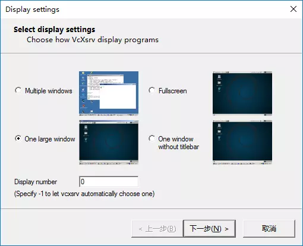
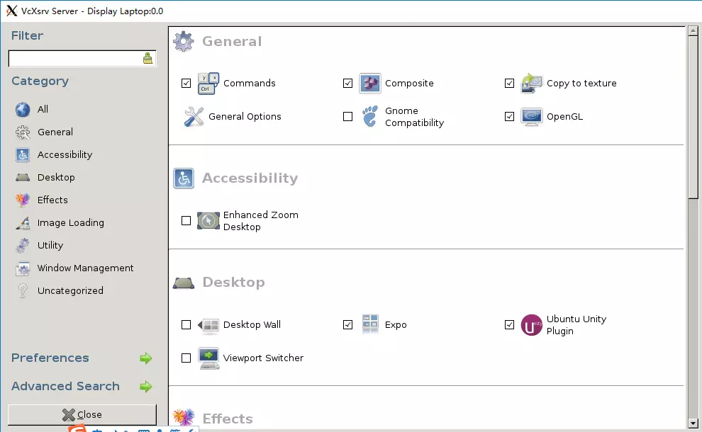
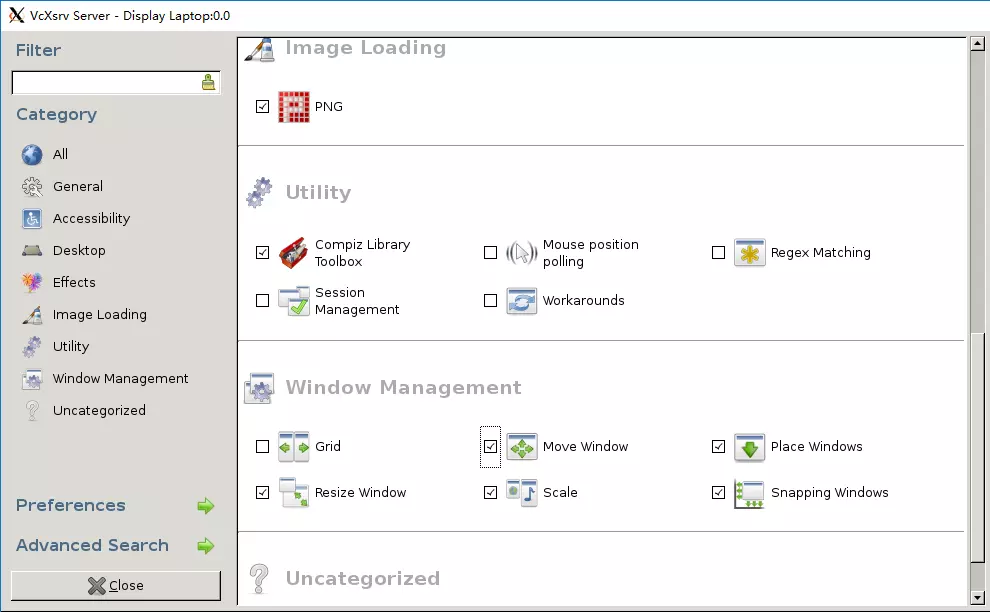
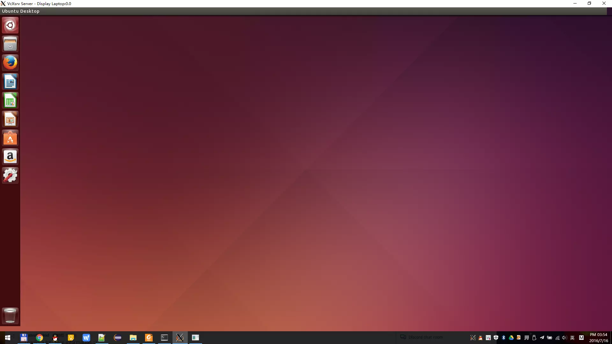

本文参照Github上的[Run any Desktop Environment in WSL](https://github.com/Microsoft/BashOnWindows/issues/637)、结合本人实际安装操作而编写。
# 安装Bash on Windows

首先安装Bash on Windows，可以参考 [如何安装体验 Ubuntu on Windows](https://linux.cn/article-7209-1.html) 一文。按照这篇文章安装的bash可以直接在开始菜单输入“bash”启动，但是不支持GUI程序的，所以有了本文。


# 安装VcXsrv并启动XLaunch
在 SourceForge:[ https://sourceforge.net/projects/vcxsrv/files/latest/download](https://sourceforge.net/projects/vcxsrv/files/latest/download) 下载安装程序并安装后，运行XLaunch，按下图配置后，一路点Next直至完成。



# 安装 ubuntu-desktop, unity和ccsm并配置
打开bash，输入：
```bash
sudo apt-get install ubuntu-desktop unity compizconfig-settings-manager
```
再打开ccsm:
```bash
ccsm
```
如果启动ccsm遇到以下的报错（感谢网友 Event 提供的解决方案）：
```bash
AttributeError: 'NoneType' object has no attribute 'get_default_screen'
```
解决方法如下：
```bash
export DISPLAY=:0 
dconf reset -f /org/compiz/ 
unity --reset-icons
```
按下图勾选需要的模块，然后按Close退出。





# 配置~/.bashrc和/etc/dbus-1/session.conf
在bash输入以下命令：
```bash
echo "export DISPLAY=:0.0" >> ~/.bashrc
sudo sed -i 's$<listen>.*</listen>$<listen>tcp:host=localhost,port=0</listen>$' /etc/dbus-1/session.conf
```

# 启动Unity桌面
在bash中输入：
```bash
compiz
```
等待十几秒之后即可显示Ubuntu桌面。Enjoy it！

2016-07-19增加：对于XFCE，则是安装xubuntu-desktop或xfce4，与上面同样的步骤，启动的时候输入xfce4-session。



