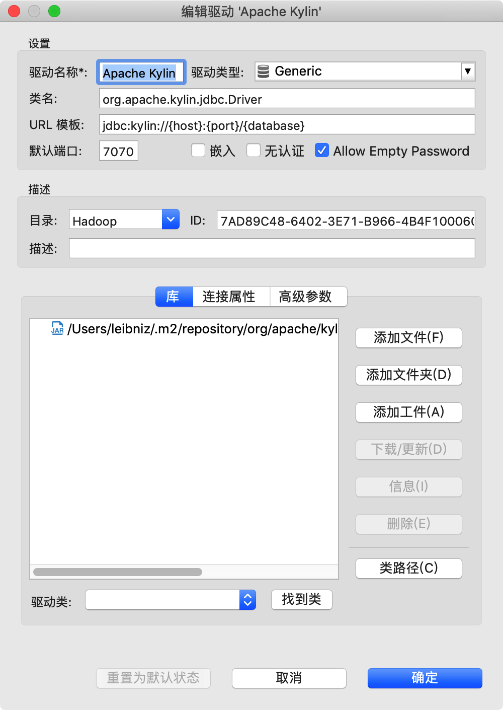
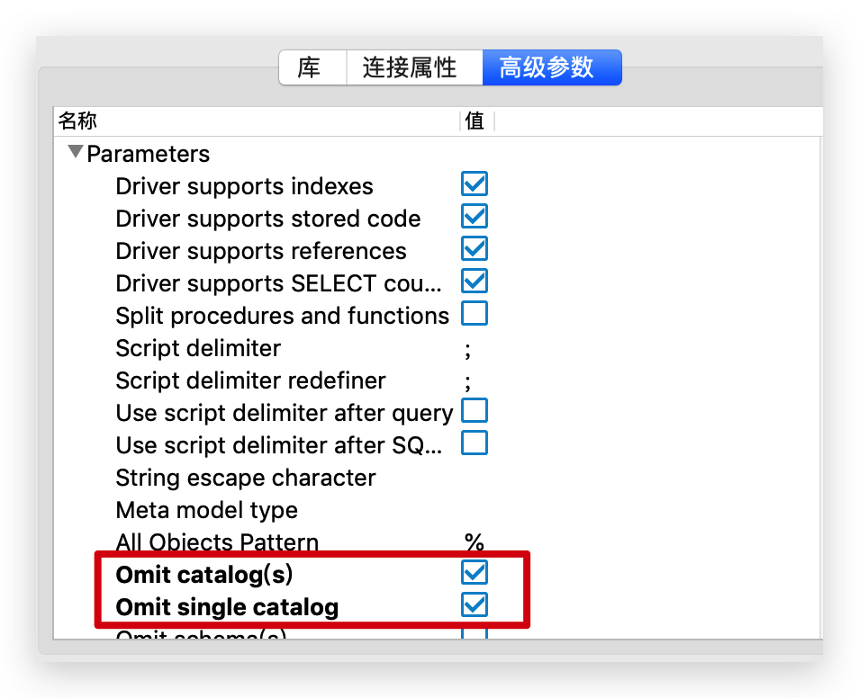
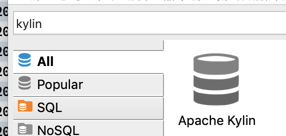
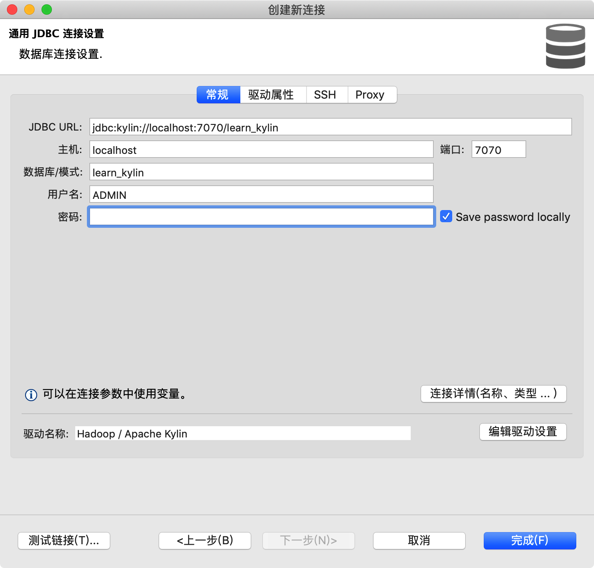

DBeaver接入Kylin数据源现在网上好象没有靠谱的博客，写一篇吧。  
打开DBeaver：

新建：

 |  属性  |           填的值                                                                                      |
 | :------- | :---------------------------------------------------------------------------------------------- |
 | 驱动名称 | Apache Kylin 或随意                                                                             |
 | 驱动类型 | 默认                                                                                            |
 | 类名     | org.apache.kylin.jdbc.Driver                                                                    |
 | URL模板  | jdbc:kylin://{host}:{port}/{database}                                                           |
 | 默认端口 | 7070                                                                                            |
 | 目录     | Hadoop 或随意                                                                                   |
 | 添加文件 | 可以在maven仓库找 ~/.m2/repository/org/apache/kylin/kylin-jdbc/<版本号>/kylin-jdbc-<版本号>.jar |
 | 驱动类   | 点击找到类，一般需要选择的就是列表中第一个，与类名一致                                          |

点高级参数（否则会使用catalog，然后导致查询失败）：  

然后新建连接，搜索kylin，填入连接信息即可：

目前只能看到table，看不到model和cube。