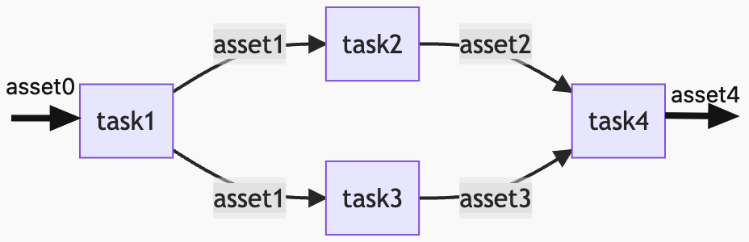
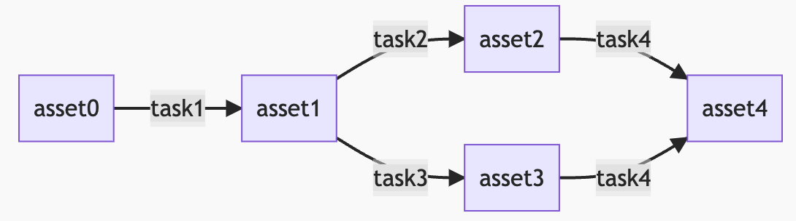

dagster是 [MDS](https://octolis.com/blog/modern-stack-data) 中推荐使用的调度组件。Dagster的官方文档已经挺完善挺人性化的了，但为了公司内推广，还是写一篇快速入门的文档吧。

## 准备工作

### 环境准备

首先，Dagster需要Python环境和pip：

- [Python下载安装](https://www.python.org/downloads/) ：MacOS已自带。请确保 [Python3.7及以上版本](https://github.com/dagster-io/dagster/releases/tag/1.0.0) 。
- [pip安装](https://pip.pypa.io/en/stable/installation/)

使用pip安装：

```bash
pip install dagster
```

### 创建第一个项目

执行以下命令创建一个简单的dagster项目：

```bash
dagster project scaffold --name my-dagster-project
```

也可以使用官方例子创建项目，请参见： [Create a New Project](https://docs.dagster.io/getting-started/create-new-project) 。

随后执行以下命令安装依赖：

```bash
cd my-dagster-project
pip install -e ".[dev]"
```

最后执行下述命令启动一个dagster服务：

```bash
dagit
```

可以看到控制台打印出类似：

```bash
To persist information across sessions, set the environment variable DAGSTER_HOME to a directory to use.

0it [00:00, ?it/s]
0it [00:00, ?it/s]
2022-09-20 15:39:59 +0800 - dagit - INFO - Serving dagit on http://127.0.0.1:3000 in process 37014
```

即可在浏览器打开 http://127.0.0.1:3000 进入dagster页面。

## 快速理解dagster基本概念

### 命令

dagster提供了两个命令：

- **`dagster`**: 核心CLI程序，可以用于执行单个job、查询asset、debug等，具体可通过 `dagster -h` 查询。
- **`dagit`**: dagster的UI服务，前面小节已经使用到了。

### Asset

在传统的工作流/DAG调度工具里，我们面向执行的任务编写(代码)/(通过UI)编辑工作流，关注的是一个个任务的流转。  
而这里定义的任务，对于数据处理而言，一般是读取一个数据源，经过处理后，写入另一个数据源。  
我们知道一个任务处理了哪个数据源、输出了什么数据源，只能通过任务命名、或阅读任务的代码/注释/文档。  
如果想知道这些用到的数据源之间的血缘关系，则需要调度工具支持+任务中声明输入输出的数据，或者在任务中调用第三方血缘关系管理的服务。  



对于单纯的执行而言，这无疑是直观的。但如果从数仓建设的角度来看，这是很不人性化的：我们只能看到一步步做了什么，不能直观地看到数仓每一层的数据流转、依赖。  

而 **Dagster**，提供了调度工作流的另一个视角： **数据资产视角** ，去审视数仓的数据流，从而声明式定义工作流。  



也就是说，在dagster里面，不再关注需要写什么任务，而是捋清到底有哪些数据资产，以及这些数据资产之间的关系。  
然后在代码里声明：

- 数据资产：`@asset` 注解
- 这个数据资产依赖什么上游的数据资产：`@asset` 注解的 `ins` 或 `non_argument_deps` 属性
- 如何利用上游的数据资产产生当前数据资产：在 `@asset` 声明的方法里通过py代码实现，比如依赖的DataFrame，在方法代码里用DataFrame API，编写业务逻辑，定义return 一个新的DataFrame

就可以了。  
当你把数据资产都定义完，可以通过 `define_asset_job` 方法，将选定的数据资产，按依赖关系自动构建出DAG工作流（dagster称之为 **job**），然后就可以执行了。

关于 asset 的定义和使用更多信息，请参考官方文档：

- [A First Asset](https://docs.dagster.io/tutorial/assets/defining-an-asset)
- [Building Graphs of Assets](https://docs.dagster.io/tutorial/assets/asset-graph)
- [Assets without Arguments and Return Values](https://docs.dagster.io/tutorial/assets/non-argument-deps)
- [Testing Assets](https://docs.dagster.io/tutorial/assets/testing-assets)
- [Software-Defined Assets](https://docs.dagster.io/concepts/assets/software-defined-assets)
- [Asset Materializations](https://docs.dagster.io/concepts/assets/asset-materializations)
- [Asset Observations](https://docs.dagster.io/concepts/assets/asset-observations)
- [Multi-Assets](https://docs.dagster.io/concepts/assets/multi-assets)

等。

> 说到这里，好像缺了什么？  
> DataFrame是定义完了，DataFrame保存到哪里？又是从哪里读的？

### IO Manager

Asset只定义了数据资产的来源依赖与自身定义，关注的是数据的业务逻辑。  
在传统的ETL工具或工作流工具里，数据的读写和处理逻辑是在同一个任务/工作流里定义的，而在Dagster中，数据的读写和处理逻辑是解耦的，处理逻辑在Asset定义了，而读写在 **IO Manager** 中定义。  
IO Manager有一些官方的实现，也可以自己实现。  
具体来说是继承 `dagster.IOManager`，实现 `handle_output`（数据输出） 和 `load_input`（数据读取） 方法。  
而每个Asset使用哪个IO Manager，则是在 `@asset` 注解的 `io_manager_key` 属性中设置，如：  

```python
class MyIOManager(IOManager):
    def handle_output(self, context, obj):
        pass

    def load_input(self, context):
        pass

@io_manager
def my_io_manager(init_context):
    return MyIOManager()

@asset(io_manager_key="my_io_manager")
def my_op():
    pass
```

具体请参见官方文档：

- [IO Managers](https://docs.dagster.io/concepts/io-management/io-managers)
- [Unconnected Inputs](https://docs.dagster.io/concepts/io-management/unconnected-inputs)
