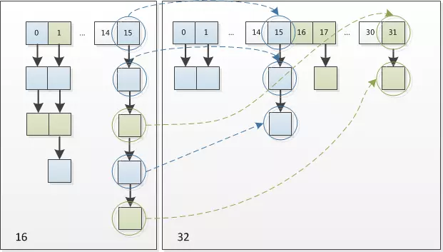

# put方法：
put方法调用私有方法
```java
putVal(hash(key),key,value,false,true); 
```

## 先去计算hash。
key非空的时候返回：
```java
h=key.hashCode())^(h>>>16)
```
即高16位不变，低16位与高16位做异或运算，因为目前的table长度n为2的幂，而计算下标的时候，是这样实现的(使用&位操作，而非%求余)：(n - 1) & hash 。设计者认为这方法很容易发生碰撞。在n - 1为15(0x1111)时，其实散列真正生效的只是低4bit的有效位，当然容易碰撞了。因此，综合考虑了速度、作用、质量，把高16bit和低16bit异或了一下。设计者还解释到因为现在大多数的hashCode的分布已经很不错了，就算是发生了碰撞也用O(logn)的tree去做了。仅仅异或一下，既减少了系统的开销，也不会造成的因为高位没有参与下标的计算(table长度比较小时)，从而引起的碰撞。

## 然后进入putVal()。
首先判断table是否为空（null或长度为0），为空的话进行resize()。
## resize()
如果原来table大小已经超过上限，则不resize，直接返回原来table；
原来table大小不为0且未超上限则容量增倍，threshold（扩容阈值）也增倍；
原来table大小为0，则大小设为DEFAULT_INITIAL_CAPACITY=16，threshold设为DEFAULT_LOAD_FACTOR*DEFAULT_INITIAL_CAPACITY=12。
然后按新的table大小，new一个Node数组。此时如果旧的table不为空，则需要进行原有数据的转移。
```java
if(oldTab!=null){
    for(intj=0;j<oldCap;++j){
        Node<K,V>e;
        if((e=oldTab[j])!=null){
            oldTab[j]=null;
            if(e.next==null)
                newTab[e.hash&(newCap-1)]=e;
            elseif(e instanceof TreeNode)
                ((TreeNode<K,V>)e).split(this,newTab,j,oldCap);
            else{//preserveorder
                Node<K,V>loHead=null,loTail=null;
                Node<K,V>hiHead=null,hiTail=null;
                Node<K,V>next;
                do{
                    next=e.next;
                    if((e.hash&oldCap)==0){
                        if(loTail==null)
                            loHead=e;
                        else
                            loTail.next=e;
                        loTail=e;
                    }else{
                        if(hiTail==null)
                            hiHead=e;
                        else
                            hiTail.next=e;
                        hiTail=e;
                    }
                }while((e=next)!=null);
                if(loTail!=null){
                    loTail.next=null;
                    newTab[j]=loHead;
                }
                if(hiTail!=null){
                    hiTail.next=null;
                    newTab[j+oldCap]=hiHead;
                }
            }
        }
    }
}
```
大致意思就是遍历旧表的元素：
1.如果旧表元素的next为空（没有发生冲突而放入链表），则计算hash放进新表对应位置：newTab[旧表元素.hash&(newCap-1)]=旧表元素（newCap为新的table长度）;
2.若旧表元素为TreeNode实例，即该节点使用了红黑树进行存储的（JDK8开始引入），则执行split方法去处理；
3.否则遍历旧表元素的对应链表，重新计算位置。
resize的时候，因为我们使用的是2次幂的扩展(指长度扩为原来2倍)，所以，元素的位置要么是在原位置，要么是在原位置再移动2次幂（oldCap）的位置，例如我们从16扩展为32时，具体的变化如下所示：

因此元素在重新计算hash之后，因为n变为2倍，那么n-1的mask范围在高位多1bit(红色，0或1)。
因此，我们在扩充HashMap的时候，不需要重新计算hash，只需要看看原来的hash值新增的那个bit是1还是0就好了（通过```(e.hash&oldCap)==0```进行判断），是0的话索引没变，是1的话索引变成“原索引+oldCap”。可以看看下图为16扩充为32的resize示意图：

既省去了重新计算hash值的时间，而且由于新增的1bit是0还是1可以认为是随机的，因此resize的过程，均匀的把之前的冲突的节点分散到新的bucket了。
上面代码中else{//preserveorder之后的部分即完成了上述过程，将一个节点上的链表拆分成用loHead,loTail和hiHead,hiTail
描述的两个链表，分别对应新表中位置不变的节点，和移动oldCap之后的节点。

## 新建节点或更新value
然后判断当前hash值对应table的节点是否为空，为空的话直接新建节点即可：new Node<>(hash,key,value,null);最后一个参数是next，因为table原节点为空，为链表第一个元素，所以next设为null即可；
如果hash值对应table节点不为空，则判断原节点和当前插入的数据key及value是否都一致，如果一致，证明是同一个节点，无需重新插入；
否则进入table节点的链表，遍历，如果找到与待插入节点一样的节点，则直接退出，否则一直找到链表末端节点还没找到相同的，则增加新节点插入当前数据，如果当前链表长度大于TREEIFY_THRESHOLD-1，还需要进行treeifyBin()操作，将链表转换为红黑树，提高查询效率（O(n)变为O(logn)，JDK8之后引入的优化）。
如果以上操作中找到待插入节点的key在map中已存在，则用新数据覆盖之，最后size++, 判断table尺寸，看是否需要进行resize()。

# get方法：
get时调用```getNode(int hash, Object key)```方法。
首先table为null或长度为0或对应hash位置的元素为null均返回null。
否则先判断hash位置上的元素key和get方法的key相同，如果相同则直接返回hash位置的元素；否则判断hash位置节点是否为TreeNode，若是则调用getTreeNode方法进行处理并返回；对于非TreeNode节点，且hash位置节点的key不等于get方法dekey的话，则遍历hash位置节点的链表，直到找到key相同的节点并返回节点的value。
