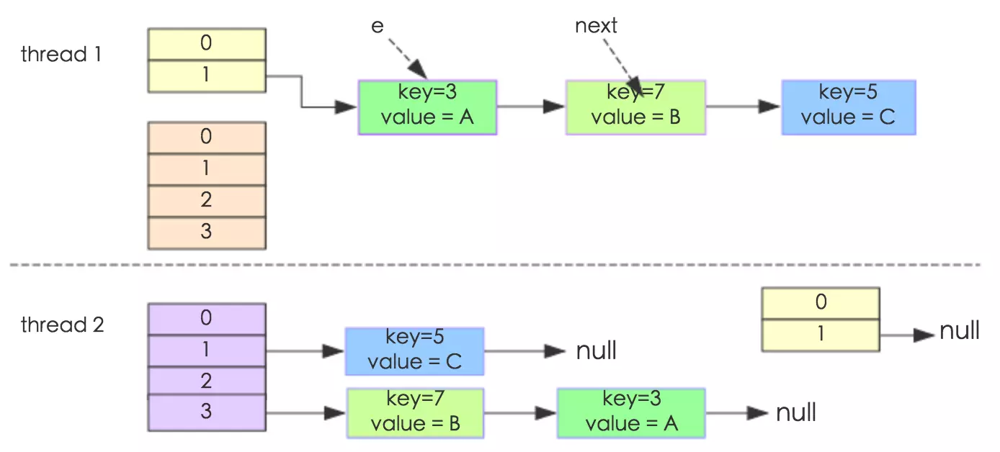
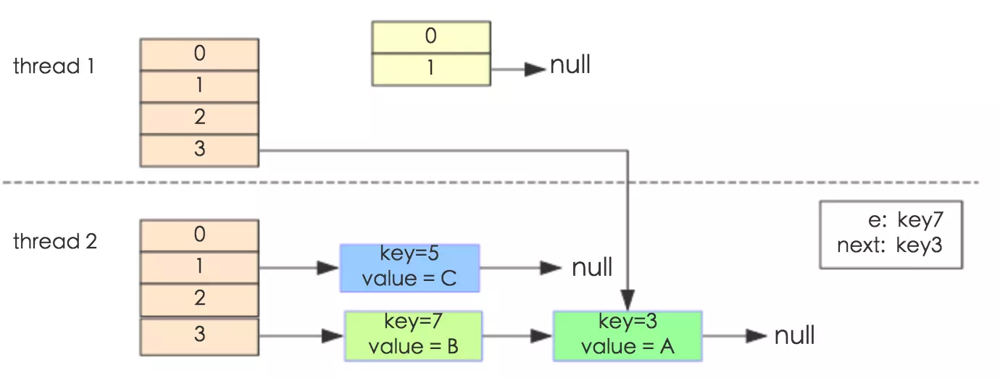
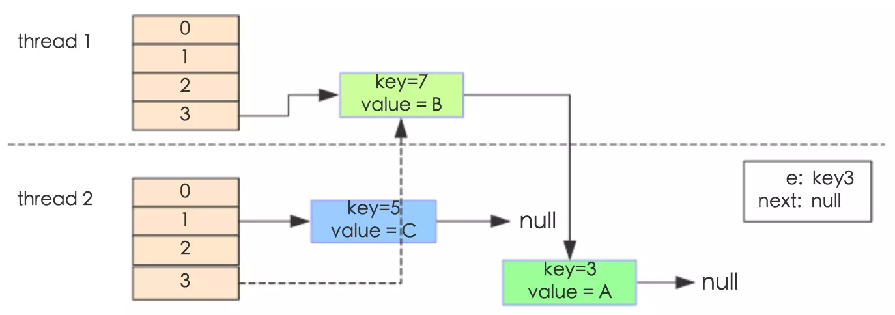
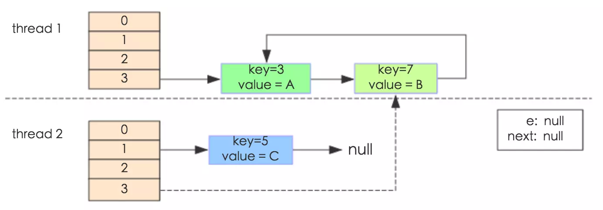

# HashMap线程安全性讨论
去年写的 [HashMap源码阅读笔记](/2016/12/24/HashMap源码阅读笔记/) 分析了JDK8 中的```HashMap```源码的```get()```和```put()```两大方法，当时并没有考虑到```HashMap```的线程安全性。  
众所周知，```HashMap```并非线程安全的，但在 *JDK8* 之前，```HashMap```的线程安全不但体现在多线程读写可能出现数据错误，还存在一个多线程扩容导致的死循环Bug。本文将讨论这一Bug，及在 *JDK8* 中的修复，以及相关的```ConcurrentHashMap```。

## *JDK8* 之前的多线程扩容Bug
### 扩容代码解析
我们直接看JDK7 中```HashMap```的扩容方法：
```java
void resize(int newCapacity) {
    Entry[] oldTable = table;
    int oldCapacity = oldTable.length;
    //最大长度限制在Integer.MAX_VALUE
    if (oldCapacity == MAXIMUM_CAPACITY) {
        threshold = Integer.MAX_VALUE;
        return;
    }
    Entry[] newTable = new Entry[newCapacity];//按新的长度分配哈希表数组
    transfer(newTable);//将旧的哈希表重新分配到新哈希表里，可能导致环链
    table = newTable;//将新的哈希表复制到HashMap的table变量
    threshold = (int)(newCapacity * loadFactor);//按新容量更新扩容阈值
}

void transfer(Entry[] newTable) {
    Entry[] src = table;
    int newCapacity = newTable.length;
    for (int j = 0; j < src.length; j++) {
        Entry<K,V> e = src[j];
        if (e != null) {
            src[j] = null;
            //关键部分
            do {
                Entry<K,V> next = e.next;//获得原来链表中的下一个元素
                int i = indexFor(e.hash, newCapacity);//获取扩容后新的下标，可能跟原来一样，或者比原来的大newCapacity/2
                e.next = newTable[i];//设置当前元素在链表的下一个元素为新哈希表对应位置原来的元素，也就是说旧元素会被往后推，该链表上最早读取的元素会成为尾部
                newTable[i] = e;//哈希表的入口改为当前元素
                e = next;//遍历原来链表的下一个元素
            } while (e != null);
        }
    }
}
```
工作原理在上面代码的注释里说得比较清楚了，值得注意的是，```transfer(newTable)```之后的新哈希表里，每个链表的顺序都与扩容之前的刚好相反，这一点直接注定了会出现多线程扩容Bug。  

### 扩容时的多线程死循环Bug
如上面的分析，由于扩容后每个链表的顺序都调转了，因此定性地分析，多线程同时触发扩容的时候，有可能其中一个线程已经把链表调转了，而另一个线程获取了链表调转前的状态，重新获取到时间片的时候，再次翻转，导致next引用的赋值出错，链表中构成环；这样在调用```get()```方法的时候，进入到这个链表就会陷入死循环。
具体的举例分析，可以参考美团点评技术团队的文章 [Java 8系列之重新认识HashMap](https://tech.meituan.com/java-hashmap.html) ，在此贴出关键的部分：
> 代码例子如下(便于理解，仍然使用JDK1.7的环境)：
```java
public class HashMapInfiniteLoop {
    private static HashMap<Integer,String> map = new HashMap<Integer,String>(2，0.75f);
    public static void main(String[] args) {
        map.put(5， "C");
        new Thread("Thread1") {
            public void run() {
                map.put(7, "B");
                System.out.println(map);
            };
        }.start();
        new Thread("Thread2") {
            public void run() {
                map.put(3, "A");
                System.out.println(map);
            };
        }.start();
    }
}
```

>其中，map初始化为一个长度为2的数组，loadFactor=0.75，threshold=2*0.75=1，也就是说当put第二个key的时候，map就需要进行resize。  
>
>通过设置断点让线程1和线程2同时debug到transfer方法(3.3小节代码块)的首行。注意此时两个线程已经成功添加数据。放开thread1的断点至transfer方法的“Entry next = e.next;” 这一行；然后放开线程2的的断点，让线程2进行resize。结果如下图。  
>
>注意，Thread1的 e 指向了key(3)，而next指向了key(7)，其在线程二rehash后，指向了线程二重组后的链表。
>
>线程一被调度回来执行，先是执行 newTalbe[i] = e， 然后是e = next，导致了e指向了key(7)，而下一次循环的next = e.next导致了next指向了key(3)。  
>  
>  
>e.next = newTable[i] 导致 key(3).next 指向了 key(7)。注意：此时的key(7).next 已经指向了key(3)， 环形链表就这样出现了。  
>  
>于是，当我们用线程一调用map.get(11)时，悲剧就出现了——Infinite Loop。

## *JDK8* 如何修复多线程扩容Bug
正如我在 [HashMap源码阅读笔记](/2016/12/24/HashMap源码阅读笔记/) 中分析到的，*JDK8* 中```Node<K,V>[] resize()```扩容方法利用了哈希表长度为2的幂，以及```get()```方法对哈希值取低位的特性，结合每次扩容哈希表大小都增倍等特性，每次扩容，一个哈希桶里的元素在扩容后的位置，只会是原位置，或者原位置+原哈希表大小。  
因此扩容的时候可以将一个哈希桶的扩容结果分为两个链表，还在原来位置的记为 *低位链表*(我自己起的名字)，用```loHead loTail```标记其头尾；扩容后分配到原位置+原哈希表大小的构成 *高位链表*(同样是我自己起的名字)，用```hiHead hiTail```标记其头尾。  
具体实现的核心部分代码如下（省略了特殊容量处理、红黑树处理等等代码）：
```java
final Node<K,V>[] resize() {
    /*…………省略前面代码…………*/
    Node<K,V>loHead=null,loTail=null;//记录低位链表头尾位置
    Node<K,V>hiHead=null,hiTail=null;//记录高位链表头尾位置
    Node<K,V>next;//记录当前链表元素在原来链表中的下一个元素，便于下次循环使用
    //遍历哈希桶的链表，拆分成高位和低位链表
    do{
        next=e.next;
        if((e.hash&oldCap)==0){ //新增的有效哈希位为0，即当前元素扩容后分配到 低位链表
            if(loTail==null) //低位链表尚未初始化
                loHead=e; //设置低位链表头部
            else
                loTail.next=e; //低位链表尾部增加当前元素，以保持原链表顺序
            loTail=e; //更新低位链表的尾部
        }else{ //新增的有效哈希位为1，即当前元素扩容后分配到 高位链表
            if(hiTail==null) //高低位链表尚未初始化
                hiHead=e; //设置高位链表头部
            else
                hiTail.next=e; //高位链表尾部增加当前元素，以保持原链表顺序
            hiTail=e; //更新高位链表的尾部
        }
    }while((e=next)!=null);
    //更新两个链表到哈希表中
    if(loTail!=null){ //扩容后低位链表不为空，需要处理
        loTail.next=null; //低位链表设置尾部结束
        newTab[j]=loHead; //哈希桶设置链表入口
    }
    if(hiTail!=null){ //扩容后高位链表不为空，需要处理
        hiTail.next=null; //高位链表设置尾部结束
        newTab[j+oldCap]=hiHead; //哈希桶设置链表入口
    }
    /*…………省略后面代码…………*/
}
```
具体处理的过程我在上面的注释里说得比较清楚了，包括代码之前的那段文字。  
可以看到，扩容后，原来哈希桶的链表被拆分为两个，两个链表中的元素都能继续维持原有的顺序。这样就算在多线程环境下同时扩容，一个线程A读取链表状态后停止工作，另一个线程B对同一链表的前几个元素进行扩容分成两个链表，此时线程A恢复工作，由于线程B对链表元素的顺序没有发生变化，所以线程A恢复工作后只是重复了拆分链表的工作，而不会因为链表已被改变顺序而导致环的生成，因此不会发生死循环的问题。  
也就是说 *JDK8* 的```HashMap```扩容方法不但效率提升了（根据哈希值特点拆分链表，红黑树），而且还维持了扩容前后的链表顺序，从而解决了多线程扩容使链表产生环，导致死循环的问题。  

## 其他线程安全Map
### Hashtable类
类名叫```Hashtable```不叫```HashTable```真是逼死强迫症。这个类现在很少用了，从源码可以看到，它是在```get() put()```等方法的声明里加了```synchronized```关键字来实现多线程安全的，因此显然效率比较低。  

### Collections.synchronizedMap()方法
在```Collections```工具类里有
```java
public static <K,V> Map<K,V> synchronizedMap(Map<K,V> m);
```
方法，传入将普通的Map实例，返回一个线程安全的Map实例。实现方法也比较简单，返回的是```Collections```的内部类：
```java
private static class SynchronizedMap<K,V> implements Map<K,V>, Serializable {
    private final Map<K,V> m;     // Backing Map
    final Object      mutex;        // Object on which to synchronize

    SynchronizedMap(Map<K,V> m) {
        this.m = Objects.requireNonNull(m);
        mutex = this;
    }

    SynchronizedMap(Map<K,V> m, Object mutex) {
        this.m = m;
        this.mutex = mutex;
    }

    public V get(Object key) {
        synchronized (mutex) {return m.get(key);}
    }

    public V put(K key, V value) {
        synchronized (mutex) {return m.put(key, value);}
    }
    /*………省略其他方法，大同小异………*/
}
```
的实例。上面也给出了简要的类代码，实现的方法相当简单粗暴，由构造方法传入线程不安全的类实例，用一个锁（默认是自身，也可以在构造方法里传入），在各种```Map```接口的方法里面使用这个锁对线程不安全的类实例方法进行同步，也就是一个包装的设计模式，用同步代码块包装原有方法。  
显然这样得到的线程安全类的效率也不高。

### ConcurrentHashMap类
*JDK8* 之前的```ConcurrentHashMap```使用Segment（锁段）提高同步的效率，而 *JDK8* 开始利用CAS算法大大提高了实现线程安全的效率。有空要再写一篇博客分析一下```ConcurrentHashMap```的源码。
