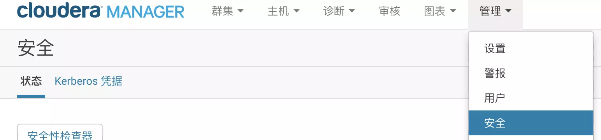
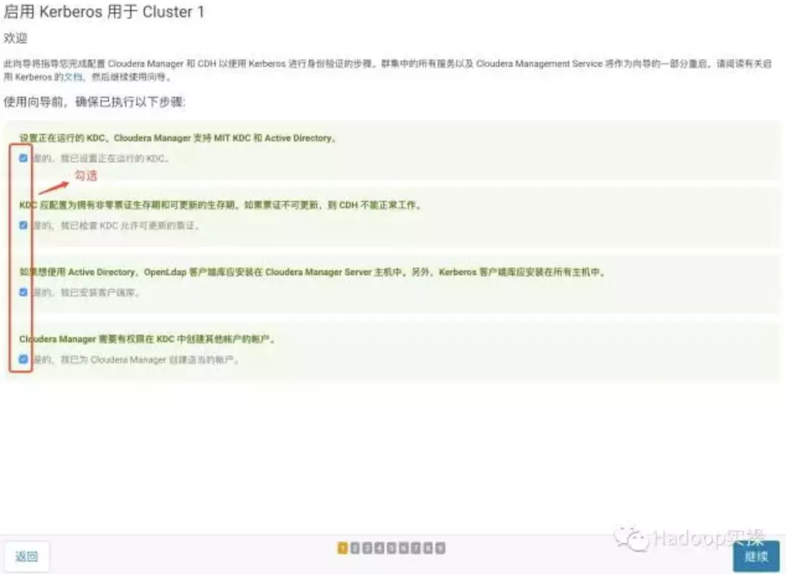
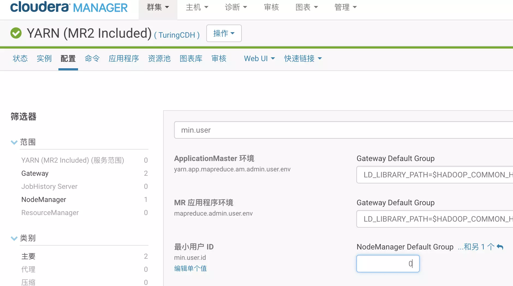

下文以本地测试集群为例, 4节点(cdh1-4), cdh1为NameNode, cdh2-4为DataNode.  
# 基础概念
Kerberos principal用于在kerberos加密系统中标记一个唯一的身份。  
kerberos为kerberos principal分配tickets使其可以访问由kerberos加密的hadoop服务。  
对于hadoop，principals的格式为username/fully.qualified.domain.name@YOUR-REALM.COM.  
keytab是包含principals和加密principal key的文件。  
keytab文件对于每个host是唯一的，因为key中包含hostname。keytab文件用于不需要人工交互和保存纯文本密码，实现到kerberos上验证一个主机上的principal。  
因为服务器上可以访问keytab文件即可以以principal的身份通过kerberos的认证，所以，keytab文件应该被妥善保存，应该只有少数的用户可以访问。  

# KDC服务安装及配置
## 安装KDC服务
选择NameNode节点(cdh1)安装KDC服务, 执行:  
```bash
yum -y install krb5-server krb5-libs krb5-auth-dialog krb5-workstation openldap-clients
```
其他节点(cdh2-4)只安装Kerberos客户端, 执行:  
```bash
yum -y install krb5-libs krb5-workstation
```
## 配置KDC服务
1.编辑/etc/krb5.conf:  

```bash
# Configuration snippets may be placed in this directory as well
includedir /etc/krb5.conf.d/

[logging]
default = FILE:/var/log/krb5libs.log
kdc = FILE:/var/log/krb5kdc.log
admin_server = FILE:/var/log/kadmind.log

[libdefaults]
dns_lookup_realm = false
dns_lookup_kdc = false
ticket_lifetime = 24h
renew_lifetime = 7d
forwardable = true
#rdns = false
default_realm = TURINGDI.COM #随意定义一个域
#default_ccache_name = KEYRING:persistent:%{uid}

[realms]
#与上面default_realm一致, 配置KDC服务所在的服务器
TURINGDI.COM = {
  kdc = cdh1
  admin_server = cdh1
}

[domain_realm]
.turingdi.com = TURINGDI.COM
turingdi.com = TURINGDI.COM
```
 2.将/etc/krb5.conf复制到每个节点的/etc/目录下.  
 3.修改/var/kerberos/krb5kdc/kadm5.acl, 配置用户名包含/admin的用户都是管理员用户:  

```bash
*/admin@TURINGDI.COM    *
```
 4.修改修改/var/kerberos/krb5kdc/kdc.conf, 配置令牌的生命周期, 并设置默认允许重新生成令牌:  

```bash
[kdcdefaults]
  kdc_ports = 88
  kdc_tcp_ports = 88

[realms]
TURINGDI.COM = {
  #master_key_type = aes256-cts
  max_renewable_life= 7d 0h 0m 0s
  default_principal_flags = +renewable
  acl_file = /var/kerberos/krb5kdc/kadm5.acl
  dict_file = /usr/share/dict/words
  admin_keytab = /var/kerberos/krb5kdc/kadm5.keytab
  supported_enctypes = aes256-cts:normal aes128-cts:normal des3-hmac-sha1:normal arcfour-hmac:normal camellia256-cts:normal camellia128-cts:normal des-hmac-sha1:normal des-cbc-md5:normal des-cbc-crc:normal
}
```

## 创建Kerberos数据库
 在cdh1执行以下命令, 注意域名:  
 ```bash
 kdb5_util create –r TURINGDI.COM -s
 ```
按提示设置密码并重复密码.  
## 创建Kerberos的管理账号
在cdh1执行:  
```bash
kadmin.local
```
依次输入:  
```bash
addprinc admin/admin@TURINGDI.COM
# 按提示设置管理账号的密码并重复密码
exit
```
## 配置服务自启动
在cdh1执行:  
```bash
chkconfig krb5kdc on
hkconfig kadmin on
service krb5kdc start
service kadmin start
```
然后尝试登陆Kerberos的管理员账号:  
```bash
kinit admin/admin@TURINGDI.COM
# 3. 输入刚才设定的管理账号密码
klist
```
应该会输出类似:
```bash
Ticket cache: FILE:/tmp/krb5cc_0
Default principal: admin/admin@TURINGDI.COM

Valid starting       Expires              Service principal
2018-03-06T16:48:23  2018-03-07T16:48:23  krbtgt/TURINGDI.COM@TURINGDI.COM
	renew until 2018-03-13T16:48:23
```
即配置成功. 

# CDH集群启用Kerberos
1. 进入Cloudera Manager的“管理”-> “安全”界面:  

2. 点击"启用Kerberos"按钮, 确保列出的所有检查项都已完成并勾选, 点击"继续"按钮:  

3. 配置相关的KDC信息，包括类型、KDC服务器、KDC Realm、加密类型以及待创建的Service Principal（hdfs，yarn,，hbase，hive等）的更新生命期等, 与/etc/krb5.conf的配置一致, 点击"继续"按钮.  
4. 取消勾选"通过Cloudera Manager管理krb5.conf", 点击"继续"按钮.  
5. 输入Cloudera Manager的Kerbers管理员账号，必须和之前创建的账号一致，点击"继续".  
6. 最后点击"继续", 勾选重启集群, 点击"继续"按钮, 等待配置重启集群.  

# AES-256加密与JCE
对于使用centos5.6及以上的系统，默认使用AES-256来加密的。这就需要集群中的所有节点上安装JCE.  
打开[http://www.oracle.com/technetwork/java/javase/downloads/index.html](http://www.oracle.com/technetwork/java/javase/downloads/index.html), 下载jdk对应的JCE文件.  
解压后的文件放入`${JAVA_HOME}/jre/lib/security/`中. 

# Kerberos的基础使用
## Yarn配置
打开Cloudera Manager的Yarn配置页面, 搜索min.user, 修改为0, 然后按提示重启Yarn.  
使用Kerberos需要新建一些用户, 其id可能小于1000, 使用Yarn的默认配置可能会导致一些用户不能提交Yarn任务.  

## 导出keytab
进入cdh1, 输入`kadmin.local`, 输入以下命令:
```bash
xst -k /path/to/*.keytab -norandkey <principal>
```
其中principal为需要导出keytab的用户名, 如hbase/cdh2, 注意-norandkey参数不可缺少, 否则可能会导致重新生成密码, 导致keytab失效.  
导出的keytab的效用等同账号密码, 请注意妥善保管.
## 以某个Kerberos用户登录
两种方法:  
1. `kinit 用户名@域名`, 输入密码;
2. `kinit 用户名@域名 -k -t 对应keytab文件`

后者无需输入密码, 适合在脚本中使用.  
一些组件对Kerberos的令牌有限制, 需要登录对应用户后才能使用, 包括HDFS的文件访问控制, 需要在Kerberos中建立对应的用户.  

## 创建Kerberos用户
前面已经使用过了, 进入cdh1, 输入`kadmin.local`, 输入以下命令:
```bash
addprinc 用户名@域名
# 按提示设置管理账号的密码并重复密码
```