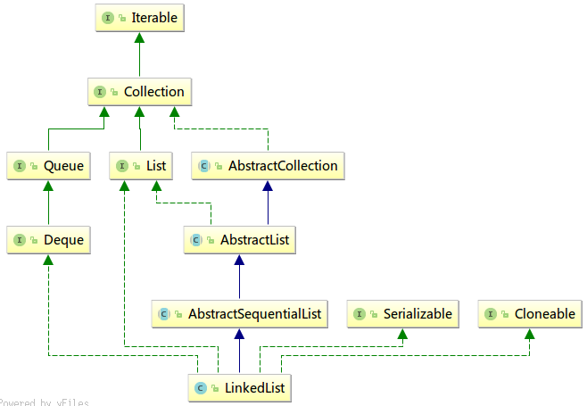

# LinkedList源码阅读笔记
## 继承结构
  
## 成员变量
```java
//记录长度
transient int size = 0;
//第一个元素的指针
transient Node<E> first;
//最后一个元素的指针（为了增加从尾部开始的速度，及支持一些增删改查尾部元素的方法）
transient Node<E> last;
```
以上成员变量都用了transient关键字避免被持久化。  

从继承结构来看，```LinkedList```继承了```AbstractSequentialList```，而```AbstractSequentialList```继承了```AbstractList```，因此```LinkedList```也继承了```protected transient int modCount```变量，具体作用与```ArayList```中一样，不再赘述。

## 构造方法
```java
public LinkedList()
```
默认构造方法，实现为空方法。  
```java
public LinkedList(Collection<? extends E> c)
```
调用```addAll()```方法将参数c中的所有元素增加到当前实例中，完成构造。

## 内部类Node
### 定义
在```LinkedList```中，使用```Node```内部类存储List的每个元素，其结构比较简单:
- ```item```存储具体的List元素引用
- ```next```和```prev```分别存储后一个和上一个元素的引用，由此构成链表。  

```java
private static class Node<E> {
    E item;
    Node<E> next;
    Node<E> prev;

    Node(Node<E> prev, E element, Node<E> next) {
        this.item = element;
        this.next = next;
        this.prev = prev;
    }
}
```

### 维护链表的基础方法
```java
/**
 * 将元素插入到链表头部
 * prev=LinkedList.next, next=null
 * 然后更新first，原来first的prev引用更新为新元素
 */
private void linkFirst(E e);

/**
 * 将元素插入到链表尾部
 * prev=null, next=LinkedList.first
 * 然后更新last，原来last的next引用更新为新元素
 */
void linkLast(E e);

/**
 * 插入到指定元素前面
 * 设置新元素的前后引用
 * 然后对应修改succ的前一项为新元素，以及原来succ的前一项的后者为新元素
 * 如果succ原来的前一项为null，那么新的LinkedList.first就是新元素
 * 我觉得可以直接进来就判断nullsucc原来的前一项时调用linkFirst()进行处理
 */
void linkBefore(E e, Node<E> succ);

/**
 * 将链表头部元素从链表中移除并返回
 * 主要任务是将LinkedList.first指向原来first的next所引用的元素
 * 同时将原来first的item以及next设为null
 * item设为null是为了原来first元素的GC回收，而next设为null是方便新的first在未来被回收
 * 最后size--，modCount++，维护边界条件并返回
 */
private E unlinkFirst(Node<E> f);

/**
 * 类似unlinkLast()，将链表尾部元素从链表中移除并返回，不再赘述
 */
private E unlinkLast(Node<E> l)；

/**
 * 将任一位置的元素从链表中移除并返回
 * 代码实现上类似于unlinkFirst()与unlinkLast()的结合
 */
E unlink(Node<E> x)
```

## 常规方法
### 维护头部尾部的方法
```java
//first为空则抛NoSuchElementException异常，否则返回first.item
public E getFirst();
//last为空则抛NoSuchElementException异常，否则返回last.item
public E getLast();

//first为空则抛异常，否则调用unlinkFirst()删除
public E removeFirst();
//last为空则抛异常，否则调用unlinkLast()删除
public E removeLast();

//调用linkFirst()进行处理，允许e为null
public void addFirst(E e);
//调用linkLast()进行处理，允许e为null
public void addLast(E e);
```

### 接口常规增删改查方法
#### 增
```java
public boolean add(E e); //调用linkLast()进行处理，并返回true
public void add(int index, E element);
```
指定下标插入元素的方法```add()```先对```index```进行下标越界检查，然后如果```index==size```，即插入到List最后面，那么直接调用```linkLast()```执行插入就可以；否则调用```linkBefore()```插入到指定下标的元素前面，即新的元素拥有```index```的下标（符合```add()```方法对```index```参数的定义）。  
```java
public boolean addAll(Collection<? extends E> c); //调用addAll(size, c)
public boolean addAll(int index, Collection<? extends E> c);
```
批量增加方法```addAll()```将参数```c```里面的元素全部逐个加到当前List中。先检查下标是否越界，然后将Collection转为Object数组，若数组长度为0则返回false。index为要插入的第一个元素所在的下标，如果不是size（最后一个元素之后），则需要读取对应插入处原来的元素及其上一个元素。
```java
Node<E> pred, succ; //插入新元素的前后元素引用
if (index == size) {
    succ = null;
    pred = last;
} else {
    succ = node(index);
    pred = succ.prev;
}
```
随后遍历Object数组，逐个生成```Node```对象，并将上一个元素的next指向当前元素。遍历完后，维护插入新元素的前/后元素的后/前引用，如果succ为null则```LinkedList.last```赋值为```pred```，同时维护```size```，更新```modCount```。  

#### 删
```java
public boolean remove(Object o);
```
删除元素的方法```remove()```类似```indexOf()```，从```first```开始遍历List，逐个元素判断是否与参数```o```相同（判断方法与```indexOf()```一样），找到后调用```unlink()```进行删除并返回true。如果没找到相同的元素则返回false。  
```java
public E remove(int index);
```
该方法删除指定下标的元素。检查下标没有越界后，调用```unlink(node(index))```删除指定元素（其中```node()```是查找指定下标的元素，详见 *查* 部分）。  
```java
public void clear();
```
清空整个List，从```first```开始，遍历整个List，把每个```Node```的```item next prev```都置为null（方便GC），以及```LinkedList```的```first last```也置为null，```size```归零。  

#### 改
```java
public E set(int index, E element);
```
将下标为```index```的元素设置为```element```，并将旧值返回。该方法在检查```index```是否越界后，先调用```node()```方法查找到指定下标的```Node```元素，直接修改```Node```实例的```item```属性为新值，并返回旧值（而不是新建一个```Node```，这样既减少操作，也减少多余的对象，从而减轻GC负担）。  

#### 旧的查找方法
```java
public boolean contains(Object o);
public int indexOf(Object o);
public int lastIndexOf(Object o);
```
方法```contains()```判断当前List是否包含指定元素，返回```indexOf(o) != -1```。  
方法```indexOf()```从```first```开始通过```next```引用遍历List，逐个元素判断是否与参数```o```相同（o为null则用```item==null```进行判断，o非null则调用```o.equals(item)```进行判断），与ArrayList的实现类似。  
方法```lastIndexOf()```的实现与```indexOf()```类似，只是查找的起点改成```last```，且遍历的方向相反。  
```java
public int size(); //返回size属性
```
```java
Node<E> node(int index);
public E get(int index);
```
前者```node()```方法是通过遍历从链表中查找到指定下标的元素，其中有个优化，如果查找的下标大于```size```的一半则从```last```引用开始找，否则从```first```引用开始找。  
后者```get()```方法在检查```index```参数没有越界后，调用前者进行查找。  

#### *JDK5* 开始引入的方法  
```java
//获取但不移除该List的头部，first为null时返回null
public E peek();
//获取但不移除该List的头部，调用getFirst()，first为null时抛NoSuchElementException异常
public E element();

//获取并移除该List的头部，first为null时返回null，否则调用unlinkFirst()处理
public E poll();
//获取并移除该List的头部，调用removeFirst()，first为null时抛NoSuchElementException异常
public E remove();

//将指定元素添加到该List的尾部，调用add()方法处理
public boolean offer(E e);
```
#### *JDK6* 开始引入的方法    
```java
//在该List的开头插入指定的元素，调用addFirst()方法，后者又调用linkFirst()处理，返回true
public boolean offerFirst(E e);
// 在该List末尾插入指定的元素，调用addLast()方法，后者又调用linkLast()处理，返回true。实际实现与offer()一致
public boolean offerLast(E e);

// 获取但不移除该List的第一个元素；如果该List为空，则返回 null。实现与peek()一样
public E peekFirst();
//获取但不移除该List的最后一个元素；如果该List为空，则返回 null。实现与peek()类似
public E peekLast();

//获取并移除该List的第一个元素；如果该List为空，则返回 null；实现与poll()一样
public E pollFirst();
//获取并移除该List的最后一个元素；如果该List为空，则返回 null；否则调用unlinkLast()进行处理
public E pollLast();

//将元素推入该List所表示的堆栈。实际调用addFirst()进行处理
public void push(E e);
//从该List所表示的堆栈处弹出一个元素。实际调用removeFirst()进行处理
public E pop();

//从该List中移除第一次出现的指定元素（从头部到尾部遍历列表时）。调用remove(o)进行处理
public boolean removeFirstOccurrence(Object o);
//从该List中移除最后一次出现的指定元素。从last开始向前遍历，找到与o相同的元素;
//再调用unlink()进行删除处理，返回true；遍历完后还找不到对应元素则返回false。
public boolean removeLastOccurrence(Object o);
```
可以看到 *JDK6* 新增的这些方法实际上是对 *JDK5* 新增的方法的扩展，从默认的操作（可能是针对头部或尾部）扩展到对头部和尾部的操作。  

### 边界检查方法
```java
//是否合法的元素下标
private boolean isElementIndex(int index);
//对迭代器和add()方法而言是否合法下标（允许等于size）
private boolean isPositionIndex(int index);

//生成报错信息字符串
private String outOfBoundsMsg(int index);

//检查是否合法的元素下标，不合法则抛IndexOutOfBoundsException异常
private void checkElementIndex(int index);
//检查对迭代器和add()方法而言是否合法下标，不合法则抛出IndexOutOfBoundsException异常
private void checkPositionIndex(int index);
```

### 其他方法
```java
//先调用父类的clone方法复制（其实是Object的本地方法），
//然后遍历原List，逐个add到克隆后的新List中并返回
public Object clone();

//List转数组
//根据size新建一个Object数组，遍历List，逐个Node的item属性加到Object数组中
public Object[] toArray();
//如果a的长度小于size，需要调用java.lang.reflect.Array.newInstance(方法新建一个size长度的T[]数组
//然后遍历List，将每个Node元素的item属性复制到数组中
//最后将下标为size的元素置为null（标识数组结束， 数组长度大于size才有这个操作）并返回
public <T> T[] toArray(T[] a);

//序列化方法
//写入到输出流，先写入size，然后遍历List逐个Node元素的item属性写入输出流
private void writeObject(java.io.ObjectOutputStream s);
//读取输入流构造List，先读入一个int作为size，
//然后从输入流读取size次，每次读取的对象强转为E类型，并调用linkLast()加入到L链表尾部
private void readObject(java.io.ObjectInputStream s);
```

### *JDK8* 开始引入的方法
```java
//spliterator：返回一个内部类static final class LLSpliterator<E> implements Spliterator<E> 的实例。
//为了并行遍历数据源中的元素，Stream.isParallel()实现调用。
//关于Spliterator接口在ArrayList源码的笔记里有介绍，在此不再赘述
//这个实现类在final int getEst()est = LinkedList的size，expectedModCount = LinkedList的modCount
public Spliterator<E> spliterator();
```

## 迭代器
### 获取迭代器的方法
```java
//返回此列表中的元素的列表迭代器（按适当顺序），从列表中指定位置开始。
//检查下标越界后，返回LinkedList的内部类ListItr的实例
public ListIterator<E> listIterator(int index);
//返回以逆向顺序在此双端队列的元素上进行迭代的迭代器。
//返回的是LinkedList的内部类DescendingIterator的实例
public Iterator<E> descendingIterator();

//返回父类AbstractList的内部类ListItr实例
public Iterator<E> AbstractSequentialList.iterator();
```
### 迭代器ListItr
包含以下成员变量：
```java
//next()，previous()，remove()，set()，add()等方法返回的Node元素记录
private Node<E> lastReturned;
//当前游标指向的Node元素
private Node<E> next;
//当前游标的下标值
private int nextIndex;
//记录应有的modCount，迭代器对链表进行修改后会更新modCount，
//而迭代器以外对链表的操作不会更新这个属性，
//因此外部操作后再进行迭代器的操作会抛出ConcurrentModificationException异常
private int expectedModCount = modCount;
```
其余```ListIterator```接口方法的具体实现在此不表，与```ArrayList```的```ListItr```的实现类似，只是在一些修改链表的方法里需要对应修改前后元素的引用而已，此外上一个下一个的迭代效率也较高（直接读取Node元素的prev/next引用）。

### 迭代器DescendingIterator
该迭代器是为了实现```java.util.Deque```接口的```Iterator<E> descendingIterator()```方法。  
具体实现还是用前面介绍的```LinkedList```的内部类```ListItr```。由于是反向的迭代器，因此用私有变量
```java
private final ListItr itr = new ListItr(size());
```
实现从链表尾部开始迭代。  
从尾部迭代到头部的迭代方式（反向迭代）从其他几个方法的具体实现也可以看出来，比较简单，只贴出代码就算了：
```java
public boolean hasNext() {
    return itr.hasPrevious();
}
public E next() {
    return itr.previous();
}
public void remove() {
    itr.remove();
}
```
可以看出并没有去重写 *JDK8* 的
```java
default void forEachRemaining(Consumer<? super E> action)
```
方法。
