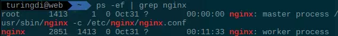

最近总结了一些技术文档，原本用于组内分享的，发到博客里备忘。

# Nginx概述
## 简介
Nginx是一个自由、开源、高性能及轻量级的HTTP服务器及反转代理服务器，以其高性能、稳定、功能丰富、配置简单及占用系统资源少而著称。  
Nginx 超越 Apache 的高性能和稳定性，使得国内使用 Nginx 作为 Web 服务器的网站也越来越多。

## 基础功能
+ 处理静态文件，索引文件以及自动索引；
+ 反向代理加速(无缓存)，简单的负载均衡和容错；
+ FastCGI，简单的负载均衡和容错；
+ 模块化的结构。过滤器包括gzipping, byte ranges, chunked responses, 以及 SSI-filter 。在SSI过滤器中，到同一个proxy或FastCGI的多个子请求并发处理；
+ SSL 和 TLS SNI 支持。

## 优势
Nginx**专为性能优化而开发**，性能是其最重要的考量, 实现上非常注重效率 。它支持内核Poll模型，能经受高负载的考验, 有报告表明能支持高达50,000个并发连接数。  
Nginx作为负载均衡服务器: Nginx 既可以在**内部直接支持 Rails 和 PHP 程序**对外进行服务, 也可以**支持作为 HTTP代理服务器**对外进行服务。  
Nginx**具有很高的稳定性**。其它HTTP服务器，当遇到访问的峰值，或者有人恶意发起慢速连接时，也很可能会导致服务器物理内存耗尽频繁交换，失去响应，只能重启服务器。例如当前apache一旦上到200个以上进程，web响应速度就明显非常缓慢了。而Nginx采取了分阶段资源分配技术，使得它的CPU与内存占用率非常低。  
nginx官方表示保持10,000个没有活动的连接，它只占2.5M内存，就稳定性而言, nginx比lighthttpd更胜一筹。  
Nginx**支持热部署**。它的启动特别容易, 并且几乎可以做到7*24不间断运行，即使运行数个月也不需要重新启动。你还能够在不间断服务的情况下，对软件版本进行进行升级。  
Nginx采用C进行编写, 不论是**系统资源开销还是CPU使用效率**都比 Perlbal 要好很多。

#	Nginx安装
## 下载
到官网下载最新的稳定版：
[nginx: download](http://nginx.org/en/download.html)

## 环境准备
准备gcc等编译环境：
```bash
sudo apt-get install libpcre3 libpcre3-dev openssl libssl-dev make build-essential gcc
```
## 编译安装
将下载到的.tar.gz包解压，进入解压后的目录，输入以下命令进行编译：
```bash
./configure
make
sudo make install
```
即可安装到/usr/local/nginx中。  
如果需要SSL，可安装OpenSSL，有些Linux发行版自带OpenSSL无需额外安装，需要安装的到OpenSSL官网下载.tar.gz包解压编译即可。
## 启动&关闭
### 启动
执行
```bash
sudo /usr/local/nginx/sbin/nginx
```
启动Nginx。  
一般make install后会安装到PATH中，可以直接执行sudo nginx。
执行nginx -v显示Nginx版本。
### 重新加载配置文件
```bash
sudo nginx -s reload
```
### 关闭
Nginx没有提供关闭的方法，只能通过ps找到进程ID后，用kill命令关闭。  
如 强制退出 sudo kill-9 [PID]，或发送其他退出的指令如TERM。  
注：nginx包含worker和master两个进程，强制关闭时两者均需关闭：


# Nginx配置
下面以DSP业务平台的Nginx配置为例进行讲解：
```bash
#user  nobody;
worker_processes  1;

#根据CPU核数设定worker工作的CPU核心mask
#worker_cpu_affinity 1000;

#error_log  logs/error.log;
#error_log  logs/error.log  notice;
#error_log  logs/error.log  info;

#pid  logs/nginx.pid;

events {
 worker_connections  1024;
}

http {
 include mime.types;
 default_type  application/octet-stream;

 log_format mylog '$remote_addr$time_local$request$http_referer$status$body_bytes_sent$request_time';
 access_log logs/access.log mylog buffer=32k flush=5s;

 sendfile  on;
 #tcp_nopush  on;

 #keepalive_timeout  0;
 keepalive_timeout  1000;

 #gzip  on;

 server {
  listen 80;
  server_name  iad.turing.asia;
  location / {
#设置真实ip
proxy_set_header real_ip $remote_addr;
proxy_pass http://dsp:8080;
  }
 }

 server {
  listen 80;
  server_name  tag.turing.asia;
  location / {
#设置真实ip
proxy_set_header real_ip $remote_addr;
proxy_pass http://tag:8080;
  }
 }

 server {
  listen 80;
  server_name  cm.turing.asia;
  location / {
#设置真实ip
proxy_set_header real_ip $remote_addr;
 #  proxy_redirect off;
proxy_pass http://cm:8080;
  }
 }
}
```

## 基本配置
### user
+ 语法: user user [group]  
+ 缺省值: nobody nobody  
指定Nginx Worker进程运行用户，默认是nobody帐号。

### error_log
+ 语法: error_log file [ debug | info | notice | warn | error | crit ]  
+ 缺省值: ${prefix}/logs/error.log  
制定错误日志的存放位置和级别。

### worker_processes
+ 语法: worker_processes number  
+ 缺省值: 1  
指定工作进程数。nginx可以使用多个worker进程。

### worker_cpu_affinity
+ 语法: 3.1.4.worker_cpu_affinity cpumask  
执行Nginx在哪个/些CPU上工作，默认由系统接管（可以在所有核心上运行）。  
如，有8个CPU线程（包括超线程），指定使用第0个CPU则配置为00000001，指定使用第7和第1个CPU线程则配置为10000010。

## Event模块
Nginx的默认配置中包含一个默认的Event模块，其中只包含worker_connections配置。
###	worker_connections
+ 语法：worker_connections number  
每个worker的最大连接数。通过worker_connections和worker_proceses可以计算出maxclients： max_clients = worker_processes * worker_connections。作为反向代理，max_clients为： max_clients = worker_processes * worker_connections/4，因为浏览器访问时会通过连接池建立多个连接。

## HTTP模块
Nginx最常用的是HTTP模块。
### 基本配置
HTTP中大部分基本配置无需修改，除了：
+ keepalive_timeout  1000;配置Keep-Alive的超时，单位为秒；
+ gzip  on;配置是否开启Gzip压缩，开启后可以提高网站访问速度；
+ log_format 配置日志格式，access_log配置日志路径和使用的格式，在此不细述。

### server作用域
HTTP模块中最常配置的是server作用域。
```bash
server {
  listen 80;
  server_name  cm.turing.asia;
  location / {
    #设置真实ip
    proxy_set_header real_ip $remote_addr;
    proxy_pass http://cm:8080;
  }
}
```

#### listen
+ 语法: listen address:port
+ 默认值： listen 80
+ 作用域: server
指定当前虚拟机的监听端口。

#### server_name
当前server匹配的用户请求路径的主机名，主要用于配置基于名称的虚拟主机，支持通配符*和正则表达式（以波浪线~起头）。  
server_name指令在接到请求后的匹配顺序分别为：准确的server_name匹配，以*通配符开始的字符串，以*通配符结束的字符串、匹配正则表达式。nginx按以上顺序依次匹配，只要有一项匹配以后就会停止搜索。  
举例： 先后配置了两个server， server_name分别配置为cm.turing.asia和*.turing.asia，当用户请求cm.turing.asia时，访问第一个server，用户访问test.turing.asia时访问第二个server。

#### location
+ 语法：location 匹配字符串 { 操作语句 }  

一个server中可以有多个location，用于匹配请求路径。  
匹配的优先级与server_name相同。  
location的操作语句中：  
可以用proxy_set_header设定/增加HTTP请求头。上面的例子中，用proxy_set_header real_ip $remote_addr;将远程主机的真实IP加到HTTP请求头的real_ip字段中，因为收到Nginx转发的服务器读取到的远程主机IP为Nginx的IP，丢失了真实的用户IP信息，所以在此加上。  

location中还可以使用if语句结合正则表达式进行请求的判断，比如根据请求中的Refer和请求资源类型，使用**valid_referers**禁用外站Refer的图片资源请求，以实现防盗链，在此不细述。  
更常用的是proxy_pass 作反向代理，将请求转发到指定的服务器。  
在上面的例子中，因为同一台Tomcat服务器中有多个项目，而经过Nginx转发的请求，会将请求的主机替代为proxy_pass中配置的主机，所以如果proxy_pass中填写的是Tomcat服务器的内网地址，则Tomcat无法分辨用户原本想访问的域名，亦即难以在server.xml中配置不同的域名绑定不同项目。  
因此，我们在Nginx的服务器中配置hosts，将多个自定义的主机名绑定到Tomcat服务器的IP中；同时，在Nginx的配置中，location的proxy_pass不再配置为Tomcat服务器的IP而是hosts中我们设定的server_name对应的主机名。最后Tomcat的server.xml也相应地配置Host节点的name属性：
```xml
<!--Tomcat服务器的server.xml 片段：-->
<Host name="cm"  appBase="cmserv" unpackWARs="true" autoDeploy="true">
　　<Context path="turingcm" docBase="turingcm" reloadable="true" />
</Host>
```

## 负载均衡配置
首先在HTTP模块中定义多台服务器构成的负载均衡：  
```bash
upstream rtb{
  server 127.0.0.1:8080 weight=5;
  server 127.0.0.1:8081 weight=5;
  …………
  server 127.0.0.1:8085 backup;
}
```
每台服务器为一行，填写IP和端口，并在weight中填入负载均衡的权重（正整数，默认为1），注意分号。以上例子将该负载均衡配置命名为”rtb”。IP和端口后面填backup的表示备用服务器，当其他非backup的服务器均忙或宕机时，会分发请求到backup服务器上。  
然后在location中，配置**proxy_pass http://[负载均衡名];** 即可，即该server和location定义的域名规则和访问路径规则匹配到的请求将按weight分发到以上几台服务器/服务中。

## 动静分离
tomcat是一个比较全面的web容器，对静态网页的处理，应该是比较费资源的，特别是每次都要从磁盘读取静态页面，然后返回。这中间会消耗Tomcat的资源，可能会使那些动态页面解析性能影响。  
```bash
//静态资源    
location ~ .*\.(js|css|htm|html|gif|jpg|jpeg|png|bmp|swf|ioc|rar|zip|txt|flv|mid|doc|ppt|pdf|xls|mp3|wma)$ { //静态资源到nginx服务器下static获取
     root static;
     expires 30d; //设置缓存期限
}
 //动态资源
 location ~ .*$ { //动态请求转发到tomcat服务器
    proxy_pass http://127.0.0.1:8080;
 }
```
动静分离的原理：Nginx配置中，通过location的配置，结合正则表达式，根据请求路径判断当前请求是否静态资源，如果是，则通过** root static;** 配置直接读取/usr/local/nginx/static下面对应相对路径的资源。如果是jsp等动态资源，则转发到Tomcat服务器。   
注意，可以使用** root [绝对路径];**， 不一定要将静态资源放在Nginx目录下。
这里将静态资源的location放在前面优先匹配（同样是正则匹配的情况下）。  
在此基础上，也可以通过不同的正则对不同的静态资源类型配置不同的缓存期限，如创意等图片可能会变动，缓存期限设小一点，而js/css等静态资源基本不变，缓存期限可以设长一点。
