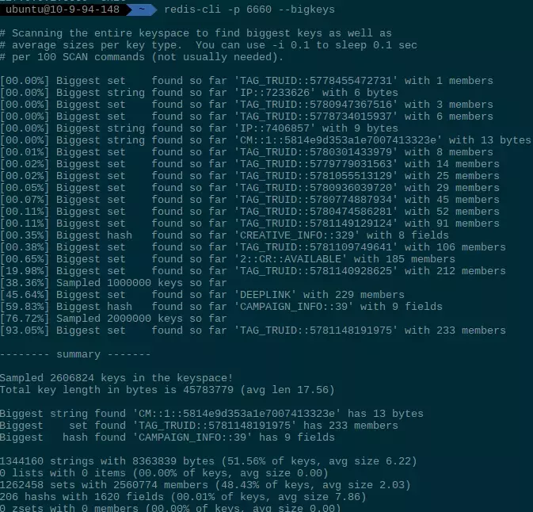
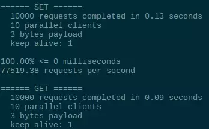
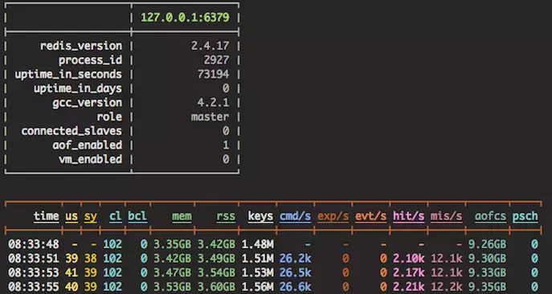

这篇也是组内分享的文档，整理了之前两篇Netty+Redis的文章，加入了一些Redis调优相关的命令和内容。

# Redis性能瓶颈
## TCP连接
Redis协议基于TCP/IP协议，受限于TCP连接建立的速度（三次握手等），及网络中数据传输的速度。

## 数据包大小
Redis官方的一项测试显示，对于1k~10k以下的数据，Redis的吞吐量变化并不明显，吞吐量曲线在1k~10k左右出现拐点，如下图。  


## 单线程
Redis服务器为C语言编写，使用异步非阻塞IO，目前坚持使用单线程（可能出于线程锁的效率考虑）。对于高并发访问+多核CPU场景而言，并不能充分使用CPU资源，可能发生某核心占用率很高，其他核心空闲，但Redis请求阻塞在队列中的情况。  
搭建Redis集群可以解决该问题，但集群节点间访问引起的网络IO延时又带来新的问题。
# Redis性能监控/测试
## info命令
redis-cli中输入info可以显示当前Redis服务器的全部状态信息。这些信息按照内容被分成了很多部分，可以用额外的参数来单独获取，如下：

| 参数名 | 	说明 |
| :------------- |:-------------|
| server |	获取 server 信息，包括 version, OS, port 等信息|
| clients |	获取 clients 信息，如客户端连接数等|
| memory |	获取 server 的内存信息，包括当前内存消耗、内存使用峰值|
| persistence |	获取 server 的持久化配置信息|
| stats |	获取 server 的一些基本统计信息，如处理过的连接数量等|
| replication |	获取 server 的主从配置信息|
| cpu |	获取 server 的 CPU 使用信息|
| keyspace |	获取 server 中各个 DB 的 key 的数量|
| cluster |	获取集群节点信息，仅在开启集群后可见|
| commandstats |	获取每种命令的统计信息，非常有用|

## slowlog命令
redis.conf中配置：
```bash
  slowlog-log-slower-than 10000
  slowlog-max-len 128
```
意为：如果一条命令的响应时间超过了 10000us (即 10ms) ，那么将会作为 "slow command" 被记录，并且将只保留最新的128条记录。  
在redis-cli中使用slowlog get N可以显示最新产生的N条慢操作：  
  
每条语句有四个描述字段，分别表示慢日志序号（最新的记录被展示在最前面）、这条记录被记录时的时间戳、这条命令的响应时间（单位：us 微秒）、这条命令的内容。  
可以根据slowlog的记录优化对应的语句。

## bigkeys命令
使用方法：
```bash
redis-cli -h <host> -p <port> --bigkeys
```
这条命令会从指定的 Redis DB 中持续采样，实时输出当时得到的 value 占用空间最大的 key 值，并在最后给出各种数据结构的 biggest key 的总结报告，如下图：  
  

## latency命令
使用方法：
```bash
redis-cli -h <host> -p <port> --latency-history
redis-cli -h <host> -p <port> --latency
```
区别仅在于：前者每隔15秒生成一条记录（这15秒内的测试结果），后者持续更新测试结果，如下图：  
  

## redis-benchmark测试
使用方法：
```bash
redis-benchmark -h <host> -p <port> -c <并发数> -n <请求次数>
```
执行后，redis-benchmark会对各个命令分别进行测试，测试结果较长，在此截取部分如下：  
  

## 第三方统计分析工具redis-stat
redis-stat采用ruby开发，利用redis-cli info 提供的原始数据，给用户提供基于文本列表或web图表方式展现的各种关键数据。
redis-stat 开源网址: https://github.com/junegunn/redis-stat  
  

# Redis性能调优
## 使用Pipeline
对于Redis读写，有很大一部分的耗时是在网络IO上，尤其是Redis(集群)与应用不在一台服务器上时；此时，对于一些连续的操作，尽量使用pipeline批处理。若批量的命令使用到的key要求在执行过程中不被其他请求修改，则需要用redis事务，效率还是比pipeline低。
```java
Jedis jedis = RedisUtils.getSingleJedis(false);//获取Jedis连接
Pipeline pl = jedis.pipelined();//获取Pipeline
Response<String> resp1 = pl.get(“key1”);//Pipeline压入命令并保存Response引用
Response<String> resp2 = pl.get(“key2”);
pl.sync();//Pipeline执行批处理
System.out.println(“key1’s value = ” + resp1.get());//从Response获取执行结果
System.out.println(“key2’s value = ” + resp2.get());
RedisUtils.close(pl);//关闭Pipeline
RedisUtils.close(jedis);//关闭Jedis连接
```
要注意的是Pipeline一次传输的key或数据也不宜过多，参考本文1.2小节。

## 使用Lua脚本
灵活利用Lua脚本，可减少Redis的网络IO。Redis支持在服务器上运行Lua脚本完成一些简单运算。Redis尽管对Lua脚本有很多限制，但的确能提高效率，对于一些Redis原生API不能满足的批量操作，比如读取多个key再进行简单计算，如果将这些key的值分别读取到本地，再进行计算，会发生多次网络IO，那么可以用上面的pipeline，而效率更高的方法是将这些计算写成Lua脚本。  
我们的RTB目前使用Lua脚本的流程如下：  
1. 配置一个监听Servlet上下文初始化的Listener（com.turingdi.rtb.service. PropertiesLoadListener），执行读取配置文件、Redis连接等初始化操作；
2. /该Listener初始化Redis时，将指定的多个Lua脚本文件读入内存（com.turingdi.rtb.utils.RedisUtils的loadScripts()）；
3. 使用Redis的SCRIPTLOAD命令，将Lua脚本加载到Redis服务器，返回一个SHA码，保存到RedisUtils类中；
4. 竞价过程中需要调用Lua脚本时，调用Redis的EVALSHA命令，使用初始化时拿到的SHA进行Lua脚本调用，返回计算结果。  
```lua
--计算QPS，QPS这个key只保留1s，不存在的时候设置为1并设置生命周期为1，存在的时候直接加1
local isExist = redis.call('EXISTS', 'QPS')
if isExist == 0 then
  redis.call('INCR', 'QPS')
  redis.call('EXPIRE', 'QPS', '1')
else
  redis.call('INCR', 'QPS')
end
--处理请求数和响应数的统计
redis.call('INCR', KEYS[1])
if ARGV[1] == '1' then
  redis.call('INCR', KEYS[2])
end
```
本文不对Lua脚本进行详细阐述，有需要的可以参照以下网页/文档：  
+ http://redisdoc.com/script/index.html
+ https://www.oschina.net/translate/intro-to-lua-for-redis-programmers
+ http://origin.redisbook.com/feature/scripting.html
+ http://wiki.jikexueyuan.com/project/redis/lua.html

## 使用本地的Redis
Redis尽量放在本地，减少网络IO时间；对相应时间要求高的，尽量不要用云服务商提供的Redis服务，读写速度比不上本地的。

## 主从复制/读写分离
Redis放在本地，在服务器集群环境下就有数据同步的问题。之前尝试过很多方案，Redis自己的Ruby集群、Twitter的Twemproxy等等，都不适合RTB使用——这些集群更多地考虑可用性和数据分片、扩容性，但对一些多键操作支持很差，而且也有各种缺陷（如使用Redis自带的Ruby集群，至少3主3从，可以建好3主3从的集群之后，手动移动Slot到同一台主机，删除其他主机，变成1主3从，但这个集群一旦关闭就无法启动）。  
考虑到RTB使用的Redis读多写少，所以最后使用的方案是Redis自带的主从复制，集群的不同的服务器之间只需要一台主机作为Redis主机，其他服务器的Redis服务设置slaveof属性，作为其从机。此外，可以将从机的只读属性设为no，但往Slave写入的数据会在下一次同步的时候被Master的数据所覆盖——这样做的目的在于写入一些临时缓存变量。  
redis.conf配置如下：
```bash
  slaveof <Master IP> <Master端口>
  slave-read-only no
```
只有一台服务器的情况下，如果是多核服务器（16核及以上），由于Redis是单线程的，只能利用一个CPU内核，只开一个Redis服务实例可能压力很大（可以从CPU占用看出来），此时也可以使用上面提到的主从复制功能，在同一台服务器上开启多个Redis实例分担查询压力，提高并发性能。  
Linux系统中，可以使用：  
```bash
taskset -cp [CPU核心号码，从0开始] [要执行的命令]
```
来指定要执行的命令在哪些CPU内核上运行，在多核服务器上，可以合理利用此命令来分配CPU资源，如指定多个Redis和Netty分别运行在多个内核上，并指定哪个Netty服务使用哪个Redis服务（需要自己编写Netty服务，读取配置文件，使用不同端口的Redis服务），避免资源浪费和拥挤。  
目前RTB在一台服务器上部署了一个Master节点（端口6660）和5个Slave节点（端口6661-6665），即只有一个对外可写入的Redis服务，其他Redis服务只能读，保证了读的性能。启动的脚本如下：
```bash
#!/bin/bash
kill -9 $(ps -ef | grep redis-server | grep -v grep | awk '{print $2}')

cd /usr/local/redis/6660
taskset -c 0 redis-server redis.conf
cd /usr/local/redis/6661
taskset -c 1 redis-server redis.conf
…………
cd /usr/local/redis/6665
taskset -c 5 redis-server redis.conf
```

## 计算缓存
Redis指令的优化及自定义计算缓存。利用SLOWLOG我们可以找到执行比较慢的命令，从而进行优化。  
比如RTB系统在测试一段时间之后，通过SLOWLOG命令得知耗时较长的都是用户人群标签的并集操作，而这个操作与请求的具体内容有关。所以后来设定了一个计算缓存，通过EXPIRE命令设置缓存的生命周期（随着时间推移，人群标签的计算结果是不一样的，需要定时更新），每次新的请求在计算这一步时，先查询缓存中是否存在计算结果，存在的话直接读取，不存在（全新的计算或旧的已过期）则重新计算并放入运算缓存。（详见com.turingdi.rtb.service.CampaignService）  

## 压缩key和value
在数据量大的情况下，压缩key和value的长度不管对存储还是网络传输都有利。
