最近在CDH集群部署Sentry和Kerberos遇到了不少坑, 把过程总结一下, 都放上来吧.  

## Sentry组件安装
进入Cloudera Manager页面, 点击集群名右边的倒三角按钮, 选择"添加服务":  
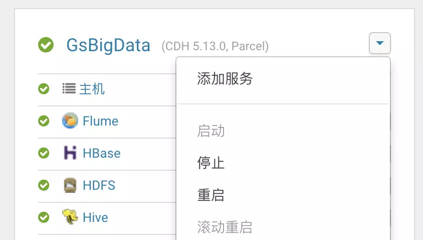  
选择Sentry组件, 点击"继续":  
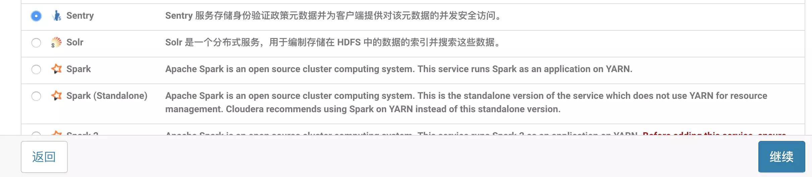  
选择集群主节点作为Sentry Server, 选择所有节点为Gateway, 然后点击"继续":  
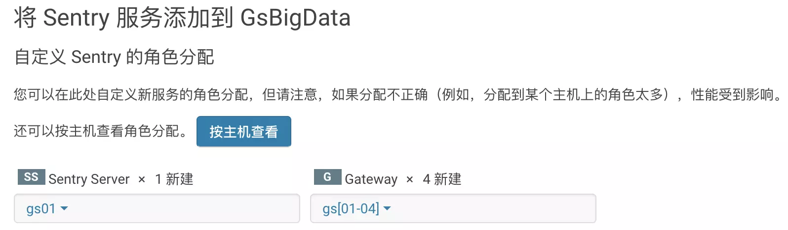  
在集群元数据MySQL中执行:
```sql
create database sentry default character set utf8 default collate utf8_general_ci;
grant all on sentry.* to 'sentry'@'%' identified by 'sentrypassword';
```
创建Sentry所需的数据库, 然后在Sentry安装页面中填上MySQL的地址账号密码, 点击继续, 等待安装和首次启动完毕.  

## Sentry及相关组件配置
### Hue配置
进入Hue配置, 找到"Sentry 服务", 选择Sentry:  
  
## Hive配置
进入Hive配置, 找到"Sentry 服务", 选择Sentry:  
  
找到"HiveServer2 启用模拟", 取消勾选:  
  
找到"sentry-site.xml 的 Hive 服务高级配置代码段（安全阀）", 增加`sentry.hive.testing.mode`属性, 值为`true`:  
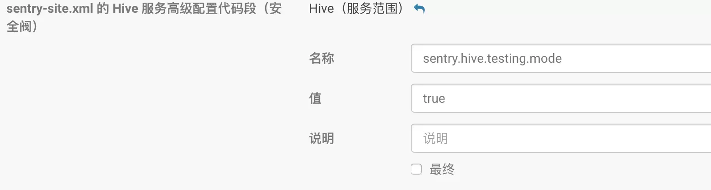  
### Impala配置
注: 需要确认集群每个节点都安装了Impala Daemon服务;如果Impala启动时提示cannot read or execute the parent directory of dfs.domain.socket.path, 则HDFS配置的dfs.client.read.shortcircuit勾选上, 并创建dfs.domain.socket.path的目录.  
进入Impala配置, 找到"Sentry 服务", 选择Sentry:  
  
### HDFS配置
进入HDFS配置, 找到"启用访问控制列表 dfs.namenode.acls.enabled", 勾选:  
  
### 重启集群
Cloudera Manager会提示过期配置需要重启组件, 点击黄色圆形箭头, 点击"重启过时服务", 并等待重启完成:  
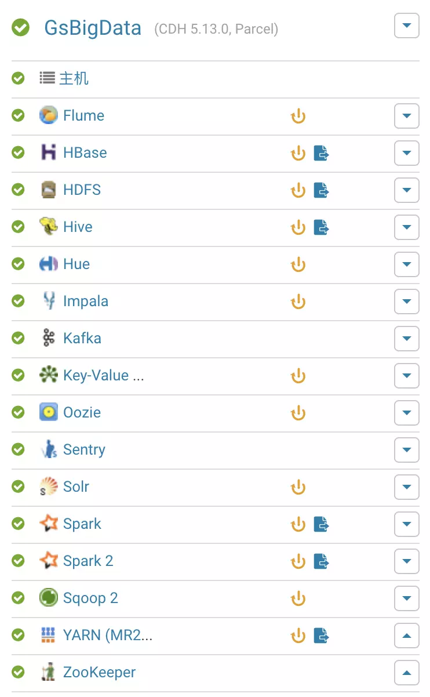  

## Hue用户权限配置
### 前提
Hue的用户权限体系是: 每个用户属于一个或多个组, 每个组可以配置其Hue页面访问权限及Hive/Solr/HDFS数据访问权限, 数据的访问权限由角色定义, 而用户组和角色之间是多对多关系.  
Hue使用Sentry进行权限管理之后, 要求登录Hue的用户及其组需要在Sentry Server节点(以正式环境为例, 即gs01节点)Linux系统中存在对应的用户和组, 否则无法进行权限控制.  
目前已经在Hue创建了一个hdfs用户组(拥有最高权限), 包含用户admin及hdfs, 两者在gs01节点Linux系统中均存在. hdfs用户的存在主要考虑到Spark程序通过hue的oozie工作流提交时, 保证其执行权限.  
下文假定需要建立一个用户组hiveselect和用户hive1, 允许登录, 拥有部分hive表的select权限.
### 创建Linux用户
ssh登录gs01节点, 执行:
```bash
groupadd hiveselect
useradd -f hiveselect hive1
```
P.S. 上面命令建立的用户是没有密码的, 需要密码或其他选项的请自行添加参数.   
### 创建Hue用户
使用admin或hdfs用户登录Hue, 点击右上角用户名, 选择"Manage users":  
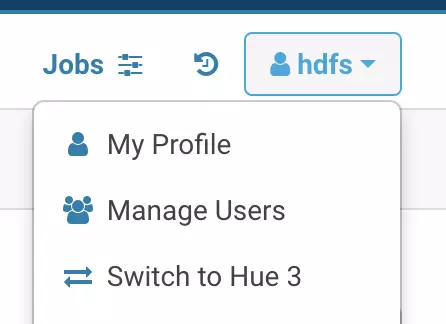  
点击"Group"选项卡, 点击"Add Group"按钮, "Name"填Linux的组名"hiveselect", "members"为该组用户, 可以后期选择, "permissions"是该组用户的Hue页面访问权限, 其中"beeswax.access:Launch this application(2)"必选; 如果需要hive查询, 则需要选择"metadata.access:Launch this application(23)"和"metastore.access:Launch this application(12)", 其他组件请根据具体需求而勾选:  
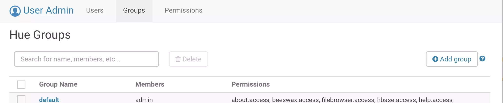  
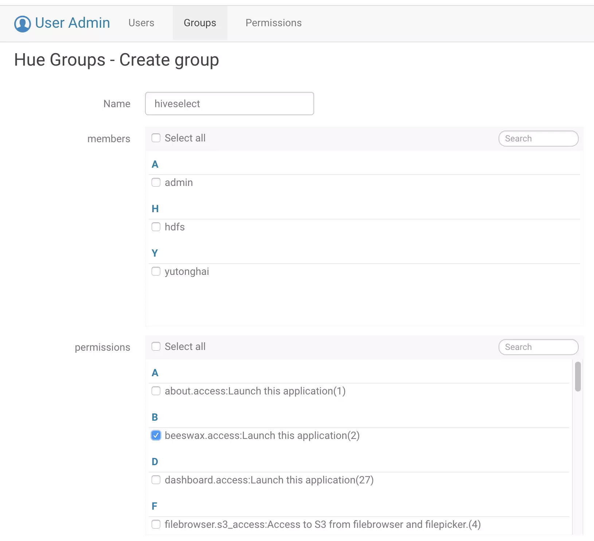  
然后点击"Add group"按钮增加组.  

随后点击"Users"选项卡, 点击"Add user"按钮, Step 1填用户名(与Linux用户名一致)和Hue登录密码, Step 2选择所属用户组为"hiveselect"(与Linux用户组一致), 最后点击"Add user"按钮: 
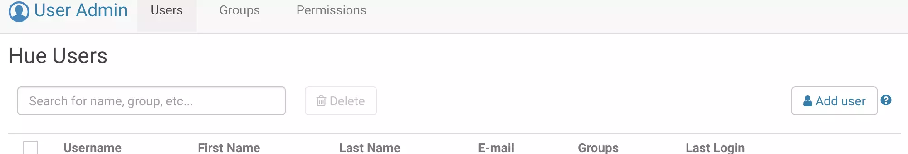  
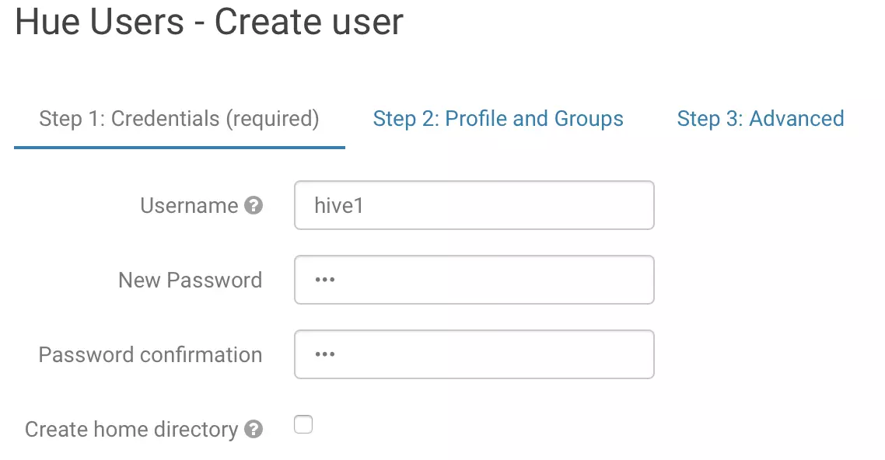  
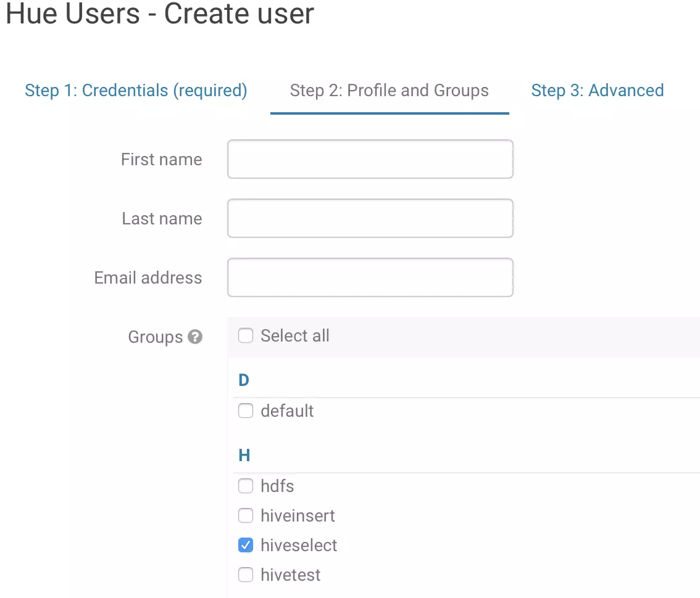  

### 配置角色权限
点击左上角≡按钮, 再点击"Security", 选择Hive Tables选项卡, 进行Hive访问权限配置.  
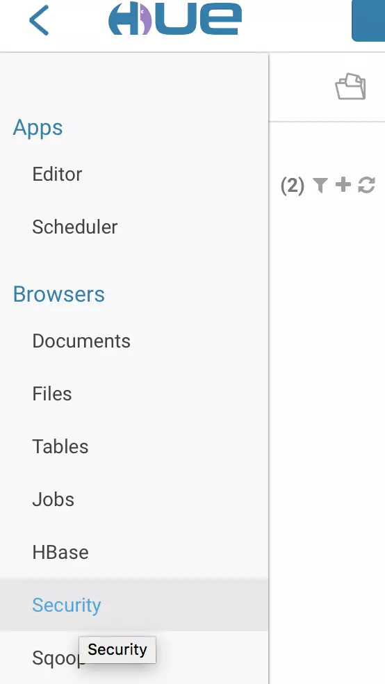  
左侧选择Roles, 点击右边的"Add"按钮, "Name"中填写角色名, 可随意填写, "Groups"选择需要授予该角色的用户组, 此处选择了我们现在要处理的hiveselect用户组, "Privileges"中点击加号, 增加权限, 可以填写权限类型(select/insert/all), 及对应权限的库/表/列, 一个角色可以增加多条权限规则:  
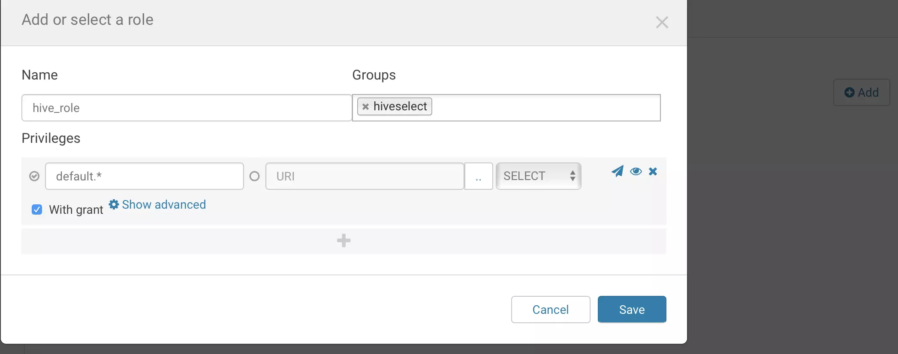  
填写完毕之后, 点击Save按钮, 稍等片刻即可生效(按目前经验来看, 新增的组可能需要3-5分钟才能生效, 已经配置过的组修改访问权限的话几乎是立刻生效).  
### Hive最高权限
Hue中配置的Hive权限是针对表的读写权限的, 并没有涉及到建库建表的权限, 使用管理员用户可以赋予该权限, 进入hue
的Hive编辑器, 执行:  
```sql
grant all on server server1 to role hue角色名;
```