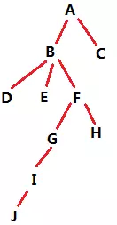

# 需求
  
对于类似上图所示的树状结构数据，统计每个节点的总子孙数、每个节点在各层的子孙数。  
比如B的总子孙数就是7（D/E/F/G/H/I/J），F的一级子孙数为2（G/H），F的二级和三级子孙数都为1（分别对应I和J）。  
注：此处用字母代替节点ID，是为了与级别区分，方便描述和理解，实际的节点ID并非如此。  

## 数据结构
树状关系在采集初期，是通过Netty搭建的微服务保存在HBase中，再通过Spark定期计算，保存到关系型数据库MySQL中。在MySQL中的表结构及保存的数据如下（经过精简，只保留与本文相关的字段）：  

| ID | 父节点ID | 父链 | 等级 |  
|:------:|:------:|:------:|:------:|  
| A | null | - | 1 |
| B | A | -A- | 2 |  
| C | A | -A- | 2 |  
| D | B | -A-B- | 3 |  
| E | B | -A-B- | 3 |  
| F | B | -A-B- | 3 |  
| G | F | -A-B-F- | 4 |  
| H | F | -A-B-F- | 4 |  
| I | G | -A-B-F-G- | 5 |  
| J | I | -A-B-F-G-I- | 6 |  

ID、父节点ID、等级这几个字段比较好理解，父链稍加思考也可以看出来是从根节点一直到当前节点的链，以减号分割，父链字段前后都有减号，方便like查询的精准性。

## 难点
可以看出来，单纯计算我们需要的指标并不困难，比如总子孙数，根据父链中包含当前节点这个条件去查询、再count就能拿到；而各级子孙数也是，父链条件结合等级的条件就能查出来。  
但这些查询都需要遍历整个树，而每个节点会产生一次查询，相当于复杂度是O(N^2)；而且每次需要查询MySQL，计算速度被IO开销限制，Spark批量计算的优势丝毫无存，可以预见计算是相当缓慢的。

# 解决方案
## 思路
父链这个字段是为了将数据保存到MySQL，方便数据分析员进行查询而作出的妥协，而我们可以从父链下手，减少计算时间复杂度。
### 总子孙数
上面的分析已经提到，总子孙数，根据父链中包含当前节点这个条件去查询、再count就能拿到，而考虑到树中没有环路，也就是说一个节点在树中只出现一次，那么在父链中也只会出现一次；也就是说，在整棵树里，一个节点的ID在所有父链中出现多少次（每次对应一个子节点的父链），就有多少个子孙节点。  
在SQL中查询父链包含某节点ID用的是like操作，查询速度很慢，我们在Spark中可以进行优化：
1. 每个节点的父链依据减号进行split，一个节点对应多个父祖节点（父链上所有节点）；
2. 所有节点父链split的结果进行Word-Count，一个节点ID在父链split结果中出现多少次，意味着它有多少个总子孙数。

以开始的图为例，所有父链拆分后拿到的结果是：`(A,A,A,B,A,B,A,B,A,B,F,A,B,F,A,B,F,G,A,B,F,G,I)`，进行Word-Count的结果（Spark中可以直接用countByValue方法）是`((A,9),(B,7),(F,4),(G,2),(I,1))`。这里已经出来每个节点的总子孙数了，结果中不存在的节点就是总子孙数为0。

### 各层子孙数
从总子孙数的计算中进行扩展就可以计算各层的子孙数了。  
1. 在父链split的时候加上当前节点的等级构成RDD，以节点D为例，D的父链为-A-B-，级别为3，split后就是`(A,3),(B,3)`;
2. 当计算N级子孙数的时候，构造一个(节点ID，节点等级+N)的RDD；
3. 两个RDD在join之后（以节点ID为key），过滤出两个RDD的value（对应父链中节点所在等级，和需要计算的等级）相等的数据；
4. 过滤后map掉无用信息，再count就是所要求的等级上的子孙数。

以开始的图为例，计算2级子孙数，所有父链拆分后拿到的结果是：  
```
(A,2),
(A,2),
(A,3),(B,3),
(A,3),(B,3),
(A,3),(B,3),
(A,4),(B,4),(F,4),
(A,4),(B,4),(F,4),
(A,5),(B,5),(F,5),(G,5),
(A,6),(B,6),(F,6),(G,6),(I,6)
```
构造(节点ID，节点等级+2)的RDD：
```
(A,3),
(B,4),
(C,4),
(D,5),
(E,5),
(F,5),
(G,6),
(H,6),
(I,7),
(J,8)
```
两个RDD在join之后（join的结果太多，不列出了），过滤出两边等级相等的数据：
```
(A,3,3),(A,3,3),(A,3,3),
(B,4,4),(B,4,4),
(F,5,5),
(G,6,6)
```
map掉无用的等级，再count得到：
```
(A,3),(B,2),(F,1),(G,1)
```
即只有这些节点有二级子孙，二级子孙个数也拿到了。

## Spark代码(scala)

```scala
//全部MySQL数据读到RDD中，格式为(用户ID,(*,*,*,*,等级,父节点ID,父链,*))
val rsRDD = sc.makeRDD(readAllMySQLData()).cache()

//统计总子孙数
val totalList = rsRDD.flatMap(r => r._2._7.split("-")).filter(p => p != null && p != "").countByValue()

//统计二级子孙数
//切分父链
val secondList = rsRDD.flatMap(r => {
    val values = r._2._7.split("-", -1)
    values.filter(p => p!=null && p.length > 0).map(userid => {
      (Integer.parseInt(userid), r._2._5)
    })
})
//构造(节点ID，节点等级+2)的RDD
val secondUser = rsRDD.map(p => (p._1, p._2._5 + 2))
//join之后，过滤出两边等级相等的数据，map掉无用信息，再count
val secondShare = secondUser.join(secondList).filter(p => p._2._1 == p._2._2).map(_._1).countByValue()

………………
```
