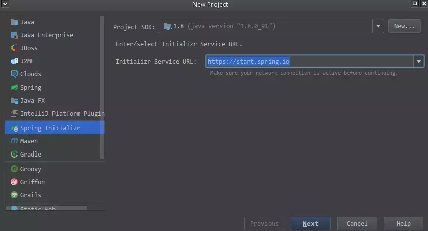
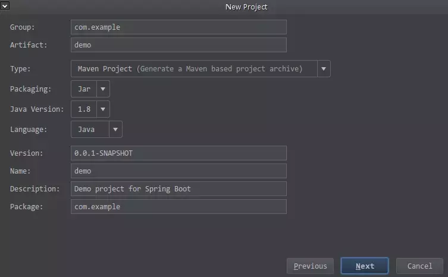
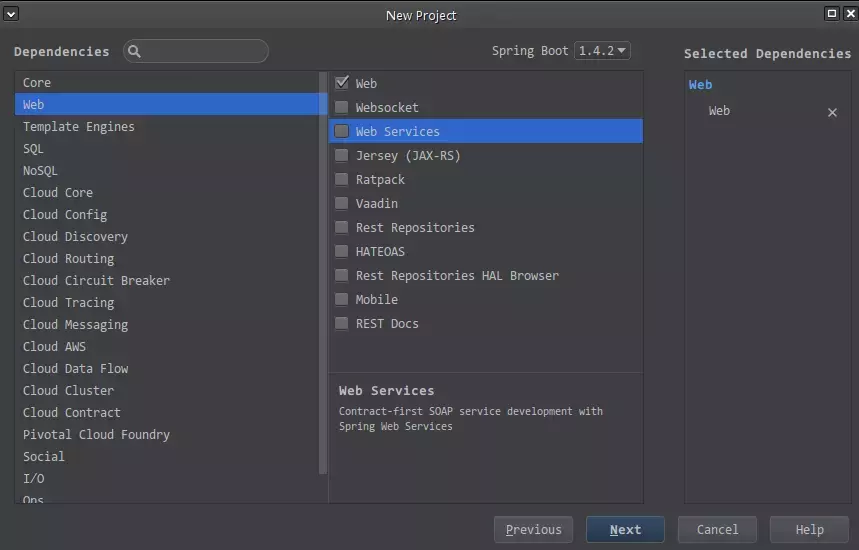
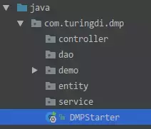

因为团队新项目需要，最近研究了一下Spring Boot + RESTful API + Thymeleaf，总结了一份文档，也放到博客里贡献。

# Spring Boot概述
## 简介
Spring Boot简化了基于Spring的应用开发，你只需要"run"就能创建一个独立的，产品级别的Spring应用。我们为Spring平台及第三方库提供开箱即用的设置，这样你就可以有条不紊地开始。多数Spring Boot应用只需要很少的Spring配置。  
你可以使用Spring Boot创建Java应用，并使用java -jar启动它或采用传统的war部署方式。我们也提供了一个运行"spring脚本"的命令行工具。

## 特性
Spring Boot主要的目标是：  
+ 为所有Spring开发提供一个从根本上更快，且随处可得的入门体验。
+ 开箱即用，但通过不采用默认设置可以快速摆脱这种方式。
+ 提供一系列大型项目常用的非功能性特征，比如：内嵌服务器，安全，指标，健康检测，外部化配置。
+ 绝对没有代码生成，也不需要XML配置。

## 文档/API
目前Spring Boot最新的Release版本为1.4.2。  
官方文档：  
http://docs.spring.io/spring-boot/docs/1.4.2.RELEASE/reference/htmlsingle/  
民间翻译的中文文档：  
http://udn.yyuap.com/doc/Spring-Boot-Reference-Guide/I.%20Spring%20Boot%20Documentation/index.html  
官方API：  
http://docs.spring.io/spring-boot/docs/1.4.2.RELEASE/api/

# 使用Spring Boot
本文的Demo可从git@turing:DMPWeb.git的demo分支（未公开于互联网）下载。
## 创建Spring Boot项目
### IntelliJ IDEA
1. 点击菜单File --> New --> Project；
2. 弹出的窗口中，左边栏选择Spring Initializr，右边选择JDK版本（通过配置也可以运行在JDK6上，但建议JDK7以上，最好JDK8）和初始化服务的URL（按默认的https://start.spring.io 即可），点击Next；  

3. 配置项目的基本信息，与平常Maven配置差不多，点击Next：  

4. 选择项目需要的依赖，Web项目可选择Web下的Web（会带上内置Tomcat和Spring MVC的依赖），不选也可以，后期手动修改pom.xml增加依赖是等效的：  

5. 点击Next，等待IDEA下载并初始化项目。

注：其实IDEA这种创建Spring Boot的方法，相当于自己去访问https://start.spring.io ，按页面提示选择了版本、项目信息和插件依赖之后，下载zip，解压导入到IDEA项目中。只不过IDEA帮你完成了下载和解压导入项目这一步而已。

### 通用的项目创建方法
任意一个IDE（在此省略截图），选择新建Maven项目，普通项目即可，填写项目基本信息后，修改pom.xml文件：
```xml
<?xml version="1.0" encoding="UTF-8"?>
<project xmlns="http://maven.apache.org/POM/4.0.0" xmlns:xsi="http://www.w3.org/2001/XMLSchema-instance"
xsi:schemaLocation="http://maven.apache.org/POM/4.0.0 http://maven.apache.org/xsd/maven-4.0.0.xsd">
 <modelVersion>4.0.0</modelVersion>

 <groupId>com.turingdi</groupId>
 <artifactId>dmpweb</artifactId>
 <version>0.0.1-SNAPSHOT</version>
 <packaging>jar</packaging>

 <name>DMPWeb</name>
 <description>Data Manage Platform</description>

 <parent>
  <groupId>org.springframework.boot</groupId>
  <artifactId>spring-boot-starter-parent</artifactId>
  <version>1.4.2.RELEASE</version>
  <relativePath/> <!-- lookup parent from repository -->
  </parent>

  <properties>
    <project.build.sourceEncoding>UTF-8</project.build.sourceEncoding>
    <project.reporting.outputEncoding>UTF-8</project.reporting.outputEncoding>
    <java.version>1.8</java.version>
  </properties>

  <!-- 核心模块，包括自动配置支持、日志和YAML等-->
  <dependencies>
    <dependency>
      <groupId>org.springframework.boot</groupId>
	    <artifactId>spring-boot-starter</artifactId>
    </dependency>

    <!-- 测试模块，包括JUnit、Hamcrest、Mockito等-->
    <dependency>
      <groupId>org.springframework.boot</groupId>
      <artifactId>spring-boot-starter-test</artifactId>
	    <scope>test</scope>
    </dependency>

	<!-- Web模块，包括Spring MVC、内置Tomcat等-->
    <dependency>
      <groupId>org.springframework.boot</groupId>	    <artifactId>spring-boot-starter-web</artifactId>
     </dependency>
  </dependencies>

.	<build>
    <plugins>
	    <plugin>
	      <groupId>org.springframework.boot</groupId>
	      <artifactId>spring-boot-maven-plugin</artifactId>
	    </plugin>
	  </plugins>
	</build>
</project>
```
然后compile等待下载依赖即可。
为提高Maven依赖下载速度，请配置本地Nexus镜像：
```xml
  <repositories>
	  <repository>
	    <id>public</id>
	    <name>public</name>
	    <url>http://172.16.99.235:8081/nexus/content/groups/public/</url>
	    <snapshots>
	      <enabled>true</enabled>
	      <updatePolicy>always</updatePolicy>
	    </snapshots>
	  </repository>
	</repositories>
```
## 编写项目入口类
### 入口类的位置
Spring Boot官方文档建议将入口类（包含main方法的类）放在项目根包下，如com.turingdi.dmp.DMPStarter，下图是一个典型的Spring Boot项目结构，注意DMPStarter类在项目中的位置：  
  
这样做的好处是使用@ComponentScan注解时可以使用默认value、无需额外指定扫描根包名的参数；而Spring Boot还提供了一个注解，包含了无参数的@ComponentScan注解及几个常用的注解，亦即在这样的项目结构下，入口类只需要一个注解即可。

### 写入口类代码
```java
	package com.turingdi.dmp;

	import org.springframework.boot.SpringApplication;
	import org.springframework.boot.autoconfigure.*;
	import org.springframework.context.annotation.*;

	@SpringBootApplication
	public class DMPStarter {
	  public static void main(String[] args) {
	    SpringApplication.run(DMPStarter.class, args);
	  }
	}
```
其中@SpringBootApplication注解等价于以默认属性使用@Configuration，@EnableAutoConfiguration和@ComponentScan，作用分别为①@Configuration：当前类可以使用 Spring IoC 容器作为 bean 定义的来源；②@EnableAutoConfiguration：根据项目依赖的jar包自动配置；③@ComponentScan：注解自动收集所有Spring组件。  
main()方法中调用SpringApplication的run()静态方法来启动Spring Boot，具体的工作为：  
1. 根据classspath创建合适的ApplicationContext；
2. 注册CommandLinePropertySource生成命令行参数；
3. 刷新application context，载入所有bean；
4. 运行CommandLineRunner bean。  

参数中选择启动的带@SpringBootApplication注解的类，一般按上面的常规写法就可以，暂时无需深入理解。
