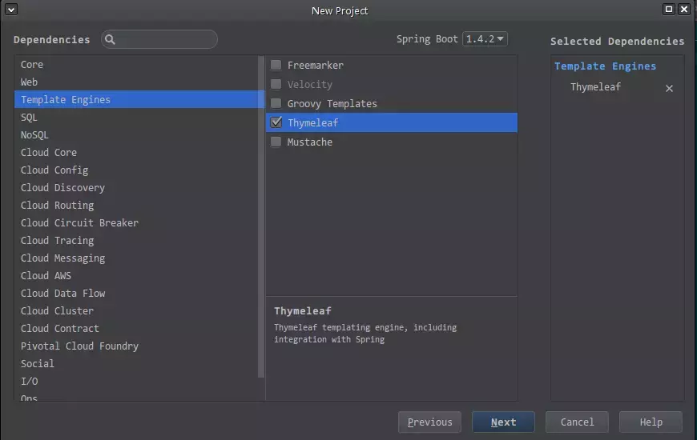
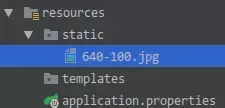
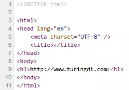
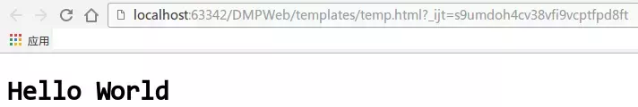

# 使用Thymeleaf模板引擎
## Thymeleaf简介
Thymeleaf是一个XML/XHTML/HTML5模板引擎，可用于Web与非Web环境中的应用开发。它是一个开源的Java库，基于Apache License 2.0许可。  
Thymeleaf提供了一个用于整合Spring MVC的可选模块，在应用开发中，你可以使用Thymeleaf来完全代替JSP或其他模板引擎，如Velocity、FreeMarker等。Thymeleaf的主要目标在于提供一种可被浏览器正确显示的、格式良好的模板创建方式，**因此也可以用作静态建模** 。你可以使用它创建经过验证的XML与HTML模板。相对于编写逻辑或代码，开发者只需将标签属性添加到模板中即可。  
Thymeleaf主要通过HTML的标签属性渲染标签内容，浏览器在解析html时，当检查到Thymeleaf的属性时候会忽略，所以Thymeleaf的模板可以通过浏览器直接打开展现，这样非常**有利于前后端的分离** 。

## 添加依赖
添加模板引擎的依赖，可以在IntelliJ IDEA创建Spring Boot项目的时候选择对应的依赖，也可以在后期手动修改pom.xml文件增加依赖。
### IntelliJ IDEA创建Spring Boot项目时增加
在选择依赖的界面，点击左边的“Template Engine”，在中间选择所需的模板引擎即可。  


### 手动修改pom.xml
以Thymeleaf为例，修改pom.xml增加以下依赖：
```xml
	<dependency>
	  <groupId>org.springframework.boot</groupId>
	  <artifactId>spring-boot-starter-thymeleaf</artifactId>
	</dependency>
```
可在resources/application.properties中对Thymeleaf进行配置。

## 目录结构
Thymeleaf默认将模板放在resources/templates目录下（可以通过application.properties文件进行配置，但建议保持默认值方便管理）；同时，Spring Boot默认将静态资源放在resources/static（从根路径访问），于是，经典的目录结构是这样的：  
  
其中640-100.jpg的访问路径为http://127.0.0.1:8080/640-100.jpg。

## 模板Demo
在resources/templates目录下新建temp.html，内容如下：
```html
	<!DOCTYPE html>
	<html>
	  <head lang="en">
	    <meta charset="UTF-8" />
	    <title></title>
	  </head>
	  <body>
	    <h1 th:text="${host}">Hello World</h1>
	  </body>
 	</html>
```
其中h1的**th:text="${host}"** 即为Thymeleaf的属性，表示获取ModelMap中的host属性赋值给h1的文本；而这个文件直接用浏览器访问的时候h1元素则显示“Hello World”。
再编写一个Controller：
```java
	@Controller
	@RequestMapping("/template")
	public class TemplateController {
	  @RequestMapping("/")
	  public String index(ModelMap map) {
	    // 加入一个属性，用来在模板中读取
	    map.addAttribute("host", "http://www.turingdi.com");
	    // return模板文件的名称，对应resources/templates/temp.html
	    return "temp";
	  }
	}
```
注意这里使用了@Controller注解而不是之前的@RestController，若使用后者，index()方法返回的”temp”会直接以JSON格式返回，页面显示“temp”。实际上我们使用@Controller注解并加入了Thymeleaf模板引擎后，index()方法返回的”temp”会被Thymeleaf模板引擎理解为src/main/resources/templates/temp.html文件，然后解析该文档并响应返回。在浏览器中接收到的html源码如下：  
  
而这个模板文件直接用浏览器打开的效果：  
  
可以看到，前端开发人员可以直接修改html并直接观察修改后的效果，修改时并不影响Thymeleaf的代码，因此可以方便前后端协同开发。

## Thymeleaf简单表达式
###   变量表达式 ${……}
```html
<input type="text" name="userName" value="James Carrot" th:value="${user.name}" />
```
上述代码为引用user对象的name属性值。

### 选择/星号表达式 *{……}
```html
	<div th:object="${session.user}">
	  <p>Nationality:
	    <span th:text="*{nationality}">Saturn</span>.
	  </p>
	</div>
```
选择表达式一般跟在th:object后，直接取object中的属性。

### 文字国际化表达式 #{……}
```html
<p th:utext="#{home.welcome}">Welcome to our grocery store!</p>
```

### URL表达式 @{……}     
```html
<a href="details.html" th:href="@{/order/details(orderId=${o.id})}">view</a>
```
@{……}支持决定路径和相对路径。其中相对路径又支持跨上下文调用url和协议的引用。
当URL为后台传出的参数时，代码如下：
```html

```

## Thymeleaf常用标签
### 简单数据转换（数字，日期）
```html
	<dt>价格</dt>
	<dd th:text="${#numbers.formatDecimal(product.price, 1, 2)}">180</dd>
	<dt>进货日期</dt>
	<dd th:text="${#dates.format(product.availableFrom, 'yyyy-MM-dd')}">2014-12-01</dd>
```

### 字符串拼接
```html
<dd th:text="${'$'+product.price}">235</dd>
```

### 表单
```html
	<form th:action="@{/bb}" th:object="${user}" method="post" th:method="post">

	<input type="text" th:field="*{name}"/>
	<input type="text" th:field="*{msg}"/>

	<input type="submit"/>
	</form>
```

### 循环
渲染列表数据是一种非常常见的场景，例如现在有n条记录需要渲染成一个表格&lt;table&gt;，该数据集合必须是可以遍历的，使用th:each标签：
```html
	<table>
	  <tr>
	    <th>NAME</th>
	    <th>PRICE</th>
	    <th>IN STOCK</th>
	  </tr>
	  <tr th:each="prod : ${prods}">
	    <td th:text="${prod.name}">Onions</td>
	    <td th:text="${prod.price}">2.41</td>
	   <td th:text="${prod.inStock}? #{true} : #{false}">yes</td>
	  </tr>
	</table>
```

### 条件判断If/Unless
Thymeleaf中使用th:if和th:unless属性进行条件判断，下面的例子中，`<a>`标签只有在th:if中条件成立时才显示：  
```html
<a th:href="@{/login}" th:unless=${session.user != null}>Login</a>
```
th:unless于th:if恰好相反，只有表达式中的条件不成立，才会显示其内容。

### Switch
Thymeleaf同样支持多路选择Switch结构，默认属性default可以用*表示：
```html
	<div th:switch="${user.role}">
	  <p th:case="'admin'">User is an administrator</p>
	  <p th:case="#{roles.manager}">User is a manager</p>
	  <p th:case="*">User is some other thing</p>
	</div>
```

## Thymeleaf配置
可在**resources/application.properties** 中对Thymeleaf进行配置，配置如下：
```bash
	# Enable template caching.
	spring.thymeleaf.cache=true
	# Check that the templates location exists.
	spring.thymeleaf.check-template-location=true
	# Content-Type value.
	spring.thymeleaf.content-type=text/html
	# Enable MVC Thymeleaf view resolution.
	spring.thymeleaf.enabled=true
	# Template encoding.
	spring.thymeleaf.encoding=UTF-8
	# Comma-separated list of view names that should be excluded from resolution.
	spring.thymeleaf.excluded-view-names=
	# Template mode to be applied to templates. See also StandardTemplateModeHandlers.
	spring.thymeleaf.mode=HTML5
	# Prefix that gets prepended to view names when building a URL.
	spring.thymeleaf.prefix=classpath:/templates/
	# Suffix that gets appended to view names when building a URL.
	spring.thymeleaf.suffix=.html spring.thymeleaf.template-resolver-order= # Order of the template resolver in the chain. spring.thymeleaf.view-names= # Comma-separated list of view names that can be resolved.
```
