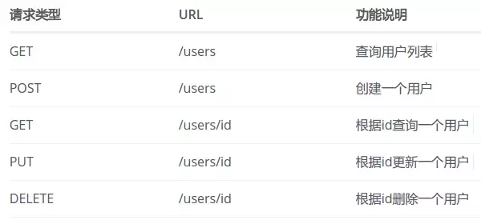

## 使用Spring Boot
##	编写Demo的REST风格Controller
#### 前言
在DMP项目中，我们创建了demo分支，其中的com.turingdi.dmp.demo包中存放着这个demo。
这个demo实现一个简单的REST风格的API：
- 在根页面显示“Hello World”
- POST请求访问/demo/user可插入一条用户（用name参数指定名字），返回该用户信息的JSON（包含后台生成的用户ID）；
- GET请求访问/demo/user/可查询到所有用户的信息；
- GET请求访问/demo/user/<用户ID>可查询到对应用户的信息JSON；
- 不使用上述HTTP方法访问的会返回错误。

#### 编写Controller代码
```java
package com.turingdi.dmp.demo;

import io.swagger.annotations.ApiImplicitParam;
import io.swagger.annotations.ApiOperation;
import org.springframework.web.bind.annotation.*;

import java.util.ArrayList;
import java.util.HashMap;
import java.util.List;
import java.util.Map;
import java.util.concurrent.atomic.AtomicInteger;
import java.util.concurrent.atomic.AtomicLong;

/*
 * Created by leibniz on 16-11-23
 */
@RestController
@RequestMapping("/demo")
public class UserController {
	private final AtomicInteger counter = new AtomicInteger();
	private Map<Integer, User> users = new HashMap<>();

	@ApiOperation(value="获取用户详细信息", notes="根据url的id来获取用户详细信息")
	@ApiImplicitParam(name = "id", value = "用户ID", required = true, paramType="path", dataType = "Integer")
	@RequestMapping(value = "/user/{id}", method = RequestMethod.GET)
	public User greeting(@PathVariable int id) {
		return users.get(id);
	}

	@ApiOperation(value="获取用户列表", notes="获取所有用户")
	@RequestMapping(value = "/user", method = RequestMethod.GET)
	public List<User> getUserList() {
		return  new ArrayList<>(users.values());
	}

	@ApiOperation(value="创建用户", notes="根据用户名创建用户")
	@ApiImplicitParam(name = "name", value = "用户名", required = true, dataType = "String", paramType="body")
	@RequestMapping(value = "/user", method = RequestMethod.POST)
	public User newUser(@RequestBody String name) {
		System.out.println(name);
		User result = new User(counter.incrementAndGet(), name);
		users.put(result.getId(), result);
		return result;
	}

	@RequestMapping("")
	public String home() {
		return "Hello World!";
	}
}
```
其中@RestController指定在Controller上，这样就不需要在每个@RequestMapping方法上加 @ResponseBody，默认返回json格式。
该Controller逻辑比较简单：
- 访问根路径返回"Hello World!"；
- POST请求访问/user时，生成一个自增的ID，用于生成Greeting对象，保存在一个Map中并返回该对象；Spring Boot回自动将该对象转换成JSON格式再返回；
- GET请求访问/user/用户ID时，从访问路径获取用户ID，然后从Map中获取对应Greeting对象并返回，同样地Spring Boot会将其转换为JSON格式返回。

注：
- 一个典型的REST风格API是这样的：  

- 可以使用Swagger2快速构建RESTful API文档，并支持在线发送请求调试API：http://blog.didispace.com/springbootswagger2/。

### 启动项目
#### 直接运行入口类
在IDE中配置、直接运行入口类com.turingdi.dmp.DMPStarter。

#### 打包jar运行
使用mvn package命令进行打包，并使用以下命令执行：
```bash
java -jar target/***.jar
```
由于我们的入口类加上了7.@SpringBootApplication注解，并在Maven中配置了spring-boot-maven-plugin插件，因此在打jar包的时候会自动设置jar包中的META-INF/MAINFEST.MF中配置好jar包的入口类，无需我们在pom.xml文件中额外配置。

#### 使用Spring Boot的Maven插件运行
执行：
```bash
 mvn spring-boot:run
 ```
即可。这也是spring-boot-maven-plugin插件起到的作用。

#### 热交换
由于Spring Boot在打包的时候将内置tomcat一并打包，所以我们无法直接更新项目文件让tomcat重新加载。Spring Boot提供了Spring Loaded实现热交换。
在pom.xml中增加以下依赖即可:
```xml
	<dependency>
	  <groupId>org.springframework.boot</groupId>
	  <artifactId>spring-boot-devtools</artifactId>
	  <optional>true</optional>
	</dependency>
```
然后项目运行时，更新源代码之后，重新编译（如IDEA中按快捷键Ctrl+F9）即可在控制台看到Spring Boot重新加载了新编译后的文件。
