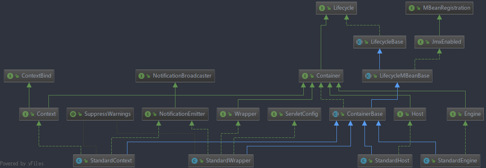

源码版本：`Tomcat 8.0.41`
### Request和Response的门面模式
   
从UML图可以看到，Tomcat中`HttpServletRequest`和`HttpServletResponse`的实现类是`org.apache.catalina.connector.Request`和`org.apache.catalina.connector.Response`，但实际提供给Servlet的时候用的是门面类`RequestFacade`和`ResponseFacade`。这是因为实现类里面的public方法比接口的多，而且可能涉及到安全问题，如果Servlet直接将其强转成实现类，是可以访问这些方法的，存在安全问题，因为使用了门面模式，将这些方法隐藏起来。  

### 统一日志消息处理
Tomcat8使用`org.apache.catalina.tribes.util.StringManager`对日志消息进行统一处理，每个包一般都有一个`LocalStrings.properties`文件，需要调用这些日志信息的类，会维护一个`StringManager`的实例，初始化时以当前包名为参数，以获取当前包对应的`LocalStrings.properties`文件：
```java
private StringManager(String packageName);
private static final Hashtable<String, StringManager> managers =
        new Hashtable<>();

/**
  * Get the StringManager for a particular package. If a manager for
  * a package already exists, it will be reused, else a new
  * StringManager will be created and returned.
  *
  * @param packageName The package name
  */
    public static final synchronized StringManager getManager(String packageName) {
    StringManager mgr = managers.get(packageName);
    if (mgr == null) {
        mgr = new StringManager(packageName);
        managers.put(packageName, mgr);
    }
    return mgr;
}

/* For Example */
 protected static final StringManager sm = StringManager.getManager(Constants.Package);
```
可以看到它使用了`Hashtable`来维护每个包对应的`StringManager`单例。  
然后在需要读取消息的时候调用`StringManager`的`getString(String key)`方法，如：
```java
log.info(sm.getString("receiverBase.socket.bind", addr));
```

### 请求参数等的懒解析
为了提高效率，请求参数在第一次调用`public String getParameter(String name)`、`public Enumeration<String> getParameterNames()`等方法的时候才会解析，如果整个请求响应处理过程中都没有调用相关方法的话，请求参数将不会被解析，因为字符串处理的消耗不低。其他的一些属性也有类似的处理。主要的代码如下：
```java
/**
  * Request parameters parsed flag.
  */
protected boolean parametersParsed = false;

/**
  * Return the value of the specified request parameter, if any; otherwise,
  * return <code>null</code>.  If there is more than one value defined,
  * return only the first one.
  *
  * @param name Name of the desired request parameter
  */
@Override
public String getParameter(String name) {
    if (!parametersParsed) {
        parseParameters();
    }
    return coyoteRequest.getParameters().getParameter(name);

}

/**
  * Returns a <code>Map</code> of the parameters of this request.
  * Request parameters are extra information sent with the request.
  * For HTTP servlets, parameters are contained in the query string
  * or posted form data.
  *
  * @return A <code>Map</code> containing parameter names as keys
  *  and parameter values as map values.
  */
@Override
public Map<String, String[]> getParameterMap() {
    if (parameterMap.isLocked()) {
        return parameterMap;
    }
    Enumeration<String> enumeration = getParameterNames();
    while (enumeration.hasMoreElements()) {
        String name = enumeration.nextElement();
        String[] values = getParameterValues(name);
        parameterMap.put(name, values);
    }
    parameterMap.setLocked(true);
    return parameterMap;
}

/**
  * Return the names of all defined request parameters for this request.
  */
@Override
public Enumeration<String> getParameterNames() {
    if (!parametersParsed) {
        parseParameters();
    }
    return coyoteRequest.getParameters().getParameterNames();
}

/**
  * Parse request parameters.
  */
protected void parseParameters() {
    parametersParsed = true;
    /*………具体的解析处理，在此省略………*/
}
```
其中`ParameterMap`是一个继承了`LinkedHashMap`的类：
```java
public final class ParameterMap<K,V> extends LinkedHashMap<K,V>
```

### Connector连接器

Tomcat8主要有四个Connector，分别为`Http11Protocol`、`Http11NioProtocol`、`Http11Nio2Protocol`、`Http11AprProtocol`，UML如上图所示，内容比较多，暂时不讨论了。

### Tomcat容器层次
Tomcat中有四个层次的容器：
- Engine：整个Catalina Servlet引擎
- Host：包含一个或多个Context容器的虚拟主机
- Context：表示一个Web应用程序，包含一个或多个Wrapper
- Wrapper：表示一个独立的Servlet

以上四个类均实现了`org.apache.catalina.Container`接口，标准实现分别为`org.apache.catalina.core`包中的`StandardEngine`、`StandardHost`、`StandardContext`、`StandardWrapper`。


### Pipeline管道
(尚未完工)
`org.apache.catalina.valves.AccessLogValve`