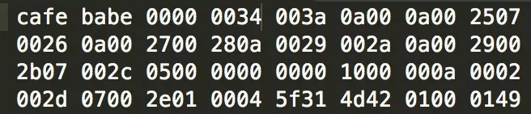

**JVM笔记系列索引**  
[《深入理解Java虚拟机》 学习笔记(一)——JVM内存结构](/p/深入理解Java虚拟机-学习笔记一JVM内存结构/)  
[《深入理解Java虚拟机》 学习笔记(二)——垃圾回收](/p/深入理解Java虚拟机-学习笔记二垃圾回收/)  
[《深入理解Java虚拟机》 学习笔记(三)——类文件结构](/p/深入理解Java虚拟机-学习笔记三类文件结构/)  
[《深入理解Java虚拟机》 学习笔记(四)——类加载机制与JVM优化](/p/深入理解Java虚拟机-学习笔记四类加载机制与JVM优化/)  
[《深入理解Java虚拟机》 学习笔记(五.终章)——Java内存模型与线程安全/优化](/p/深入理解Java虚拟机-学习笔记五.终章Java内存模型与线程安全/优化/)  
## JVM多语言支持
Java规范分为Java语言规范（The Java Language Specification）和Java虚拟机规范（The Java Virtual Machine Specification），因此JVM支持多种语言，只要该语言编译后的类文件符合JVM规范。比如我们常用的Scala、Kotlin、Clojure、Groovy等等。  
## 类文件结构
基础原则：多字节的数据，高位在前。JVM加载Class文件的时候进行动态连接。  
Class文件结构类似C的结构体，包含无符号数（u1/u2/u4/u8表示1/2/4/8字节的无符号数）和表（由多个无符号数或表组成的结构体，class文件本身就是一个大的表），有多个同类的无符号数或者表并数量不确定的时候，一般先用一个无符号数记录数量，后面接上一系列连续的这种无符号数或者表。Class文件没有分隔符号，所以整个数据结构都是被严格规定的。  

### 魔数与Class文件版本
Class文件头4个字节是固定的0xCAFEBABE（咖啡宝贝），显然与Java语言命名的历史相关。  
紧接着4个字节存储Class文件版本号，5-6字节是子版本号，7-8字节是主版本号（比如1.7.0是0x0033）。JVM读取Class文件的时候，搞版本JDK可以兼容旧版本Class文件，就是通过这4个字节进行判定的。
### 常量池
一般来说常量池占Class文件空间最大，由于长度不定，所以入口有u2类型的常量池容量计数器（8-9位），计数从1开始（Class文件中其他容量计数器都是从0开始的）。  
常量池存储两类常量：字面量（类似Java语言中的常量）和符号引用，后者包括类和接口全名、字段名称和描述符、方法名称和描述符。JVM运行时从常量池获取符号引用再在类创建时解析到具体内存地址，没有C语言的“连接”步骤。  
常量池每一个常量都是一个表。，一共有14种表，表的开头都是一个u1类型的标志位代表当前常量的类型（浮点整形之类），后面的结构与具体的常量类型有关，各自不同。  
使用```javap -verbose 类名```可以解析类的结构，输出结构大概这样：  
```bash
 javap -verbose com.turingdi.breorent.user.controller.RentAndReturnController
 
Classfile /home/leibniz/workspace/BreoRent/target/classes/com/turingdi/breorent/user/controller/RentAndReturnController.class
  Last modified 2017-6-6; size 9126 bytes
  MD5 checksum 26ed5594f39cfc9d6b109637ad76bf12
  Compiled from "RentAndReturnController.java"
public class com.turingdi.breorent.user.controller.RentAndReturnController
  minor version: 0
  major version: 52
  flags: ACC_PUBLIC, ACC_SUPER
Constant pool:
    #1 = Methodref          #111.#203     // java/lang/Object."<init>":()V
    #2 = Class              #204          // org/springframework/web/servlet/ModelAndView
    #3 = Methodref          #2.#203       // org/springframework/web/servlet/ModelAndView."<init>":()V
    #4 = Class              #205          // com/turingdi/breorent/common/wechatApi/process/WechatJdk
    #5 = Methodref          #4.#206       // com/turingdi/breorent/common/wechatApi/process/WechatJdk."<init>":(Ljavax/servlet/http/HttpServletRequest;)V
    #6 = Methodref          #4.#207       // com/turingdi/breorent/common/wechatApi/process/WechatJdk.getMap:()Ljava/util/Map;
    #7 = String             #208          // appId
    #8 = String             #209          // wechat
    #9 = String             #210          // APP_ID
……
```
常见的两种常量举例：
1. CONSTANT_Class_info，类常量，标志为0x07，紧接着是1个u2类型的类名索引，指的是类名（字符串常量）在常量池中的索引（如上面所说，从1开始数）。
2. CONSTANT_Utf8_info，字符串变量，标志为0x01，紧接着是1个u2类型的字符串长度，然后是字符串内容的bytes，u1类型，数量等于前面u2定义的。

从上面可以推导：类名（全限定名）是字符串常量，长度用u2类型表示，也就是最大长度是65535，换言之就是Java类全名最长65535，超过的无法编译。  
### 访问标志
常量池结束之后，有两个字节为访问标志，代表当前Class文件是否public、是否类/接口/枚举、是否抽象、是否注解等等。  
### 类索引、父类索引及接口索引集合
**类索引**和**父类索引**分别为u2类型数据，**接口索引集合**结合为u2类型数据的集合（只能有一个父类，可以实现多个接口），分别用于记录当前类、父类、实现的接口的类描述符（CONSTANT_Class_info）在常量池中的索引。  
类索引和父类索引紧接在访问标志后面，再后面是接口索引集合，入口是一个数量计数器，0表示没有实现任何接口，再后面就是具体的接口类描述符索引。
### 字段表集合
描述类或接口中定义的字段，包括静态和非静态的。结构如下：

| 类型 | 名称 | 数量 | 含义 |  
|:------:|:------:|:------:|:------:|  
| u2 | access_flags | 1 | 访问标志，public/private/final/static/enum等描述符 |
| u2 | name_index | 1 | 字段简单名称在常量池中的索引，即变量名或方法名 |
| u2 | descriptor_index | 1 | 字段和方法的描述符在常量池的索引，描述字段类型或方法参数列表/返回类型 |
| u2 | attibutes_count | 1 | 属性表计数器 |
| attribute_info | attributes | attibutes_count | 属性额外描述，比如描述变量初始化值在常量池中的索引 |

描述符描述方法的时候，先是参数列表，然后是返回值类型。而方法
```java
public String toString(int test)
```
对应的描述符是
```java
(I)Ljava/lang/String;
```
其中L是表示对象类型。  
此外，字段表集合不会列出从父类或接口中继承的字段，但可能会有代码中不存在的字段，比如内部类对外部类实例的引用之类。  
### 方法表集合
方法表集合的入口同样也是一个u2类型的计数器，紧接着是各个具体的方法。方法表的结构与字段表基本一样，不列出来了。区别：
1. 首先是access_flags的取值范围不同，比如没有ACC_TRANSIENT、有ACC_SYNCHRONIZED等值；
2. name_index表示方法名索引，descriptor_index表示方法描述符索引，跟字段表一样；
3. 而编译后的方法代码，放在属性表里面名为“Code”的属性中；
4. 没有Override的父类方法，不会出现在子类的方法表集合中；
5. 同样可能出现代码中原本没有的方法，比如&lt;clinit&gt;（类构造器）、&lt;init&gt;（实例对象构造器）。

两个方法名字相同，参数列表相同，返回值类型不同，是允许共存在一个Class文件中的，但Java语言不允许这样。
### 属性表集合
Class文件、字段表、方法表都可以有自己的属性表，Java7里面定义了21种属性。
#### Code属性
并非所有方法表都有Code属性，比如接口和抽象类的方法就没有。结构如下：

| 类型 | 名称 | 数量 | 含义 |  
|:------:|:------:|:------:|:------:|  
| u2 | attribute_name_index | 1 | 属性名的索引，对Code属性而言恒为"Code" |
| u4 | attribute_length | 1 | 属性值长度，相当于整个属性表长度长度减6(u2+u4) |
| u2 | max_stack | 1 | 操作数栈深度最大值。JVM运行时根据此值分配栈桢的操作栈深度 |
| u2 | max_locals | 1 | 局部变量表所需存储空间，单位是Slot，double和long占用2个Slot、其他基本类型1Slot，Slot空间可以重用(变量作用域问题) |
| u4 | code_length | 1 | 编译后的字节码长度，理论上最长2^32-1，实际上JVM规定一个方法不允许超过65535条字节码指令 |
| u1 | code | code_length | 代码编译后的字节码 |
| u2 | exception_table_length | 1 | 异常表长度 |
| exception_info | exception_table | exception_table_length | 异常表，记录字节码在start_pc到end_pc行之间如果出现类型为catch_type或其子类的异常则跳转到handler_pc行继续处理 |
| u2 | attibutes_count | 1 | 属性表计数器 |
| attribute_info | attributes | attibutes_count | 属性额外描述，比如描述变量初始化值在常量池中的索引 |

字节码值得注意的一个地方是，javac编译时将this关键字作为一个普通方法参数由JVM调用时自动传入。
#### Exceptions属性
描述方法可能抛出的受检异常。
#### LineNumberTable属性
描述Java远吗行号与字节码行号之间映射关系，也就是为什么抛异常的时候可以显示源码哪一行抛出的。
#### LocalVariableTable属性
描述栈桢中局部变量表与Java源码中变量的关系，以保证编译后的代码被其他代码调用时，IDE可以显示参数名（否则被arg0、arg1之类的变量名代替）
#### SourceFile属性
描述生成当前Class文件的源文件名称，也是抛异常时可以显示源文件名字的原因。但内部类不会生成这个属性。
#### ConstantValue属性
static关键字修饰的变量可以使用这个属性。对于Sun javac编译器，final static的变量采用ConstantValue属性初始化，其他static变量在&lt;clinit&gt;（类构造器）中初始化。
#### InnerClasses属性
记录内部类和宿主类的关联。内部类和宿主类的Class文件都会有这个属性。
#### Signature属性
记录泛型签名信息。Java的泛型是使用擦除式实现的伪泛型，编译后擦除泛型，这个属性为了弥补此缺陷，方便反射API可以拿到泛型类型。

## 字节码指令
字节码指令由一个字节的**操作码**（代表具体操作）及跟随其后的0个或多个**操作数**（操作所需的参数）组成。JVM大多数指令不含操作数只有操作码。  
Class文件放弃了操作数对齐，因此省略很多填充和分割符，因此体积可以尽量小；缺点是损失一些解析字节码的性能。  
JVM的指令大多数包含了操作的数据类型信息，但因为只有一个字节，也就是说最多只有256种指令，所以不是所有命令对所有数据类型都有独立的指令（非完全独立），同时提供一些指令将指令不支持类型的操作数转换为可支持的类型。  
JVM的浮点数运算，舍入模式是最低有效位向下（0）取整。操作溢出时用有符号的无穷大表示（INF），如果操作结果没有明确数学意义则得到NaN（非数字，比如0/0，∞×0之类）
