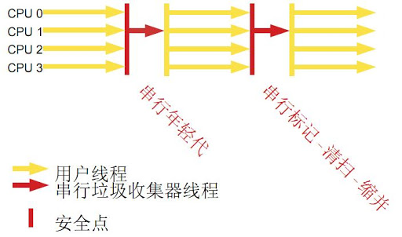
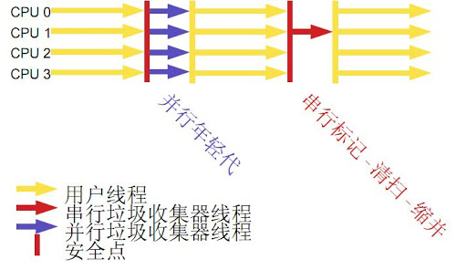
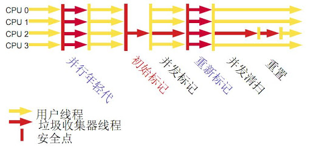
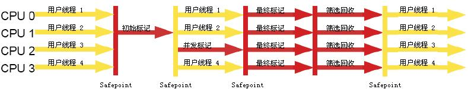

**JVM笔记系列索引**  
[《深入理解Java虚拟机》 学习笔记(一)——JVM内存结构](/p/深入理解Java虚拟机-学习笔记一JVM内存结构/)  
[《深入理解Java虚拟机》 学习笔记(二)——垃圾回收](/p/深入理解Java虚拟机-学习笔记二垃圾回收/)  
[《深入理解Java虚拟机》 学习笔记(三)——类文件结构](/p/深入理解Java虚拟机-学习笔记三类文件结构/)  
[《深入理解Java虚拟机》 学习笔记(四)——类加载机制与JVM优化](/p/深入理解Java虚拟机-学习笔记四类加载机制与JVM优化/)  
[《深入理解Java虚拟机》 学习笔记(五.终章)——Java内存模型与线程安全/优化](/p/深入理解Java虚拟机-学习笔记五.终章Java内存模型与线程安全/优化/)  
## 判断对象可回收
有以下方法：
### 引用计数法
维护引用计数的Map，对象被引用时计数加1，引用失效时计数减1，简单粗暴。  
实现简单，判断效率高。但主流JVM没有用这个方法的，因为无法解决循环引用的问题。  
### 可达性分析算法
JVM主流实现时可达性分析。  
通过一系列GC Root的对象作为起点，开始向下搜索，搜索经过的路径为引用链，当一个对象到GC Root没有任何引用链项链，则引用不可达，可以GC掉。  
GC Root通常包括以下几种：
1. 虚拟机栈（栈帧中的本地变量表）中引用的对象；
2. 方法区中类静态属性引用的对象；
3. 方法区中常量引用的对象；
4. 本地方法栈中JNI（即一般说的Native方法）引用的对象；
5. …………

## 引用分类
引用分为**强引用**（平常用的引用，只要还存在有效，就不会被GC），**软引用**（SoftReference类，将要发生内存溢出前GC回收），**弱引用**（WeakReference类，生存到下一次GC，只被弱引用关联的对象会被回收！），**虚引用**（PhantomReference类，不影响实例生存时间，无法取得实例，唯一作用是被GC时收到一个系统通知）。

## finalize()方法
可达性分析中发现不可达的对象，会被标记，如果没有覆盖finalize()方法，或者其finalize()方法已经被JVM调用过，则不会执行finalize()方法。  
否则需要执行finalize()方法，此对象放入F-Queue队列中，由JVM的低优先级Finalizer线程去执行。  
稍后，GC会对F-Queue的对象进行第二次标记，如果对象在finalize()方法中拯救了自己（重新被引用），则将会被移出要回收的集合。  
一般不覆盖finalize()方法，该方法设计之初是为了迎合C++语法的析构函数，应该用try-finally取代之。  

## 方法区/永生代的GC
永生代也会进行GC，主要收集废弃的常量和无用的类。  
其中无用的类的判定比较严格，要求：
1. 该类所有实例已被回收；
2. 加载该类的ClassLoader已被回收；
3. 该类的Class对象没有任何地方被引用，无法在任何地方通过反射访问该类的方法。

然而满足了以上条件的类，也不一定会被回收，仅仅是可以回收。

## 垃圾收集算法
包括以下：
### 标记-清除算法(Mark-Sweep)
先标记出所有需要回收的对象，然后统一回收被标记需要回收的对象。  
**缺点**：标记和清除的效率都不高，且清除后产生大量不连续的内存碎片。
### 复制算法(Copying)
内存划分成等大小的两块，只有一块在使用，GC时将存活对象复制到另一块区域中，清除另一半。  
**缺点**：有一半内存浪费，复制操作效率低，不适合老年代。  
实际使用中并不是一半一半的内存分配，因为大部分对象生命周期很短，所以划分成一块很大的**Eden区**和两块小的**Survivor区**，一般默认8:1:1的比例。每次使用一块Eden和一块Survivor区，GC时讲Eden和Survivor中存活的对象复制到另一块Survivor区中。当Survivor区不够大时，使用**老年代**进行**分配担保**，存活对象放入老年代。
### 标记-整理算法(Mark-Compact)
类似标记-清除算法，标记之后存活的对象向一端移动，最后清理掉边界以外的内存，保证内存的规整。

## HotSpot的算法实现
以下是HotSpot中垃圾回收的几个关键点技术实现方法。
### 枚举GC Root
可达性分析要求在一个能保证一致性的快照中进行工作，即GC时必须停止所有线程，即Stop The World~~（JOJO里面Dio的世界 ザ・ワールド？）~~。  
在HotSpot里面，通过一个叫OopMap的数据结构来维护哪些地方存放着对象引用，记录栈上本地变量与堆中对象的引用关系，方便枚举GC Root。
### 安全点
并不是所有指令都会生成/改变OopMap，这样效率太低。线程必须到达安全点（SafePoint）才会生成OopMap，然后开始GC。安全点的选定是以“有让程序长时间执行的特征”的原则进行的（如方法调用，循环跳转，异常跳转等）。  
考虑多线程，必须所有线程都跑到安全点才能开始GC。方法有二：
1. **抢先式中断**：GC时先中断所有线程，对于还没跑到安全点的线程，让其恢复并等它跑到安全点上再停。——商业JVM几乎没有这样实现的；
2. **主动式中断**：GC需要中断线程时，设置一个标志，各个线程执行时，跑到安全点的时候轮询这个标志，发现标志为真的时候自己中断挂起。

### 安全区域
线程执行的时候，可能很久都不会跑到安全点（比如执行了Thread.Sleep()的情况），导致GC不能马上执行。因此引入安全区域的概念（Safe Region），表示这段代码片段中引用关系不会发生变化。  
线程执行到安全区域的时候，标识自己进入了安全区域；则发动GC的时候，可以忽略标识为安全区域的线程；而线程在离开安全区域的时候，需要检查是否已完成GC Root枚举（或者是整个GC过程），没完成的话要GC发出等待离开的信号。

## 实际的垃圾收集器

上图给出了HotSpot的7个垃圾收集器，中间有连线的标识可以搭配使用。
### Serial收集器

收集时，暂停所有其他工作线程（Stop The World），开一个线程进行GC。对新生代采用复制算法，对老年代采取标记-整理算法。   
JVM在client模式下默认新生代垃圾收集器还在用Serial。  
优点：简单高效。  
缺点：GC时的停顿时间长。   

### Serial Old收集器
Serial收集器的老年代版本，单线程，标记-整理算法。  

### ParNew收集器

Serial收集器的多线程版本，可以配合CMS收集器工作，不能配合Parallel Scavenge收集器工作。使用```-XX+UseParNewGC```指定使用之。  
澄清垃圾收集器的两个概念：  
1. **并行Parallel**：多条垃圾回收线程并行工作，用户线程在等待；
2. **并发Concurrent**：垃圾收集线程和用户线程同事执行（CMS）。

### Parallel Scavenge收集器
新生代收集器，多线程、复制算法，与ParNew收集器的区别在于，关注点在于吞吐量（Thoughput，=运行用户代码时间/(运行用户代码时间+GC时间)），适合在后台运算而不需要提案多交互的任务。  
用```-XX:MaxGCPauseMillis```参数指定保证GC消耗时间的最大值（毫秒），减少GC时间是以牺牲吞吐量及新生代空间来获取的。  
用```-XX:GCTimeRatio```参数指定GC占总时间的比例，0-100，默认99，即允许1/(1+99)=1%的GC时间。  
使用```-XX:UseAdaptiveSizePolicy```参数之后，JVM根据当前系统情况动态调整新生代大小、Eden与Survivor比例等参数以保证最佳的吞吐量和设定的最长GC时间。   

### Parallel Old收集器
Parallel Scavenge收集器的老年代版本，多线程，标记-整理算法，JDK1.6开始提供。  

### CMS收集器

老年代收集，设计目标是获取最短回收停顿时间，基于标记-清除算法设计，包括以下步骤：
1. **初始标记**：标记GC Root可以直接关联到的对象，速度很快，需要Stop The World；
2. **并发标记**：可达性分析枚举，耗时较长；
3. **重新标记**：修正并发标记期间因用户程序继续运行而导致的引用变动，需要Stop The World；
4. **并发清除**：耗时较长。

CMS收集器缺点：
1. 对CPU资源敏感，并发阶段总吞吐量降低，CPU数量少的时候对用户程序影响大；
2. 无法处理浮动垃圾（Floating Garbage），即并发清理阶段新产生的垃圾，要等到下一次GC；因此需要预留内存空间给用户线程使用，不能等内存快满才进行收集；当
CMS运行期间预留的内存不够，会出现“Concurrent Mode Failure”失败，JVM会临时启用Serial Old收集器重新进行老年代垃圾收集，导致停顿时间变长。可以通过```-XX:CMSInitiatingOccupancyFraction```参数调整老年代内存占用比例触发GC的阈值。
3. 收集后产生内存碎片。

### G1收集器

面向服务端，全称Garbage-First，停顿时间可控、可预测，不会产生内存碎片。  
G1收集器将整个Java堆划分成多个大小相等的独立区域（Region），跟踪各个Region里面垃圾堆积的价值（根据回收所获得的空间大小及回收耗费时间的经验值），维护优先列表，每次收集的时候，根据允许的收集时间，优先回收价值更大的Region。  
此外每个Region维护一个Remembered Set来避免全堆扫描，引用型数据进行写操作的时候，会产生中断写操作，检查引用的对象是否处于不同的Region，如果是，则记录到被引用对象所属的Remember Set中；那么在GC时，GC Root的枚举范围加入Remembered Set，保证不进行全堆扫描也不会有遗漏。  
G1收集器的回收步骤包括：
1. **初始标记**：与CMS一样；
2. **并发标记**：与CMS一样，包含Remembered Set；
3. **最终标记**：并发标记期间对象变化记录到Remembered Set Logs中，合并到Remembered Set；
4. **筛选回收**：先根据回收价值和回收成本进行排序，再根据用户期望GC停顿时间制定回收计划。

## 内存分配、回收策略
1. **优先在Eden分配**：大多数情况下，对象在新生代Eden区分配，当Eden区空间不够时，发起Minor GC；
2. **大对象直接进入老年代**：提供```-XX:PretenureSizeThreshold```参数，大于此值的对象直接在老年代分配，避免在Eden区和Survivor区之间大量内存复制；
3. **长期存活的对象进入老年代**：JVM为对象定义年龄计数器，经过Minor GC依然存活且被Survivor区容纳的，移动到Survivor区，年龄加1，每经历一次Minor GC不被清理则年龄加1，增加到一定年龄则移动到老年区（默认15岁，通过```-XX:MaxTenuringThreshold```设置）；
4. **动态对象年龄判定**：若Survivor区中同年龄所有对象大小总和大于Survivor空间一半，则年龄大于等于该年龄的对象可以直接进入老年代；
5. **空间分配担保**：Minor GC之前，JVM检查老年代最大可用连续空间大于新生代所有对象总空间，成立的话Minor GC确认是安全的；否则检查老年代最大可用连续空间大于历次晋升到老年代对象的平均大小，大于的话进行Minor GC；小于的话进行Full GC。
