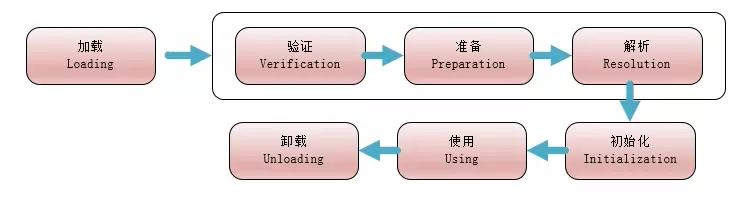
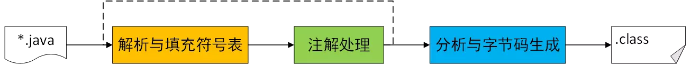
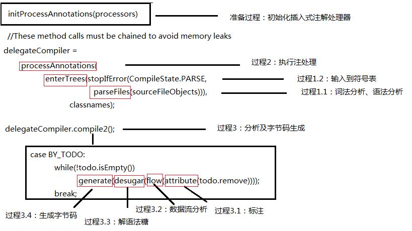

**JVM笔记系列索引**  
[《深入理解Java虚拟机》 学习笔记(一)——JVM内存结构](/p/深入理解Java虚拟机-学习笔记一JVM内存结构/)  
[《深入理解Java虚拟机》 学习笔记(二)——垃圾回收](/p/深入理解Java虚拟机-学习笔记二垃圾回收/)  
[《深入理解Java虚拟机》 学习笔记(三)——类文件结构](/p/深入理解Java虚拟机-学习笔记三类文件结构/)  
[《深入理解Java虚拟机》 学习笔记(四)——类加载机制与JVM优化](/p/深入理解Java虚拟机-学习笔记四类加载机制与JVM优化/)  
[《深入理解Java虚拟机》 学习笔记(五.终章)——Java内存模型与线程安全/优化](/p/深入理解Java虚拟机-学习笔记五.终章Java内存模型与线程安全/优化/)  
## 类加载机制

类从加载导卸载出内存的整个生命周期如上图所示。图中的7个阶段中，加载、验证、准备、初始化和卸载的顺序是确定的，而解析和使用阶段不一定，解析可能在初始化之后（动态绑定）。
### 类加载时机
**有且只有**以下5种情况：
1. 遇到new、getstatic、putstatic、invokestatic等字节码，对应Java代码中的new对象、读取或者设置类的静态变量、调用类的静态方法；  
2. 使用reflect包进行反射的时候；
3. 初始化类时，若父类未初始化，则先出发父类的初始化；
4. JVM启动时，执行的主类（包含main()方法的类）；
5. JDK1.7以后动态语言支持。

注意是有且仅有，其他情况，譬如数组定义引用到未加载的类、调用类的静态常量（存储在常量池中）等其他情况并不会触发类的初始化加载。
### 加载
完成以下事情：
1. 通过类的全限定名获取类的二进制字节流（不一定从文件获取，也可能是从网络、zip包、动态代理、其他文件如jsp等途径生成）；
2. 将字节流的静态存储结构转化为方法区的运行时数据结构，具体由虚拟机自行实现定义；
3. 生成对应java.lang.Class对象，放在方法区。

数组类本身不通过类加载器创建，而是JVM直接创建的，如果数组类加载的时候，其组件类型（去掉最外面维度之后的类型）是引用类型，则递归地加载。  
加载阶段和连接阶段的部分内容（比如一部分字节码文件格式的验证动作）时交叉进行的，但两者的开始时间肯定是保持先后顺序的。

### 验证
验证步骤是为了确保Class文件的字节流中的信息符合JVM要求，且不危害JVM安全。验证过程又细分为以下4个子过程：  
1. **文件格式验证**：验证是否符合Class文件格式，如果验证到不符合Class文件格式约束，则JVM抛出java.lang.VerifyError异常或其子类；
2. **元数据验证**:进行语义分析，保证其符合Java语言规范；
3. **字节码验证**：通过数据流和控制流分析，确认语义合法且符合逻辑。JDK1.6之后的javac在Code属性的属性表里面增加了一项“StackMapTable”属性，描述了方法提中所有基本块（按控制流拆分的代码块）开始时本地变量表和操作栈应有的状态，字节码验证过程中秩序检查StackMapTable属性的记录是否合法即可；
4. **符号引用验证**：在连接的第三阶段——解析阶段中，JVM将符号引用转化为直接引用进行符号引用验证，对类自身以外的信息进行匹配行校验，比如符号引用的类是否能找到，类、方法、字段的访问性是否能被当前类访问。

### 准备
为类的静态变量分配内存，并初始化其值（初始化为零值）。如果有定义其取值，且非final变量，比如
```java
public static String test = "test";
```
test变量不是final变量，会被初始化为零值null，在初始化阶段调用&lt;clinit&gt;方法时才会赋值"test"。  
而一个final的静态变量，即常量，如：
```java
public final static String test = "test";
```
是会通过ConstantValue属性在准备阶段就初始化为"test"。  

### 解析
JVM将常量池的符号引用替换为直接引用的过程。JVM规范要求在调用符号引用操作的字节码指令之前必须先对其所使用的符号引用进行解析。JVM会将第一次解析结果进行缓存，避免解析动作重复进行。  
### 初始化
初始化是类加载过程的最后一步，执行类构造器&lt;clinit&gt;()方法。  
&lt;clinit&gt;方法由编译器自动收集类中所有静态变量的赋值动作以及静态代码块合并生成的，按源文件中出现的顺序（即静态代码块对于其后的静态变量，可以赋值，但不能访问）。&lt;clinit&gt;方法不需要调用父类的类构造器，JVM会保证&lt;clinit&gt;执行前父类的&lt;clinit&gt;方法已经执行，所以JVM第一个执行的&lt;clinit&gt;方法是Object的。JVM会保证多线程环境中&lt;clinit&gt;方法执行的安全性，保证只有一个线程去执行。  
&lt;clinit&gt;方法不是必须的，比如没有静态变量的接口，或没有静态代码块和静态变量的类。

## 编译期优化
javac对代码的运行效率几乎没有任何优化措施（JDK1.3之后-O优化参数没有意义了），性能优化主要集中在运行期（后端的即时编译期），javac主要进行了一些针对Java语言编码过程的优化，如语法糖。  
### 编译过程
编译过程大概分为3个过程：

javac中的代码是这样的：

1. **解析与填充符号表**过程：首先进行词法、语法分析，将源代码的字符流转换为Token集合，然后根据Token序列构造抽象语法树AST，对应parseFiles()方法；然后填充符号表（记录符号地址和符号信息映射关系），符号表中记录的信息在编译的不同阶段都会用到，对应enterTress()方法；
2. 插入式注解处理器的**注解处理**过程：处理代码中的注解，这个过程中可能影响到语法树的元素，如果影响到了，则要重新回到解析及填充符号表的过程，这样一个循环称作一个Round，直到注解处理器没有对语法树进行修改；
3. **分析与字节码生成**过程：具体又分为**标注检查**（检查变量使用前是否已生命、变量与赋值之间类型是否匹配等问题，以及常量折叠，如"1"+"2"优化为"12"）、**数据及控制流分析**（检查局部变量使用前是否赋值、每条路径是否都有返回值、异常是否都处理了等问题）、**解语法糖**（由desugar()方法完成）、**字节码生成**（收敛生成&lt;clinit&gt;()方法he &lt;init&gt;()方法，将所有生成的信息转换成字节码写入磁盘）等子过程。

### 语法糖
#### 泛型
Java的泛型是伪泛型，只在源码中存在，编译时进行类型擦除变成原生类型（Raw Type），并在调用的地方加上强转类型代码，这是为了兼容旧版本。对于重载方法，如果泛型参数的泛型类型不同而其他参数以及返回类型相同，是不允许重载的，比如以下方法1和方法2不能重载；而如果泛型参数的泛型类型不同，且返回类型不同，则可以重载，比如方法1和方法3（JVM本来就允许）。
```java
//方法1和方法2不能重载，方法1和方法3可以重载
//方法1
public String test(List<Integer>);
//方法2
public String test(List<String>);
//方法3
public int test(List<String>);
```
#### 自动装箱/拆箱、遍历循环、变长参数
遍历循环（增强for）的实现是编译时还原为迭代其的实现，因此需要实现Iterable接口。  
#### 条件编译
java的条件编译通过条件为常量的if语句实现。如下面代码中，编译后的字节码不会包含调用B()方法的指令。
```java
if(true){
    A();
} else {
    B();
}
```
## 运行期优化
### 解释器与编译器
许多主流商用JVM包括HotSpot采用解释器与编译器并存的结构，启动的时候使用解释器，保证启动速度，随着运行时间推移，编译器发挥作用，编译为本地代码，提高执行效率。在JVM中这种模式被称为混合模式，可以用```-Xint```强制JVM运行于解释模式，或用```-Xcomp```强制JVM运行于编译模式。HotSpot包含两个及时编译器Client Compiler和Server Compiler，一般简称为C1和C2。
### 热点探测
运行过程中被即时编译器编译的**热点代码**包括被多次调用的 **方法** 或 **循环体**，对于后者编译器还是会以整个方法作为编译对象。  
判断方法或循环体是否热点代码的行为被称为**热点探测**，目前主要的热点探测方法有两种：
1. **基于采样的热点探测**。JVM周期性的检查各个线程的栈顶，如果发现某些方法经常出现在栈顶，那么就是热点方法。缺点是容易收到线程阻塞或其他外界因素影响，优点是简单高效；
2. **基于计数器的热点探测**。为每个方法甚至代码块建立计数器，统计执行次数，超过一定阈值就认为是热点方法。缺点是不能获取导方法的调用关系，优点是精确且严谨。

HotSpot使用第二种，准备了**方法调用计数器**和**回边计数器**。前者统计方法被调用的次数，默认的阈值：Client模式1500次，Server模式10000次，可以通过```-XX:CompileThreshold```来设定；后者统计循环体被执行的次数，字节码遇到控制流向后跳转的指令称为回边(Back Edge)，通过```-XX:BackEdgeThreshold```来手动设置阈值。  
对于方法调用计数器，一个方法执行时先判断存不存在JIT编译过的版本，存在的话执行编译后版本，不存在的话计数器加一，再判断是否超过阈值，超过的话向即时编译器提交编译申请。其统计的并不是方法被调用的绝对次数，而是一段时间内的调用次数，如果超过一定时间计数器仍不足阈值，则计数值会减少一半，这被成为**热度衰减**(Counter Decay)，这段时间被称为半衰期。热度衰减的动作时在GC时顺便进行的。  
回边计数器没有计数热度衰减的过程，记录循环体被调用的绝对次数。  
默认配置下，编译是在后台的编译线程进行的，除非用```-XX:-BackgroundCompilation```来禁止后台编译，这样提交编译请求的线程会一直等待编译完成。
### 编译优化技术
JVM几乎所有的优化措施都集中在及时编译器中。
#### 方法内联
方法内联（Method Inlining）指的是将调用的方法代码替换掉调用者的调用语句。目的：
1. 取出调用方法的成本，如建立栈帧；
2. 为其他优化建立良好基础，比如内联可以发现更多的无用代码。

考虑到多态，方法内联的实现并不简单，在编译器无法得出调用的方法是哪个版本的结论（父类还是子类），需要在运行期确定。  
JVM引入了类型继承关系分析（Class Hierarchy Analysis，CHA）技术，用于确定目前加载的类中某个接口是否有多于一种的实现、某类是否存在子类、子类是否抽象等信息。进行内联时：
1. 如果目标方法是非虚方法（私有方法、实力构造器、父类方法、静态方法等），那么直接进行内联；
2. 对于虚方法，向CHA查询该方法是否有多个版本可选，如果只有一个版本，则直接进行内联，此时属于激进优化，需要预留逃生门（守护内联），此后如果JVM没有加载到改变方法接受者的继承关系的类，则可以继续使用内联优化的版本，否则抛弃已编译的代码、退回到解释状态进行或重新编译；
3. 如果虚方法有多个版本，则尝试内联缓存（Inline Cache）。发生方法调用前，内联缓存状态为空；第一次调用后，缓存记录下方法接受者的版本信息，每次进行方法调用的时候都比较接受者版本，如果方法接受者版本一样，则继续调用内联缓存进行内联，否则取消内联。

#### 冗余访问消除
冗余访问消除（Redundant Loads Elimination）指的是如果能保证一个方法的两次调用之间的代码不会引起其返回值的更改，那么这第二次调用的结果可以直接用第一次调用结果去赋值，比如一下代码：
```java
public void foo1(){
	y=b.value;
	//其他调用，不会影响b.value的返回值
	z=b.value();
}
```
以上代码可以优化为：
```java
public void foo1(){
	y=b.value;
	//其他调用，不会影响b.value的返回值
	z=y;
}
```
#### 复写传播
复写传播（Copy Propagation）指的是去掉重复的变量。
#### 无用代码消除
无用代码消除（Dead Code Elimination），无用代码指的是永远不会izhixing的代码，或者完全没有意义的代码。
#### 公共子表达式消除
Common Subexpression Elimination定义：一个表达式E已经计算过，且计算后到现在E的变量全部没有变化，那么E这次出现成为了公共子表达式，无需重复计算，直接用前面计算结果替换即可。如果消除优化仅限于程序基本块内，则成为局部公共子表达式消除，如果覆盖范围涵盖多个基本块，则成为全局公共子表达式消除。
#### 数组边界检查消除
Java访问数组元素时，会对下标进行上下界范围检查，不满足上下界时会抛出ArrayIndexOutOfBoundsException异常。  
编译器根据数据流分析确定数组长度，并判断下标有无越界；在循环中进行数组访问时，也是可以通过数据流分析判定循环变量的取值是否越界，如果能保证循环体中不越界的话循环体中访问数组的语句可以消除边界检查。  
还有一种思路时隐式异常处理，将空指针检查和除数为零检查消除，注册一个Segment Fault信号的异常处理器，放在异常处理里面，在这个异常处理器里面再转换为对应的异常并抛出。  
还有一些其他的消除操作，比如自动装箱消除、安全点消除、消除反射等等。
#### 逃逸分析
逃逸分析不能直接优化代码，而是为其他优化手段提供优化的依据。逃逸分析指的是分析对象动态作用域：一个对象在方法中被定义后，被外部方法引用，则称为**方法逃逸**，被外部线程引用访问到的话，被称为**线程逃逸**。如果能证明一个对象不会逃逸到方法或线程外，则可以进行以下优化：
1. **栈上分配**（Stack Allocation）：若确认对象没有方法逃逸，可以将其在栈上分配内存，则其占用内存会随着栈帧出栈而被销毁，减少GC压力，而一般应用中不逃逸的局部对象占很大比例；
2. **同步消除**（Synchronization Elimination）：若确认对象没有线程逃逸，可以对该变量实时的同步措施消除；
3. **标量替换**（Scalar Replacement）：**标量**指一个数据无法再分解为更小的数据来表示，如基础数据类型，反之称之为**聚合量**（Aggregate），如对象。若确认一个对象没有逃逸，则可以不创建对象，改为直接创建它会被使用到的成员变量来代替，同时可以保存在栈上，提高读写效率，并为进一步优化创造条件。

