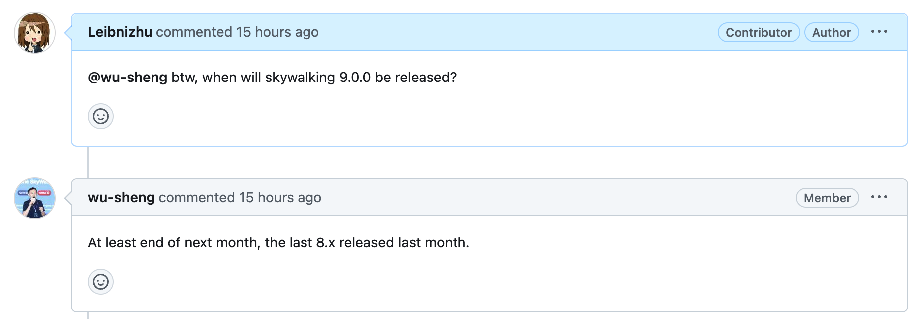

Quarkus3已经发布一段时间了（[Quarkus 3.0, our new major release, is here! April 26, 2023](https://cn.quarkus.io/blog/quarkus-3-0-final-released/)），不知道大家都升级了没有。  
而Quarkus3.2也成为了首个LTS版本（[Long-Term Support (LTS) for Quarkus](https://quarkus.io/blog/lts-releases/)），很适合升级。  
官方给出了升级的方法，如：
- [Migration Guide 3.0](https://github.com/quarkusio/quarkus/wiki/Migration-Guide-3.0)
- [Migration Guide 3.0: Hibernate ORM 5 to 6 migration](https://github.com/quarkusio/quarkus/wiki/Migration-Guide-3.0:-Hibernate-ORM-5-to-6-migration)
- [Migration Guide 3.1](https://github.com/quarkusio/quarkus/wiki/Migration-Guide-3.1)
- [Migration Guide 3.2](https://github.com/quarkusio/quarkus/wiki/Migration-Guide-3.2)

但实际升级下来，除了官方Migration Guide以外，还有一些其他的必要的调整，如第三方插件，在此记录。

1. `kubernetes-client` 系列依赖从6.3升级到6.7，部分api不兼容；因此要检查pom文件，确认是否有显式声明的依赖版本和 `quarkus-bom` 所定义的版本冲突；其他的依赖类似的，比如 `quarkus-bom` 声明了一个依赖A及其子依赖B的版本，而在项目中显式声明了依赖A的版本，则其B与A可能不兼容
2. 如果测试中使用到h2数据库，需要在jdbcUrl加上 `DATABASE_TO_UPPER=false` 以避免一些sql语句失败；h2变成默认区分大小写了，具体原因未知
3. javax转jakarta包这点是官方Migration Guide里面有写的，但要注意配置文件里如果用到也记得修改。如restclient的scope配置
4. 如果使用到lombok，建议升级到最新版，并需要在 `maven-compiler-plugin` 插件加上：
	```xml  
	<configuration>  
		<annotationProcessorPaths>  
			<path>  
				<groupId>org.projectlombok</groupId>  
				<artifactId>lombok</artifactId>  
				<version>${lombok.version}</version>  
			</path>  
		</annotationProcessorPaths>  
	</configuration>
    ```
5. 一些插件依赖的升级：
    - quarkus-logging-logback=1.1.0
    - logback-core=1.4.7
    - quarkus-mybatis-plus=2.0.0
    - quarkus-openapi-generator=2.2.8
    - mockito-inline=5.2.0
    - 显式增加 quarkus-rest-client-jackson 依赖（quarkus3不绑定在 quarkus-rest-client 里面了）
    - openapi-generator-maven-plugin 升级6.6.0，并加上 `<useJakartaEe>true</useJakartaEe>` 配置，这样生成的代码的import才是使用jakarta包的；但升级后，model前缀的替换出现问题，如果不使用 `modelNamePrefix + importMappings` 配置则无影响
6. 如果使用到spotless，注意检查import顺序是否加上了jakarta包
7. Hibernate升级带来的一些调整；
    - hql语句必须用实体的属性名，需要检查
    - hql语句对类型的检查更为严格，需要检查
8. 由于Quarkus3使用的 `Resteasy` 升级到6.x（升级Jakarta REST3），所以如果你的应用使用到Skywalking进行监控，则原来的Resteasy4.x插件无法正常工作：
    - 为此我写了Skywalking javaagent的Resteasy 6.x plugin
    - 该PR [Add support for RESTEasy 6.x #587](https://github.com/apache/skywalking-java/pull/587) 已合入主分支
    - 该特性随Skywalking javaagent 9.0.0版本发布，预估最早8月底发布：
