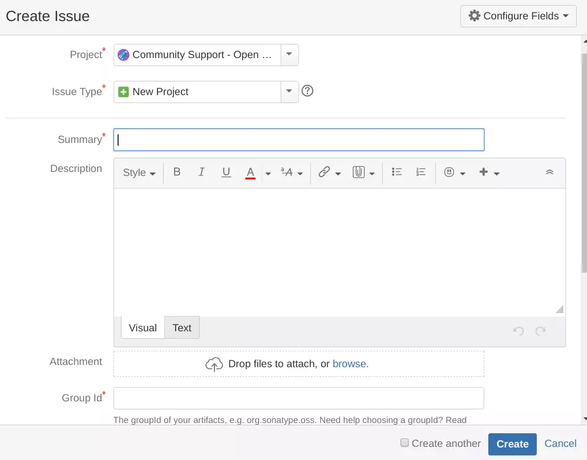
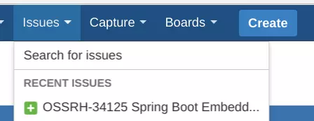
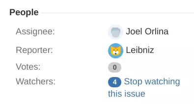
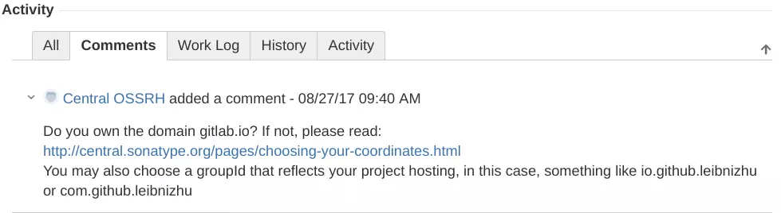
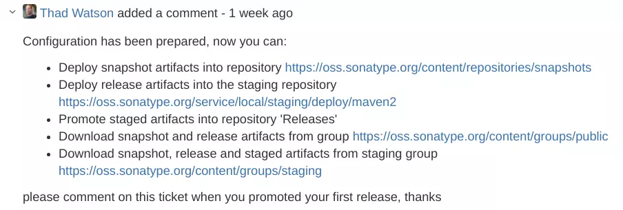
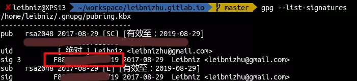
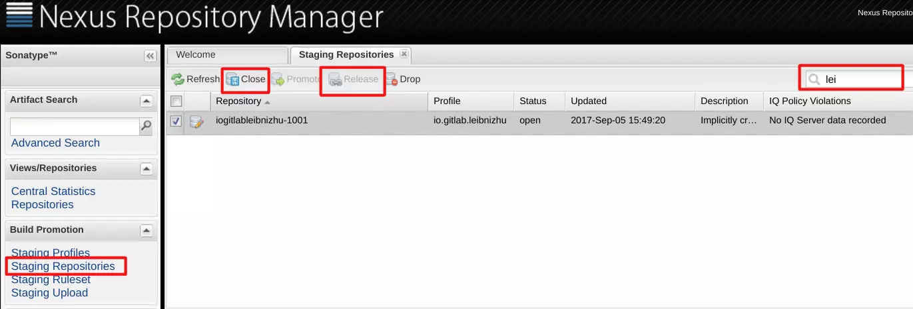
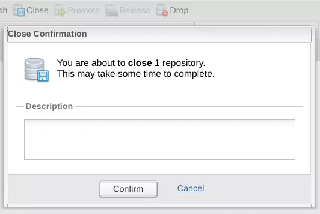

# 发布项目到Maven中央仓库
## 前言
写完项目之后，为了方便别人调用，需要发布到网上，有以下方法：
1. 提交到Github/Gitlab上的公开项目（包含pom.xml），其他人clone后，通过```mvn install```安装到本地仓库，再通过maven依赖引入。缺点：需要使用者手动操作的比较多，体验不好。  
2. 提交到Maven中央仓库，使用者只要直接通过maven依赖引入即可。缺点：发布者操作较多麻烦。  

本文讨论的是第二种方法，目前网上也有很多相关文章，经过实践发现一些具体的操作已经过时/不可用，本人也踩了不少坑。所以写下本文记录。  

## 注册Sonatype提交申请
Maven中央仓库由Sonatype公司在维护，在向Maven中央仓库提交项目前，需要先注册Sonatype账户，然后提交issue申请。
### 注册Sonatype
到 [Sonatype官网](https://issues.sonatype.org/secure/Signup!default.jspa) 注册帐号，随后登录。
### 提交issue申请
登录点击上方导航栏的```Create```按钮：
  
弹出模态窗：  
  
其中```Project```选择```Community Support - Open Source Project Repository Hosting```，```Already Synced to Central```按默认选```No```其他信息按实际填写，页面上也有例子。值得注意的是```Group Id```要与项目pom.xml里面的以及实际包名一致，最好是你拥有的域名倒着写；```Project URL```和```SCM url```可以写Gitlab/Github地址。  
创建后可以通过导航栏的```issue```菜单找到我们提交的issue：  
  

### 等待工作人员确认
由于时差关系，Sonatype的工作人员大约会在北京时间22：00开始处理issue。  
分配工作人员后，在issue页面右边看到```Assignee```分配给谁了：  
  
如果这个groupId是第一次用来提交，会有工作人员留言，向你确认groupId：  
  
我们回复、工作人员确认没问题之后，会告诉你审批通过，准备好配置了：  
  
这时就可以准备上传了。  

## 上传前的准备
### GPG签名
一般Linux发行版都会预装gpg，没有的自行安装即可（apt、pacman等命令，不再赘述）。输入命令：
```bash
gpg --gen-key
```
需要输入姓名、邮箱等字段，其它字段可使用默认值，此外，还需要输入一个 Passphase，相当于一个密钥库的密码，要记好，deploy要用。  
再输入下面命令来获取公钥ID：
```bash
gpg --list-signatures
```
  
上图是输出结果，其中红框里的就是公钥ID，记下来。  
最后输入以下命令将公钥发布到 PGP 密钥服务器（以下三句命令发布到三个不同的服务器，任意输入一句即可，Sonatype对这三个服务器均认可）：
```bash
gpg --keyserver hkp://pool.sks-keyservers.net：11371 --send-keys 刚才的公钥ID
gpg --keyserver hkp://pgp.mit.edu:11371 --send-keys 刚才的公钥ID
gpg --keyserver hkp://keyserver.ubuntu.com:11371 --send-keys 刚才的公钥ID

```
然后验证是否发布成功（也是任选一句，对应上面输入的服务器）：
```bash
gpg --keyserver hkp://pool.sks-keyservers.net：11371 --recv-keys 刚才的公钥ID
gpg --keyserver hkp://pgp.mit.edu:11371 --recv-keys 刚才的公钥ID
gpg --keyserver hkp://keyserver.ubuntu.com:11371 --recv-keys 刚才的公钥ID
```
正常结果应该类似：
```bash
gpg: 密钥 F***9：“L***z <l***u@***.***>”未改变
gpg: 合计被处理的数量：1
gpg:           未改变：1
```

### 修改pom.xml
pom.xml文件需要修改比较多，在这直接列出相关的：  
```xml
<licenses>
    <license>
        <name>The Apache Software License, Version 2.0</name>
        <url>http://www.apache.org/licenses/LICENSE-2.0.txt</url>
        <distribution>repo</distribution>
    </license>
</licenses>

<scm>
  <!-- 修改自己的地址 -->
    <tag>master</tag>
    <url>https://github.com/Leibnizhu/spring-boot-starter-netty</url>
    <connection>scm:git:git@github.com:Leibnizhu/spring-boot-starter-netty.git</connection>
    <developerConnection>scm:git:git@github.com:Leibnizhu/spring-boot-starter-netty.git</developerConnection>
</scm>

<developers>
    <developer>
        <id>***</id>
        <name>***</name>
        <email>L***@***.***</email>
    </developer>
</developers>

<properties>
    <project.build.sourceEncoding>UTF-8</project.build.sourceEncoding>
    <project.reporting.outputEncoding>UTF-8</project.reporting.outputEncoding>
    <java.version>1.8</java.version>
    <javadoc.version>8</javadoc.version>
    <compiler-plugin.version>3.6.2</compiler-plugin.version>
    <war-plugin.version>3.1.0</war-plugin.version>
    <clean-plugin.version>3.0.0</clean-plugin.version>
    <resources-plugin.version>3.0.2</resources-plugin.version>
    <surefire-plugin.version>2.20</surefire-plugin.version>
    <jar-plugin.version>3.0.2</jar-plugin.version>
    <source-plugin.version>3.0.1</source-plugin.version>
    <javadoc-plugin.version>2.10.4</javadoc-plugin.version>
    <gpg-plugin.version>1.6</gpg-plugin.version>
</properties>

<distributionManagement>
    <repository>
        <id>oss</id>
        <url>
            https://oss.sonatype.org/service/local/staging/deploy/maven2
        </url>
    </repository>
    <snapshotRepository>
        <id>oss</id>
        <uniqueVersion>false</uniqueVersion>
        <url>
            https://oss.sonatype.org/content/repositories/snapshots
        </url>
    </snapshotRepository>
</distributionManagement>

<profiles>
    <profile>
        <id>release</id>
        <build>
            <plugins>
                <plugin>
                    <groupId>org.apache.maven.plugins</groupId>
                    <artifactId>maven-source-plugin</artifactId>
                    <version>${source-plugin.version}</version>
                    <executions>
                        <execution>
                            <id>attach-sources</id>
                            <goals>
                                <goal>jar-no-fork</goal>
                            </goals>
                        </execution>
                    </executions>
                    <configuration>
                        <attach>true</attach>
                    </configuration>
                </plugin>
                <plugin>
                    <groupId>org.apache.maven.plugins</groupId>
                    <artifactId>maven-javadoc-plugin</artifactId>
                    <version>${javadoc-plugin.version}</version>
                    <executions>
                        <execution>
                            <phase>package</phase>
                            <goals>
                                <goal>jar</goal>
                            </goals>
                        </execution>
                    </executions>
                    <configuration>
                        <links>
                            <link>
                                http://docs.oracle.com/javase/${javadoc.version}/docs/api
                            </link>
                        </links>
                    </configuration>
                </plugin>
                <plugin>
                    <groupId>org.apache.maven.plugins</groupId>
                    <artifactId>maven-gpg-plugin</artifactId>
                    <version>${gpg-plugin.version}</version>
                    <executions>
                        <execution>
                            <phase>install</phase>
                            <goals>
                                <goal>sign</goal>
                            </goals>
                        </execution>
                    </executions>
                </plugin>
            </plugins>
        </build>
        <distributionManagement>
            <repository>
                <id>oss</id>
                <url>
                    https://oss.sonatype.org/service/local/staging/deploy/maven2/
                </url>
            </repository>
        </distributionManagement>
    </profile>
</profiles>

<build>
    <plugins>
        <plugin>
            <groupId>org.apache.maven.plugins</groupId>
            <artifactId>maven-compiler-plugin</artifactId>
            <configuration>
                <source>${java.version}</source>
                <target>${java.version}</target>
            </configuration>
        </plugin>

        <plugin>
            <groupId>org.apache.maven.plugins</groupId>
            <artifactId>maven-jar-plugin</artifactId>
            <version>${jar-plugin.version}</version>
        </plugin>

        <plugin>
            <groupId>org.apache.maven.plugins</groupId>
            <artifactId>maven-surefire-plugin</artifactId>
            <version>${surefire-plugin.version}</version>
            <configuration>
                <skip>true</skip>
            </configuration>
        </plugin>

    </plugins>
</build>
```
这里加了很多插件，因为Sonatype要求有javadoc、GPG签名等等。  

### 修改~/.m2/settings.xml
```xml
<settings>
    ...
    <servers>
        <server>
            <id>oss</id>
            <username>用户名</username>
            <password>密码</password>
        </server>
    </servers>
    ...
</settings>
```

## 上传&&发布
### Maven上传
进入项目，输入以下命令：  
```bash
mvn deploy -P release -Dgpg.passphrase=[GPG密码]
```
稍等片刻，期间可能会弹窗要求输入GPG密码。最后看到```BUILD SUCCESS```成功。  
注: MacOS下可能会提示：  
```
gpg: signing failed: Inappropriate ioctl for device
```
请先输入：  
```
export GPG_TTY=$(tty)
```
再执行`mvn deploy`

### OSS发布
打开 [https://oss.sonatype.org/](https://oss.sonatype.org/) 并登陆（帐号密码与前面注册一样）。  
点击左边的```Staging Repositories```，再在右上角搜索groupid：  
  
选中自己的项目，点击```Close```再在弹出模态窗点```Confirm```，描述可以不用写：  
  
等一两分钟再刷新上面的列表，可以看到状态已经变成Closed（如果没有的话，在下方的Acitivity可以看到close操作的情况，看具体是什么问题，我一开始就一直说找不到签名，将GPG公钥发布后又说缺少javadoc，于是再加Maven插件生成javadoc）。
这时候再选中自己的项目，然后点```Release```按钮，再点```Confirm```提交，即可。   

## 收尾工作
### 关闭OSS的issue
回到OSS [https://issues.sonatype.org](https://issues.sonatype.org) ，打开自己提交的issue，回复一下，告诉工作人员已经上传发布到OSS了，很快他们就会回复说10分钟内会同步到中央仓库，2小时内可以被搜索到：  
  

### 等待同步中央仓库
一般等最多两个小时，就可以在 [https://search.maven.org](https://search.maven.org) 搜索到自己发布的项目啦。  
我的Spring-Boot-Starter-Netty项目地址： [https://search.maven.org/#artifactdetails%7Cio.gitlab.leibnizhu%7Cspring-boot-starter-netty%7C1.0%7Cjar](https://search.maven.org/#artifactdetails%7Cio.gitlab.leibnizhu%7Cspring-boot-starter-netty%7C1.0%7Cjar)
