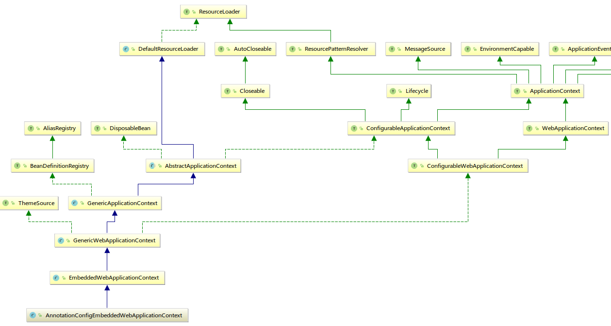

# 基于Netty的Spring Boot内置Servlet容器的实现（三）
## EmbeddedServletContainer实现
### Spring Boot启动过程与EmbeddedServletContainer
一般来说，Spring Boot的应用如果使用内置Servlet容器单独运行，我们都会在main()方法中调用
```java
SpringApplication.run(Object source, String... args);
```
方法。通过```source```参数构造一个```SpringApplication```对象再调用其
```java
public ConfigurableApplicationContext run(String... args);
```
方法，这个方法先通过```createApplicationContext()```创建一个```AnnotationConfigEmbeddedWebApplicationContext```对象，随后会调用到
```java
protected void refresh(ApplicationContext applicationContext);
```
方法，这个方法会调用到```AbstractApplicationContext```的```refresh()```方法。而通过下面的UML图可以看到，```AnnotationConfigEmbeddedWebApplicationContext```是```AbstractApplicationContext```的子类。

实际上，这里使用了模板设计模式，```refresh()```的具体流程由父类```AbstractApplicationContext```定义，具体的一些操作由子类去实现，在子类调用```refresh()```方法的时候，调用的是子类实现的操作方法，如：  
```java
protected void onRefresh() throws BeansException
```
方法。这个方法在```AnnotationConfigEmbeddedWebApplicationContext```的父类```EmbeddedWebApplicationContext```中有实现：
```java
protected void onRefresh() {
    super.onRefresh();

    try {
        this.createEmbeddedServletContainer();
    } catch (Throwable var2) {
        throw new ApplicationContextException("Unable to start embedded container", var2);
    }
}

private void createEmbeddedServletContainer() {
   EmbeddedServletContainer localContainer = this.embeddedServletContainer;
   ServletContext localServletContext = this.getServletContext();
   if (localContainer == null && localServletContext == null) {
       EmbeddedServletContainerFactory containerFactory = this.getEmbeddedServletContainerFactory();
       this.embeddedServletContainer = containerFactory.getEmbeddedServletContainer(new ServletContextInitializer[]{this.getSelfInitializer()});
   } else if (localServletContext != null) {
       try {
           this.getSelfInitializer().onStartup(localServletContext);
       } catch (ServletException var4) {
           throw new ApplicationContextException("Cannot initialize servlet context", var4);
       }
   }
   this.initPropertySources();
}
```
检查embeddedServletContainer私有变量是否为空，为空的话获取```EmbeddedServletContainerFactory```工厂类（就是我们写的```EmbeddedNettyFactory```），获取到```EmbeddedServletContainer```实例并赋值给```this.embeddedServletContainer```。  
在模板方法```AbstractApplicationContext.refresh()```中，调用```onRefresh()```后，会继续调用```finishRefresh()```，通过上面的分析我们知道实际调用的是```EmbeddedWebApplicationContext.finishRefresh()```：  
```java
protected void finishRefresh() {
    super.finishRefresh();
    EmbeddedServletContainer localContainer = this.startEmbeddedServletContainer();
    if (localContainer != null) {
        this.publishEvent(new EmbeddedServletContainerInitializedEvent(this, localContainer));
    }
}

private EmbeddedServletContainer startEmbeddedServletContainer() {
    EmbeddedServletContainer localContainer = this.embeddedServletContainer;
    if (localContainer != null) {
        localContainer.start();
    }
    return localContainer;
}
```
可以看到他调用了私有方法```startEmbeddedServletContainer()```启动容器，在这个方法里面，获取```this.embeddedServletContainer```（就是我们本文要实现的```NettyContainer```）然后执行其```start()```方法，以启动内置Servlet容器。  
因此我们应该在```EmbeddedServletContainer```实现类的```start()```对Netty服务器进行初始化。  

### NettyContainer
自己编写的内置Servlet容器需要实现```EmbeddedServletContainer```接口，具体包括以下三个方法：
```java
public interface EmbeddedServletContainer {
  void start() throws EmbeddedServletContainerException; //Spring Boot启动时调用
  void stop() throws EmbeddedServletContainerException; //Spring Boot关闭时调用
  int getPort(); //获取端口
}
```
这几个方法的用途比较清晰明确了，接下来就是实现。

#### 构造方法
首先在之前写的```EmbeddedNettyFactory```工厂类里面，需要调用将要写的```EmbeddedNettyFactory```的构造方法，并将必要的参数传入其构造方法，比如端口号、以及已经i初始化完毕的ServletContext实例。
构造方法：  
```java
private final InetSocketAddress address; //监听端口地址
private final NettyContext context; //Context

public NettyContainer(InetSocketAddress address, NettyContext context) {
  this.address = address;
  this.context = context;
}
```
在```EmbeddedNettyFactory```中修改为：
```java
public EmbeddedServletContainer getEmbeddedServletContainer(ServletContextInitializer... initializers) {
  /*…………………………*/
  //return null;
  return new NettyContainer(address, context); //初始化容器并返回
}

@Override
public int getPort() {
    return address.getPort();
}
```

#### start()
通过以上的分析，我们知道```EmbeddedServletContainer```的```start()```是由```AbstractApplicationContext.refresh()```模板方法负责调用启动的，我们应该在这个方法里面初始化Netty服务器。Netty的启动大家应该比较清楚了，无非就是设置两个```EventLoopGroup```用于处理请求的获取与读写，并设置```Pipeline```上的```Handler```，最后绑定端口，启动服务。以下是具体实现的代码：  
```java
@Override
public void start() throws EmbeddedServletContainerException {
    servletContext.setInitialised(false);

    ServerBootstrap sb = new ServerBootstrap();
    //根据不同系统初始化对应的EventLoopGroup
    if ("Linux".equals(StandardSystemProperty.OS_NAME.value())) {
        bossGroup = new EpollEventLoopGroup(1);
        workerGroup = new EpollEventLoopGroup();//不带参数，线程数传入0,实际解析为 Math.max(1, SystemPropertyUtil.getInt("io.netty.eventLoopThreads", Runtime.getRuntime().availableProcessors() * 2));
        sb.channel(EpollServerSocketChannel.class)
                .group(bossGroup, workerGroup)
                .option(EpollChannelOption.TCP_CORK, true);
    } else {
        bossGroup = new NioEventLoopGroup(1);
        workerGroup = new NioEventLoopGroup();
        sb.channel(NioServerSocketChannel.class)
                .group(bossGroup, workerGroup);
    }
    sb.option(ChannelOption.TCP_NODELAY, true)
            .option(ChannelOption.SO_REUSEADDR, true)
            .option(ChannelOption.SO_BACKLOG, 100);
    log.info("Bootstrap configuration: " + sb.toString());

    servletExecutor = new DefaultEventExecutorGroup(50);
    sb.childHandler(new ChannelInitializer<SocketChannel>() {
        @Override
        protected void initChannel(SocketChannel ch) throws Exception {
            ChannelPipeline p = ch.pipeline();
            p.addLast("codec", new HttpServerCodec(4096, 8192, 8192, false)); //HTTP编码解码Handler
            p.addLast("servletInput", new ServletContentHandler(servletContext)); //处理请求，读入数据，生成Request和Response对象
            p.addLast(checkNotNull(servletExecutor), "filterChain", new RequestDispatcherHandler(servletContext)); //获取请求分发器，让对应的Servlet处理请求，同时处理404情况
        }
    });

    servletContext.setInitialised(true);

    ChannelFuture future = sb.bind(address).awaitUninterruptibly();
    Throwable cause = future.cause();
    if (null != cause) {
        throw new EmbeddedServletContainerException("Could not start Netty server", cause);
    }
    log.info(servletContext.getServerInfo() + " started on port: " + getPort());
}
```
这里有两个```Handler```类是我们实现的——```ServletContentHandler```和```RequestDispatcherHandler```，我们将在后面讲解。

#### stop()
在```stop()```方法里应该关闭在```start()```方法中开启的资源，以便Spring Boot关闭，防止资源/内存泄漏：  
```java
@Override
public void stop() throws EmbeddedServletContainerException {
    try {
        if (null != bossGroup) {
            bossGroup.shutdownGracefully().await();
        }
        if (null != workerGroup) {
            workerGroup.shutdownGracefully().await();
        }
        if (null != servletExecutor) {
            servletExecutor.shutdownGracefully().await();
        }
    } catch (InterruptedException e) {
        throw new EmbeddedServletContainerException("Container stop interrupted", e);
    }
}
```

## Netty服务设计
### 设计思路
看过Tomcat之类Servlet容器的源码的话，应该对Servleti容器设计有一点概念。  
1. 首先我们需要通过Socket，处理HTTP连接，获取请求的数据，这一块可通过netty的API进行。  
2. 然后对接收到的数据进行解析封装成```HttpServletRequest```和```HttpServletResponse```对象，这一块需要netty自带的http解码编码器，并自定义Handler来i实现。  
3. 而```HttpServletRequest```本身也需要一些处理，比如Cookie、Session、Attributes（懒解析），需要自行实现。  
4. 接着需要对请求路径进行匹配，找到对应处理的Servlet， 这一部分前面已经实现了（2017-08-26似乎还有点Bug需要解决）。  
5. 接下来就是调用对应Servlet的```service()```方法，等待返回（在容器启动的时候需要对有on-startup的Servlet进行```init()```方法的调用）。  
6. Servlet返回后，包装响应，处理异常和HTTP错误。  
7. HTTP编码响应返回。
8. 容器关闭的时候，调用所有已注册的Servlet的```destroy()```方法，并关闭打开的资源。    

### 自定义Netty的Handler处理请求响应
根据前面的分析，我们的netty服务需要三个Handler，其中HTTP解码编码的有现成的```HttpServerCodec```，另外两个则需要我们自己实现。  
首先是对请求进行封装的Handler， 功能：
* channel激活时， 开启一个新的输入流
* 有信息/请求进入时，封装请求和响应对象，执行读操作
* channel恢复时，关闭输入流，等待下一次连接到来

```java
@Override
public void channelActive(ChannelHandlerContext ctx) throws Exception {
    inputStream = new HttpRequestInputStream(ctx.channel());
}

@Override
public void channelRead(ChannelHandlerContext ctx, Object msg) throws Exception {
    if (msg instanceof HttpRequest) {
        HttpRequest request = (HttpRequest) msg;
        HttpResponse response = new DefaultHttpResponse(HttpVersion.HTTP_1_1, HttpResponseStatus.OK, false);
        HttpUtil.setKeepAlive(response, HttpUtil.isKeepAlive(request));
        NettyHttpServletResponse servletResponse = new NettyHttpServletResponse(ctx, servletContext, response);
        NettyHttpServletRequest servletRequest = new NettyHttpServletRequest(ctx, servletContext, request, servletResponse, inputStream);
        if (HttpUtil.is100ContinueExpected(request)) { //请求头包含Expect: 100-continue
            ctx.write(new DefaultFullHttpResponse(HttpVersion.HTTP_1_1, HttpResponseStatus.CONTINUE), ctx.voidPromise());
        }
        ctx.fireChannelRead(servletRequest);
    }
    if (msg instanceof HttpContent) {
        inputStream.addContent((HttpContent) msg);
    }
}

@Override
public void channelInactive(ChannelHandlerContext ctx) throws Exception {
    inputStream.close();
}
```
然后是一个处理URL匹配分发请求的Handler，完成以下功能：
* 读入请求数据时，对请求URI获取分发器
* 找不到返回404错误.
* 找到则调用FilterChain进行业务逻辑
* 最后关闭输出流

```java
@Override
public void channelReadComplete(ChannelHandlerContext ctx) throws Exception {
    ctx.flush();
}

@Override
protected void channelRead0(ChannelHandlerContext ctx, NettyHttpServletRequest request) throws Exception {
    HttpServletResponse servletResponse = (HttpServletResponse) request.getServletResponse();
    try {
        NettyRequestDispatcher dispatcher = (NettyRequestDispatcher) context.getRequestDispatcher(request.getRequestURI());
        if (dispatcher == null) {
            servletResponse.sendError(404);
            return;
        }
        dispatcher.dispatch(request, servletResponse);
    } finally {
        if (!request.isAsyncStarted()) {
            servletResponse.getOutputStream().close();
        }
    }
}

@Override
public void exceptionCaught(ChannelHandlerContext ctx, Throwable cause) throws Exception {
    logger.error("Unexpected exception caught during request", cause);
    ctx.close();
}
```
