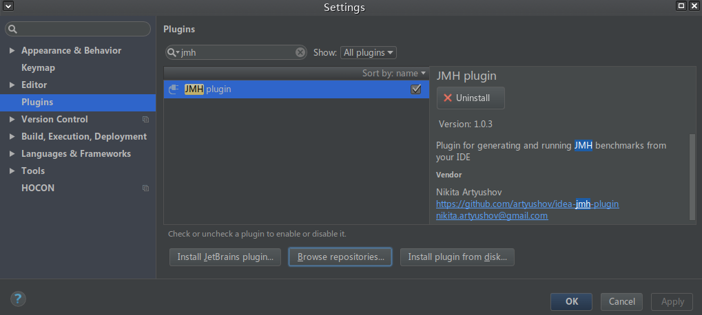
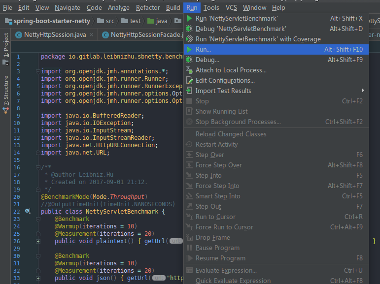
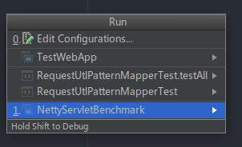

# 基于Netty的Spring Boot内置Servlet容器的实现（五）
## BenchMark 程序编写
BenchMark可以用Jmeter进行，也可以直接编写java Test程序，通过@Befor进行时间计算。  
更方便的方法直使JM框架。
### JMH简介
JMH是新的microbenchmark（微基准测试）框架（2013年首次发布）。与其他众多框架相比它的特色优势在于，它是由Oracle实现JIT的相同人员开发的。特别是我想提一下Aleksey Shipilev和他优秀的博客文章。JMH可能与最新的Oracle JRE同步，其结果可信度很高。
### IDEA的JMH插件
直接使用JMH需要额外编写一些入口方法、增加依赖等，并不是特别方便，而IDEA有插件支持JMH。打开`Files-Settings`，找到`Plugins`选项卡，安装`JMH Plugin`插件，安装后重启如下：  

### 编写BenchMark方法
安装`JMH Plugin`插件之后无需编写入口方法、增加依赖，可以直接关注具体的测试。  
编写一个简单例子，测试我们容器的测试用例吞吐量：
```java
@BenchmarkMode(Mode.Throughput)
public class NettyServletBenchmark {
    @Benchmark
    @Warmup(iterations = 10)
    @Measurement(iterations = 20)
    public void plaintext() {
        getUrl("http://localhost:9999/netty/plaintext", false);
    }

    @Benchmark
    @Warmup(iterations = 10)
    @Measurement(iterations = 20)
    public void json() {
        getUrl("http://localhost:9999/netty/json?msg=1", false);
    }

    private String getUrl(String url, boolean read) {
        BufferedReader br = null;
        InputStream is = null;
        StringBuilder sbuf = new StringBuilder();
        try {
            URL reqURL = new URL(url);
            HttpURLConnection connection = (HttpURLConnection) reqURL.openConnection(); // 进行连接，但是实际上getrequest要在下一句的connection.getInputStream() 函数中才会真正发到服务器
            connection.setDoOutput(false);
            connection.setUseCaches(false);
            connection.setRequestMethod("GET");
            connection.setConnectTimeout(200);
            connection.setDoInput(true);
            connection.connect();
            if (read) {
                br = new BufferedReader(new InputStreamReader(connection.getInputStream()));
                String line;
                while ((line = br.readLine()) != null) {
                    sbuf.append(line).append("\n");
                }
            } else {
                is = connection.getInputStream();

            }
        } catch (IOException e) {
            System.out.println("连接服务器'" + url + "'时发生错误：" + e.getMessage());
        } finally {
            try {
                if (null != br) {
                    br.close();
                }
                if (is != null) {
                    is.close();
                }
            } catch (IOException e) {
                e.printStackTrace();
            }
        }
        return sbuf.toString();
    }
}
```
其中`@BenchmarkMode(Mode.Throughput)`表示测试吞吐量，即一秒内可以跑多少次测试方法。其他的测试模式如下：  

| 名称	| 描述 |
|:------|:------|
|Mode.Throughput|	计算一个时间单位内操作数量|
|Mode.AverageTime|	计算平均运行时间|
|Mode.SampleTime|	计算一个方法的运行时间(包括百分位)|
|Mode.SingleShotTime|	方法仅运行一次(用于冷测试模式)。或者特定批量大小的迭代多次运行；这种情况下JMH将计算批处理运行时间(一次批处理所有调用的总时间)|
|这些模式的任意组合|	可以指定这些模式的任意组合——该测试运行多次(取决于请求模式的数量)|
|Mode.All|	所有模式依次运行|

接下来是具体的测试方法：
```java
@Benchmark
@Warmup(iterations = 10)
@Measurement(iterations = 20)
public void plaintext() {
    getUrl("http://localhost:9999/netty/plaintext", false);
}
```
其中`@Benchmark`注解表示当前方法是需要JMH执行测试的方法，`@Warmup(iterations = 10)`表示每次正式测试前，先跑10次进行热身（不参与测试结果的计算），`@Measurement(iterations = 20)`表示每次正式测试执行20次方法。

### 执行测试
执行方法很简单，点击菜单`Run-Run...`，弹出窗中选择当前类，即可：  
  
  
等测试完毕，就会打印出测试结果：  
```bash
Result "io.gitlab.leibnizhu.sbnetty.benchmark.NettyServletBenchmark.plaintext":
  6508.938 ±(99.9%) 189.498 ops/s [Average]
  (min, avg, max) = (157.637, 6508.938, 7098.929), stdev = 802.346
  CI (99.9%): [6319.440, 6698.436] (assumes normal distribution)
Benchmark                         Mode  Cnt     Score     Error  Units
NettyServletBenchmark.json       thrpt  200  6756.677 ± 182.976  ops/s
NettyServletBenchmark.plaintext  thrpt  200  6508.938 ± 189.498  ops/s
```
可以看到IDEA对该类两个带有`@Benchmark`注解的方法分别进行了测试，测试结果分别是6.76kQps和6.51kQps（平均值）。
