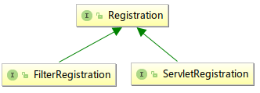
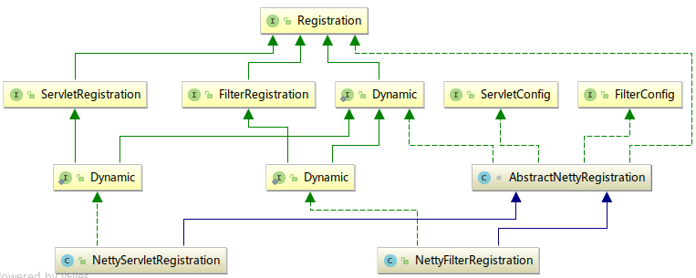

# 基于Netty的Spring Boot内置Servlet容器的实现（四）
## Registration注册器的实现
### 设计与继承结构
在本系列第一篇提到了```javax.servlet.Registration```接口，用于实现Filter和Servlet的动态注册，这个接口相对比较简单；有两个子接口，详见下面的UML图：  
  
我们将要分别实现```FilterRegistration```和```ServletRegistration```接口，为了保持与```Registration```接口的继承关系相近，我们设计了三个类，分别是抽象类，Filter注册、Servlet注册：  
```java
class AbstractNettyRegistration implements Registration, Registration.Dynamic, ServletConfig, FilterConfig{}
public class NettyFilterRegistration extends AbstractNettyRegistration implements FilterRegistration.Dynamic{}
public class NettyServletRegistration extends AbstractNettyRegistration implements ServletRegistration.Dynamic{}
```
这些类构成的UML图如下：  
  
### 代码实现
在实际实现的过程中，忽略了很多用不到的方法，着重实现了加入Mapping以及获取Filter/Servlet实例的方法。  
加入Mapping的方法由ServletContext处理（Mapping本身也是由ServletContext维护），而获取Filter/Servlet的方法使用的是类似于懒加载单例的方法，每个Registration实例维护自己的一个Filter/Servlet实例，首次获取的时候通过反射获取到实例，并将反射获取到的实例由Registration实例持有。具体实现代码如下：
```java
public class NettyServletRegistration extends AbstractNettyRegistration implements ServletRegistration.Dynamic {
    private final Logger log = LoggerFactory.getLogger(getClass());
    private volatile boolean initialised;
    private Servlet servlet;
    private Collection<String> urlPatternMappings = new LinkedList<>();

    public NettyServletRegistration(NettyContext context, String servletName, String className, Servlet servlet) {
        super(servletName, className, context);
        this.servlet = servlet;
    }

    public Servlet getServlet() throws ServletException {
        if (!initialised) {
            synchronized (this) {
                if (!initialised) {
                    if (null == servlet) {
                        try {
                            servlet = (Servlet) Class.forName(getClassName()).newInstance(); //反射获取实例
                        } catch (Exception e) {
                            throw new ServletException(e);
                        }
                    }
                    servlet.init(this); //初始化Servlet
                    initialised = true;
                }
            }
        }
        return servlet;
    }

    @Override
    public Set<String> addMapping(String... urlPatterns) {
        //在RequestUrlPatternMapper中会检查url Pattern是否冲突
        NettyContext context = getNettyContext();
        for (String urlPattern : urlPatterns) {
            try {
                context.addServletMapping(urlPattern, getName(), getServlet());
            } catch (ServletException e) {
                log.error("Throwing exception when getting Servlet in NettyServletRegistration.", e);
            }
        }
        urlPatternMappings.addAll(Arrays.asList(urlPatterns));
        return new HashSet<>(urlPatternMappings);
    }
}

public class NettyFilterRegistration extends AbstractNettyRegistration implements FilterRegistration.Dynamic {
    private volatile boolean initialised;
    private Filter filter;
    private Collection<String> urlPatternMappings = new LinkedList<>();

    public NettyFilterRegistration(NettyContext context, String filterName, String className, Filter filter) {
        super(filterName, className, context);
        this.filter = filter;
    }

    public Filter getFilter() throws ServletException {
        if (!initialised) {
            synchronized (this) {
                if (!initialised) {
                    if (null == filter) {
                        try {
                            filter = (Filter) Class.forName(getClassName()).newInstance(); //反射获取实例
                        } catch (Exception e) {
                            throw new ServletException(e);
                        }
                    }
                    filter.init(this); //初始化Filter
                    initialised = true;
                }
            }
        }
        return filter;
    }

    @Override
    public void addMappingForUrlPatterns(EnumSet<DispatcherType> dispatcherTypes, boolean isMatchAfter, String... urlPatterns) {
        NettyContext context = getNettyContext();
        for (String urlPattern : urlPatterns) {
            context.addFilterMapping(dispatcherTypes, isMatchAfter, urlPattern);
        }
        urlPatternMappings.addAll(Arrays.asList(urlPatterns));
    }
}
```

## FilterChain过滤器链的实现
大家应该都知道过滤器链的概念，所有过滤器都在过滤器链上，当有请求进入，将依次经过每个适用的过滤器（根据过滤器的Url Pattern与请求的路径而不同），过滤器里执行```doFilter()```方法让过滤器链执行下一个过滤器，直到最后一个，则执行Servlet的```service()```方法。而过滤器链对应的接口```javax.servlet.FilterChain```里面就一个方法：  
```java
public interface FilterChain {
    public void doFilter ( ServletRequest request, ServletResponse response ) throws IOException, ServletException;
}
```
显然，实现```FilterChain```接口，应该要维护一个过滤器的数组或者List，而在```doFilter()```方法里面，应该判断有没有下一个过滤器，有则调用其```doFilter()```方法，无则调用当前请求对应Servlet实例的```service()```方法，可以用迭代器或者记录游标（数组或List的下标）来实现。具体代码：  
```java
public class NettyFilterChain implements FilterChain {
    /**
     * 考虑到每个请求只有一个线程处理，而且ServletContext在每次请求时都会new 一个SimpleFilterChain对象
     * 所以这里把过滤器链的Iterator作为FilterChain的私有变量，没有线程安全问题
     */
    private final Iterator<Filter> filterIterator;
    private final Servlet servlet;

    public NettyFilterChain(Servlet servlet, Iterable<Filter> filters) throws ServletException {
        this.filterIterator = checkNotNull(filters).iterator();
        this.servlet = checkNotNull(servlet);
    }

    /**
     * 每个Filter在处理完请求之后调用FilterChain的这个方法。
     * 这时候应该找到下一个Filter，调用其doFilter()方法。
     * 如果没有下一个了，应该调用servlet的service()方法了
     */
    @Override
    public void doFilter(ServletRequest request, ServletResponse response) throws IOException, ServletException {
        if (filterIterator.hasNext()) {
            Filter filter = filterIterator.next();
            filter.doFilter(request, response, this);
        } else {
            servlet.service(request, response);
        }
    }
}
```

## HttpServletRequest的实现
接口```javax.servlet.http.HttpServletRequest```的方法比较多，大概可以分为Cookie相关、Header相关、各种路径相关、Session相关、请求参数相关、请求协议/地址/端口相关、Attributes相关、异步相关、multipart/form-data相关（上传文件）等等方法，以上提到的方法本文基本实现了，还有一些没实现的是暂时用不到的。
### Cookie相关方法
Cookie使用“懒解析”，就是用标识```isCookieParsed```记录Cookie是否被解析过，初始化Request对象的时候不解析，在获取Cookiea相关方法被调用的时候再判断是否未解析，若未解析则解析再返回，否则直接返回。```NettyHttpServletRequest```的构造方法传入了netty的```HttpHeaders```实例，可以从中获取Cookie请求头，再进行解析。具体代码如下：  
```java
/*====== Cookie 相关方法 开始 ======*/
private Cookie[] cookies;
private transient boolean isCookieParsed = false;

@Override
public Cookie[] getCookies() {
    if (!isCookieParsed) {
        parseCookie();
    }
    return cookies;
}

/**
 * 解析request中的Cookie到本类的cookies数组中
 *
 * @author Leibniz
 */
private void parseCookie() {
    if (isCookieParsed) {
        return;
    }

    String cookieOriginStr = this.headers.get("Cookie");
    if (cookieOriginStr == null) {
        return;
    }
    Set<io.netty.handler.codec.http.cookie.Cookie> nettyCookies = ServerCookieDecoder.LAX.decode(cookieOriginStr);
    if (nettyCookies.size() == 0) {
        return;
    }
    this.cookies = new Cookie[nettyCookies.size()];
    Iterator<io.netty.handler.codec.http.cookie.Cookie> itr = nettyCookies.iterator();
    int i = 0;
    while (itr.hasNext()) {
        io.netty.handler.codec.http.cookie.Cookie nettyCookie = itr.next();
        Cookie servletCookie = new Cookie(nettyCookie.name(), nettyCookie.value());
//            servletCookie.setMaxAge(Ints.checkedCast(nettyCookie.maxAge()));
        if(nettyCookie.domain() != null) servletCookie.setDomain(nettyCookie.domain());
        if(nettyCookie.path() != null) servletCookie.setPath(nettyCookie.path());
        servletCookie.setHttpOnly(nettyCookie.isHttpOnly());
        this.cookies[i++] = servletCookie;
    }

    this.isCookieParsed = true;
}

/*====== Cookie 相关方法 结束 ======*/
```

### Header相关方法
上面提到```NettyHttpServletRequest```的构造方法传入了netty的```HttpHeaders```实例，可以从中获取所有请求头，而Header相关方法的实现就靠他了：  
```java
/*====== Header 相关方法 开始 ======*/
private HttpHeaders headers;

@Override
public long getDateHeader(String name) {
    return this.headers.getTimeMillis(name);
}

@Override
public String getHeader(String name) {
    return this.headers.get(name);
}

@Override
public Enumeration<String> getHeaders(String name) {
    return Collections.enumeration(this.headers.getAll(name));
}

@Override
public Enumeration<String> getHeaderNames() {
    return Collections.enumeration(this.headers.names());
}

@Override
public int getIntHeader(String name) {
    String headerStringValue = this.headers.get(name);
    if (headerStringValue == null) {
        return -1;
    }
    return Integer.parseInt(headerStringValue);
}
/*====== Header 相关方法 结束 ======*/
```
### Session相关方法
Session相关方法相对多一些。Session的解析分两种，首先尝试从Cookie中获取Cookie（名为JSESSIONID），如果没有，则从请求路径中找类似";jsessionid=*******"的参数作为SessionID。拿到SessionID后，再调用SessionManager的方法获取Session对象；而根据从哪里解析到的SessionID可以设置```isCookieSession```和```isURLSession```两个属性，用于```isRequestedSessionIdFromCookie()```和```isRequestedSessionIdFromURL()```方法。如果拿不到SessionID，则调用SessionManager的方法创建一个新Session。  
至于Session和SessionManager的实现我们在下一小节再讲，值得注意的是，```getSession()```方法返回的并不是我们定义的Session类实例，而是其门面类，是出于安全的考虑；这一点参考了Tomcat的做法（Tomcat的Request、Response、Session等对象都是用门面模式）。  
```java
private NettyHttpSession session;
private boolean isCookieSession;
private boolean isURLSession;

/**
 * 先后看请求路径和Cookie中是否有sessionid
 * 有，则从SessionManager获取session对象放入session属性
 * 如果session对象过期，则创建一个新的并放入
 * 无，则创建一个新Session并放入
 */
private void parseSession() {
    String sessionId;
    NettyHttpSession curSession;

    //从Cookie解析SessionID
    sessionId = getSessionIdFromCookie();
    if(sessionId != null){
        curSession = servletContext.getSessionManager().getSession(sessionId);
        if (null != curSession) {
            this.isCookieSession = true;
            recoverySession(curSession);
            return;
        }
    }

    if (!this.isCookieSession) {
        // 从请求路径解析SessionID
        sessionId = getSessionIdFromUrl();
        curSession = servletContext.getSessionManager().getSession(sessionId);
        if(null != curSession){
            this.isURLSession = true;
            recoverySession(curSession);
            return;
        }
    }
    //Cookie和请求参数中都没拿到Session，则创建一个
    if (this.session == null) {
        this.session = createtSession();
    }
}

/**
 * @return 从URL解析到的SessionID
 */
private String getSessionIdFromUrl() {
    StringBuilder u = new StringBuilder(request.uri());
    int sessionStart = u.toString().indexOf(";" + NettyHttpSession.SESSION_REQUEST_PARAMETER_NAME + "=");
    if(sessionStart == -1) {
        return null;
    }
    int sessionEnd = u.toString().indexOf(';', sessionStart + 1);
    if (sessionEnd == -1)
        sessionEnd = u.toString().indexOf('?', sessionStart + 1);
    if (sessionEnd == -1) // still
        sessionEnd = u.length();
    return u.substring(sessionStart + NettyHttpSession.SESSION_REQUEST_PARAMETER_NAME.length() + 2, sessionEnd);
}

/**
 * @return 从Cookie解析到的SessionID
 */
private String getSessionIdFromCookie() {
    Cookie[] cookies = getCookies();
    if(cookies == null){
        return null;
    }
    for (Cookie cookie : cookies) {
        if (cookie.getName().equals(NettyHttpSession.SESSION_COOKIE_NAME)) {
            return cookie.getValue();
        }
    }
    return null;
}

/**
 * 恢复旧Session
 * @param curSession 要恢复的Session对象
 */
private void recoverySession(NettyHttpSession curSession) {
    this.session = curSession;
    this.session.setNew(false);
    this.servletContext.getSessionManager().updateAccessTime(this.session);
}

@Override
public HttpSession getSession(boolean create) {
    boolean valid = isRequestedSessionIdValid(); //在管理器存在，且没到期
    //可用则直接返回
    if (valid) {
        return session.getSession();
    }
    //不可用则判断是否新建
    if (!create) {
        session = null; //如果过期了设为null
        return null;
    }
    //不可用且允许新建则新建之
    this.session = createtSession();
    return this.session.getSession();
}

@Override
public HttpSession getSession() {
    return getSession(true);
}

@Override
public String changeSessionId() {
    this.session = createtSession();
    return this.session.getId();
}

private NettyHttpSession createtSession() {
    return servletContext.getSessionManager().createSession();
}

@Override
public boolean isRequestedSessionIdValid() {
    return servletContext.getSessionManager().checkValid(session);
}

@Override
public boolean isRequestedSessionIdFromCookie() {
    return isCookieSession;
}

@Override
public boolean isRequestedSessionIdFromURL() {
    return isURLSession;
}

@Override
@Deprecated
public boolean isRequestedSessionIdFromUrl() {
    return isRequestedSessionIdFromURL();
}

@Override
public String getRequestedSessionId() {
    return session.getId();
}
/*====== Session 相关方法 结束 ======*/
```

## HttpServletResponse实现
HttpServletResponse接口相对简单一点，方法少一点，下面列举出部分方法的实现。
### Header相关方法
这里的Header指响应头。```NettyHttpServletResponse```的构造方法里传入了netty的```HttpResponse```对象，默认的调用是传入一个200的正常HTTP响应。我们可以通过这个```HttpResponse```对象的```headers()```方法对响应头进行操作。具体代码如下：
```java
@Override
public void setDateHeader(String name, long date) {
    response.headers().set(name, date);
}

@Override
public void addDateHeader(String name, long date) {
    response.headers().add(name, date);
}

@Override
public void setHeader(String name, String value) {
    if (name == null || name.length() == 0 || value == null) {
        return;
    }
    if (isCommitted()) {
        return;
    }
    if (setHeaderField(name, value)) {
        return;
    }
    response.headers().set(name, value);
}

private boolean setHeaderField(String name, String value) {
    char c = name.charAt(0);//减少判断的时间，提高效率
    if ('C' == c || 'c' == c) {
        if (HttpHeaderNames.CONTENT_TYPE.contentEqualsIgnoreCase(name)) {
            setContentType(value);
            return true;
        }
    }
    return false;
}

@Override
public void addHeader(String name, String value) {
    if (name == null || name.length() == 0 || value == null) {
        return;
    }
    if (isCommitted()) {
        return;
    }
    if (setHeaderField(name, value)) {
        return;
    }
    response.headers().add(name, value);
}

@Override
public void setIntHeader(String name, int value) {
    if (name == null || name.length() == 0) {
        return;
    }
    if (isCommitted()) {
        return;
    }
    response.headers().set(name, value);
}

@Override
public void addIntHeader(String name, int value) {
    if (name == null || name.length() == 0) {
        return;
    }
    if (isCommitted()) {
        return;
    }
    response.headers().add(name, value);
}
```
### getNettyResponse()方法
方法```public HttpResponse getNettyResponse()```是我们自己定义的，用于响应输出流在写入时做的一些基本处理，主要是请求头的处理，具体代码如下：
```java
/**
 * 设置基本的请求头
 */
public HttpResponse getNettyResponse() {
    if (committed) {
        return response;
    }
    committed = true;
    HttpHeaders headers = response.headers();
    if (null != contentType) {
        String value = null == characterEncoding ? contentType : contentType + "; charset=" + characterEncoding; //Content Type 响应头的内容
        headers.set(HttpHeaderNames.CONTENT_TYPE, value);
    }
    CharSequence date = getFormattedDate();
    headers.set(HttpHeaderNames.DATE, date); // 时间日期响应头
    headers.set(HttpHeaderNames.SERVER, servletContext.getServerInfo()); //服务器信息响应头

    // cookies处理
//        long curTime = System.currentTimeMillis(); //用于根据maxAge计算Cookie的Expires
    //先处理Session ，如果是新Session需要通过Cookie写入
    if (request.getSession().isNew()) {
        String sessionCookieStr = NettyHttpSession.SESSION_COOKIE_NAME + "=" + request.getRequestedSessionId() + "; path=/; domain=" + request.getServerName();
        headers.add(HttpHeaderNames.SET_COOKIE, sessionCookieStr);
    }
    //其他业务或框架设置的cookie，逐条写入到响应头去
    for (Cookie cookie : cookies) {
        StringBuilder sb = new StringBuilder();
        sb.append(cookie.getName()).append("=").append(cookie.getValue())
                .append("; max-Age=").append(cookie.getMaxAge());
        if (cookie.getPath() != null) sb.append("; path=").append(cookie.getPath());
        if (cookie.getDomain() != null) sb.append("; domain=").append(cookie.getDomain());
        headers.add(HttpHeaderNames.SET_COOKIE, sb.toString());
    }
    return response;
}
```

## Session实现
Session相关的包括Session实现类```NettyHttpSession```，Sessionn门面包装类```NettyHttpSessionFacade```，以及Session管理器```NettySessionManager```。  
门面类前面提及到了，构造的时候传入一个```NettyHttpSession```实例并持有，所有```HttpSession```接口的方法都调用```NettyHttpSession```实例的对应方法去处理。  
Session管理器```NettySessionManager```是单例，由```NettyContext```实例持有，负责存储所有Session的映射，方便其他类根据SessionID去获取Session对象，提供创建新Session的方法，允许更新Session访问时间，同时定时清理过期的Session。  
每个```NettyHttpSession```实例都持有```NettySessionManager```的引用，实现了```HttpSession```接口。  
### NettyHttpSession
实现比较简单，Attribute由对象持有的HashMap进行存储，自身保存ID、创建时间、访问时间、生命周期等信息。
具体代码如下（部分过时的方法、简单的getter不列出）：  
```java
public class NettyHttpSession implements HttpSession, Serializable {
    public static final String SESSION_COOKIE_NAME = "JSESSIONID";
    public static final String SESSION_REQUEST_PARAMETER_NAME = "jsessionid";
    private NettySessionManager manager;
    private long creationTime;
    private long lastAccessedTime;
    private int interval = NettySessionManager.SESSION_LIFE_SECONDS;
    private String id;

    NettyHttpSession(String id, NettySessionManager manager){
        long curTime = System.currentTimeMillis();
        this.creationTime = curTime;
        this.lastAccessedTime = curTime;
        this.id = id;
        this.manager = manager;
        this.sessionFacade = new NettyHttpSessionFacade(this);
    }

    private HttpSession sessionFacade;

    public HttpSession getSession(){
        return sessionFacade;
    }

    void updateAccessTime() {
        lastAccessedTime = System.currentTimeMillis();
    }

    @Override
    public void setMaxInactiveInterval(int interval) {
        this.interval = interval;
    }

    private Map<String, Object> attributes = new ConcurrentHashMap<>();

    @Override
    public Object getAttribute(String name) {
        return attributes.get(name);
    }

    @Override
    public void setAttribute(String name, Object value) {
        attributes.put(name, value);
    }

    @Override
    public void removeAttribute(String name) {
        attributes.remove(name);
    }

    @Override
    public void invalidate() {
        attributes.clear();
        attributes = null;
        manager.invalidate(this);
        manager = null;
    }

    private boolean isNew = true;
    @Override
    public boolean isNew() {
        return isNew;
    }

    public void setNew(boolean isNew){
        this.isNew = isNew;
    }

    /**
     * 是否过期
     * @return
     */
    public boolean expire(){
        return System.currentTimeMillis() - creationTime >= interval * 1000;
    }
}
```
### NettySessionManager
Session管理器没有现成的接口，因为比较简单所以也没抽出接口，自己在实现的过程中根据需求写了一些public方法：  
- 使用ConcurrentHashMap存储所有Session。  
- 在构造的同时开启一个线程，每隔```SESSION_LIFE_CHECK_INTER```毫秒扫描所有Session判断是否过期需要清除（有待优化，比如等待时间按最快过期的session的过期时间，或者记录预计下次需要处理的个数，减少遍历的数量）。  
- SessionID是6位随机数字+时间戳翻转。  

```java
public class NettySessionManager {
    private Logger log = LoggerFactory.getLogger(getClass());

    private NettyContext servletContext;
    private Map<String, NettyHttpSession> sessions = new ConcurrentHashMap<>();
    static final int SESSION_LIFE_SECONDS = 60 * 30;
    static final int SESSION_LIFE_MILLISECONDS = SESSION_LIFE_SECONDS * 1000;
    private static final int SESSION_LIFE_CHECK_INTER = 1000 * 60;

    public NettySessionManager(NettyContext servletContext){
        this.servletContext = servletContext;
        new Thread(new checkInvalidSessions(), "Session-Check").start();
    }

    void invalidate(HttpSession session) {
        sessions.remove(session.getId());
    }

    public void updateAccessTime(NettyHttpSession session){
        if(session != null){
            session.updateAccessTime();
        }
    }

    public boolean checkValid(NettyHttpSession session) {
        return session != null && sessions.get(session.getId()) != null && !session.expire();
    }

    public NettyHttpSession getSession(String id){
        return id == null ? null : sessions.get(id);
    }

    public NettyHttpSession createSession(){
        String id = createUniqueSessionId();
        NettyHttpSession newSession = new NettyHttpSession(id, this);
        sessions.put(id ,newSession);
        return newSession;
    }

    private String createUniqueSessionId() {
        String prefix = String.valueOf(100000 + new Random().nextInt(899999));
        return new StringBuilder().append(System.currentTimeMillis()).reverse().append(prefix).toString();
    }

    public void setOldSession(NettyHttpSession session) {
        if(session != null){
            session.setNew(false);
        }
    }

    /**
     * 超时的Session无效化，定期执行
     */
    private class checkInvalidSessions implements Runnable {
        @Override
        public void run() {
            log.info("Session Manager expire-checking thread has been started...");
            while(true){
                try {
                    Thread.sleep(SESSION_LIFE_CHECK_INTER);
                } catch (InterruptedException e) {
                    e.printStackTrace();
                }
                long curTime = System.currentTimeMillis();
                for(NettyHttpSession session : sessions.values()){
                    if(session.expire()){
                        log.info("Session(ID={}) is invalidated by Session Manager", session.getId());
                        session.invalidate();
                    }
                }
            }
        }
    }
}
```
### 可以改进的地方
- Session持久化，包括可选的持久化时间间隔、shutdown自动持久化、startup自动读入。
- Redis集中存储Session，便于服务集群使用
- 优化解析速度
