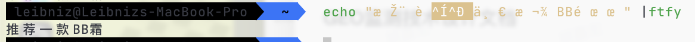

最近在使用jvppeteer监听SSE（Server-Sent Events）响应时，调用 `com.ruiyun.jvppeteer.api.core.Response.content()` 方法获取响应内容，结果发现返回的中文内容全部变成了乱码。这里记录一下问题的分析过程和解决方案。

## 现象描述

在SSE接口的响应中，中文内容无法正常显示，变成了乱码，而英文部分则没有受到影响。这个问题出现在使用 `jvppeteer` 处理 Chrome DevTools Protocol（CDP）的 `Network.getResponseBody` 方法时。

## 原因分析

经过源码分析发现，`Response.content()` 方法实际上是调用了 [CDP协议](https://chromedevtools.github.io/devtools-protocol/tot/Network/#method-getResponseBody) 获取响应内容。然而，SSE接口返回的 `Content-Type` 头部为 `text/event-stream`，但未显式声明编码方式。

CDP 默认按照 `windows-1252` 编码解析响应数据，而实际数据是 `UTF-8` 编码，导致乱码。例如，在 [DrissionPage 的 issue](https://github.com/g1879/DrissionPage/issues/343) 中，也有人遇到类似问题。

尝试使用 [在线工具](http://www.mytju.com/classcode/tools/messycoderecover.asp) 恢复乱码，发现这些乱码正是将 UTF-8 文本按 `windows-1252` 编码读取后导致的，因此是可逆的。

## 乱码恢复方案

### Java 中恢复乱码

尝试在 Java 中手动转换 `windows-1252` -> `UTF-8`，但发现部分字符会丢失。

原因未知，但测试中发现复制粘贴乱码的时候存在格式变乱的情况，可能是由于windows-1252编码的乱码中包含了控制字符，导致java中解码失败。

挑选丢失了字符的一段进行对比，发现这段乱码使用windows-1252的编码、与原文使用utf-8编码生成的byte数组确实有差异：

### Python 方案（推荐）

在 [GitHub issue](https://github.com/g1879/DrissionPage/issues/343) 讨论中，有人推荐使用 Python 的 [`ftfy`](https://github.com/rspeer/python-ftfy) 库来修复乱码，实测效果良好:

## 临时解决方案

在实际环境中，可以采用以下步骤修复乱码：

1. 在 `Docker` 镜像中安装 `ftfy`。
2. 在处理可能包含中文的内容时（如 AI 回答、网页搜索结果等），调用 `ftfy` 进行修复。
3. 需要特别注意：
   - 文本中的换行符需要特殊处理，以避免 `ftfy` 处理后丢失格式，建议替换为其他字符。
   - 文本中的单引号 `'` 可能导致生成的 `ftfy` 命令无效，需在调用前替换或转义。

通过 `ftfy` 进行自动修复，可以较好地解决 SSE 响应乱码问题，避免影响正常业务逻辑。

## 处理SSE响应异常

在 jvppeteer 中，使用 Response.content() 方法获取 SSE 的响应内容时，可能会遇到以下问题：

- 在 SSE 事件未完全响应时，方法可能抛出 ProtocolException。
- 偶尔不会报错，但返回 null。

为了解决这些问题，可以捕获异常并进行重试，直到 SSE 完全响应结束。
