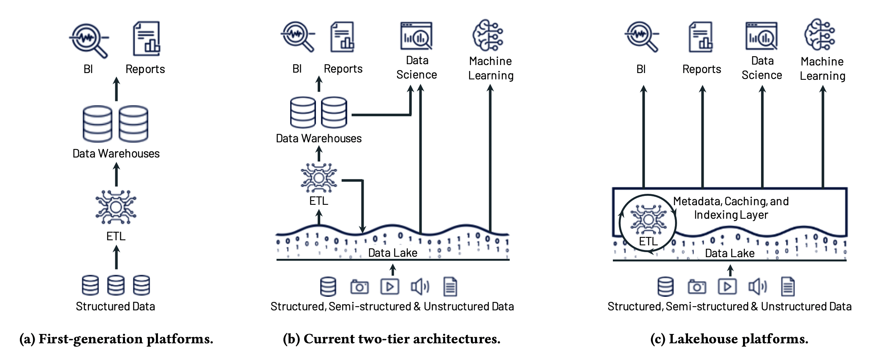
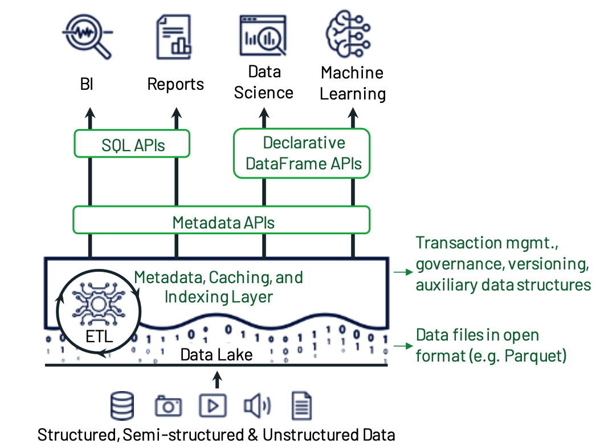
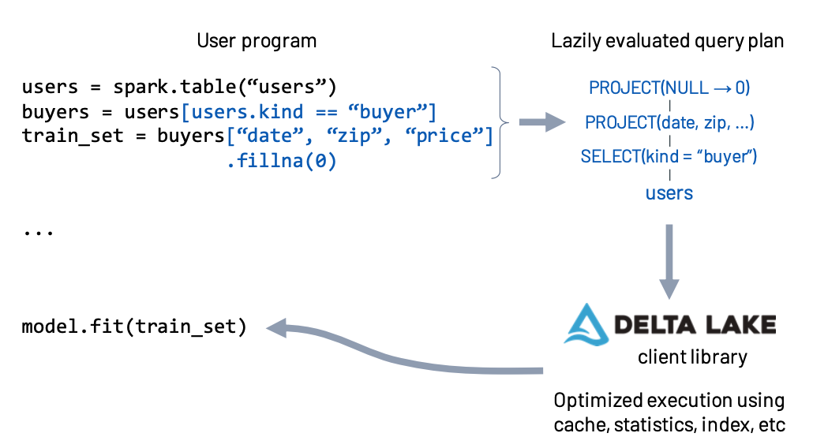
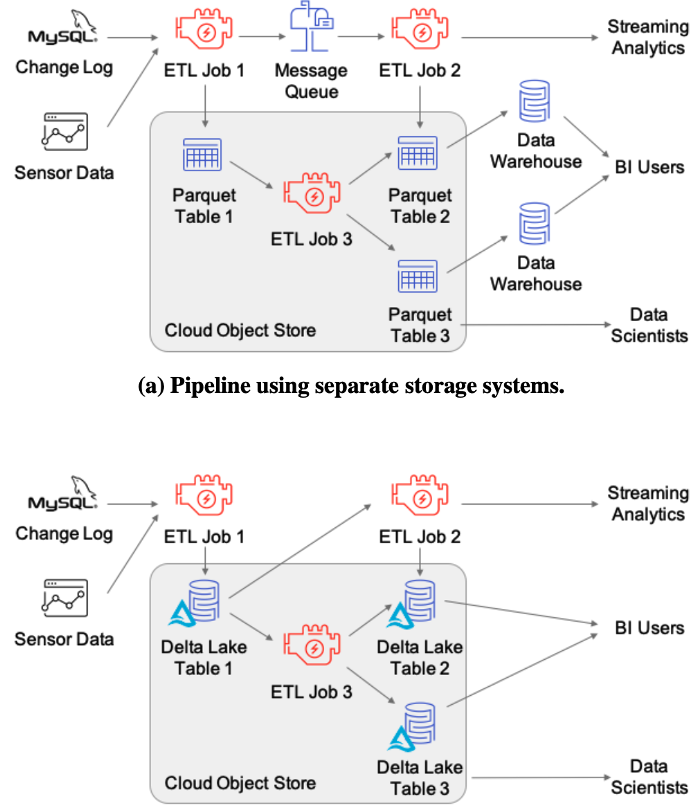
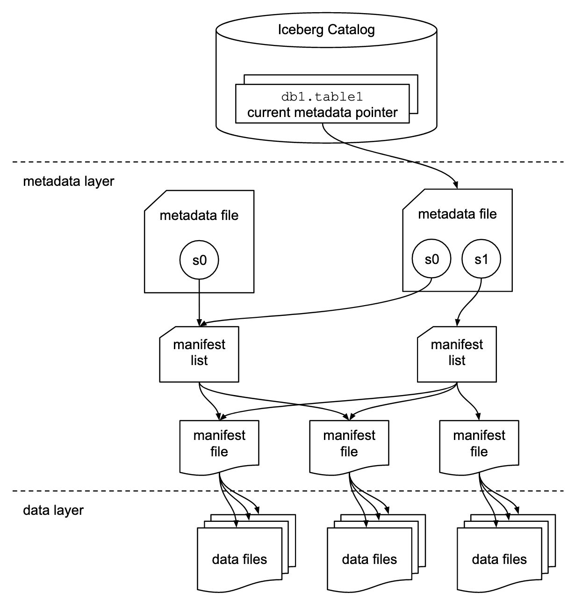

## Delta Lake

Delta Lake是Databricks推出的流批一体存储层，分为开源版和商业版，深度绑定自家Spark。

### Lakehouse论文

请先快速阅读Databricks的论文 [Lakehouse: A New Generation of Open Platforms that Unify Data Warehousing and Advanced Analytics](https://databricks.com/wp-content/uploads/2020/12/cidr_lakehouse.pdf)。

这篇论文主要讲了传统的数仓和数据湖模型的缺陷，在此基础上提出湖仓一体的LakeHouse模型，并阐述了LakeHouse的一些设计细节。下面挑一些要点来讲讲。

LakeHouse是Databricks提出的一种将在未来几年取代传统数仓结构的架构。传统数仓将业务数据库数据收集到集中式的数仓，在写入时针对下游BI消费对schema进行优化；然而传统数仓将计算与存储耦合，且对非结构化数据支持不佳。于是出现了数据湖，以开放格式（如Parquet、ORC）存储在低成本的存储系统（如S3），湖中的数据ETL到下游数仓，再提供给BI使用。但这样的两层结构带来了一下问题：

- **可靠性**：难以维持数据湖与下游数仓的数据一致性
- **数据不及时**：需要两次ETL才到BI，对于传统数仓而言，甚至是开历史倒车
- **对高级分析支持不佳**：机器学习Tensorflow、PyTorch等，需要通过非SQL处理大量数据，无法通过JDBC/ODBC高效运行
- **总成本高**

于是噔噔瞪瞪，LakeHouse出来了：基于开放文件格式（如ORC/Parquet）的低成本存储，同时提供数仓的管理功能、传统DBMS的管理特性（如ACID事务、版本控制、审计、索引、缓存等）、及for高级分析（如机器学习）的高速I/O，的高性能系统。同时在设计上适应可存储计算隔离的云计算环境。LakeHouse解决了以下关键问题：

- **可靠的数据管理**：传统数据湖只是管理了一堆半结构化文件，在事务、回滚等方面的能力太差。
- **支持机器学习**：支持DataFrame API；而ML系统可以直接读取数据湖的格式，很多也支持DataFrame
- **SQL查询性能**：归功于过去对ORC/Parquet做SQL查询的性能优化经验

下面是这三代数仓/数据湖结构对比：

下面是LakeHouse架构和实现要点。

 **元数据层**：

LakeHouse设计理念是使用标准文件格式以低成本存储，在存储的顶层设计实现传统的元数据层，可提高抽象级别、实现ACID事务、版本控制等特性。DeltaLake _**以Parquet格式在数据湖本身的存储上存放事务日志**_ ，可以存储哪些对象属于表的信息：

- 实践证明这套设计在性能类似或更优于原始Parquet/ORC的同时，提供了事务等管理功能
- 元数据层同时可以保证数据质量，如强制schema（schema enforcement）可以保障新增数据必须匹配已有schema，并提供了API允许配置数据约束（如某列数据需要满足枚举要求）。
- 元数据层可实施ACL、日志审计等功能

**SQL性能优化**：

- 缓存：热数据缓存到更快的存储设备，如SSD、RAM
- 辅助数据：Lakehouse虽然使用了公开的文件格式（Parquet/ORC），但可以通过辅助数据帮助优化查询速度，如构建索引、维护统计信息。DeltaLake在上面提到的事务日志中维护列的最大最小值信息，方便查询时跳过；并实现了基于布龙过滤器的索引
- 数据布局优化：在Parquet格式不变的基础上，还是有优化空间，如记录排序，让数据聚拢便于读取。DeltaLake使用Z-order和Hilbert曲线对记录排序。

**针对高级分析的优化**：

通过声明式的DataFrame API加速高级分析。DataFrame API在DeltaLake的位置：

下图是Spark MLlib中执行声明式的DataFrame API。用户的DataFrame调用是lazy的，执行时Spark引擎获取执行计划，传给DeltaLake的库，后者读取元数据层，根据缓存、索引、统计信息等进行优化查询，最后执行。

### Delta Lake白皮书

请先快速阅读Databricks的论文 [Delta Lake: High-Performance ACID Table Storage over Cloud Object Stores](https://databricks.com/wp-content/uploads/2020/08/p975-armbrust.pdf) 。

**纯Parquet/ORC的缺陷**：

- 多对象更新不是原子的，所以查询之间没有隔离；回滚写操作也很困难：如果更新查询崩溃，则表处于损坏状态。
- 元数据操作的成本很高
- 大多数企业数据集是不断更新的，因此它们需要一个原子性的写入解决方案

Delta Lake应运而生，它是一个云对象存储上的ACID表存储层。核心思想：

- 用ACID方式在云对象中存储日志（write-ahead），以纪录哪些对象是Delta表的一部分
- 日志还包含元数据，例如每个数据文件的最小/最大统计信息，用于查询优化。
- 将所有元数据都存在底层对象存储中，并且使用针对对象存储的乐观并发协议实现事务，意味着不需要运行服务器来维护Delta表的状态

**特性**：

- Time travel
- UPSERT, DELETE and MERGE operations
- Efficient streamingI/O
- Caching
- Data layout optimization
- Schema evolution
- Audit logging

使用DeltaLake的例子：

**旧世界的桎梏**：

- 对象存储API：云对象存储的API太慢太麻烦云云
- 一致性保证：云对象存储为每个键提供了最终的一致性，并且没有跨键的一致性保证；对现有对象的更新可能不会立即对其他客户端可见
- 性能问题
- 目前有三种表存储方式：
  - 文件目录：将表存储为对象的集合，基于一个或多个属性将记录“分区”到目录中。比如Hive。主要问题是存在性能和一致性问题
  - 自定义存储引擎：在一个单独的、高度一致的服务中管理元数据本身。比如Snowflake。需要运行一个高可用性的服务来管理元数据，这可能很开销很大；而且表的所有I/O操作都需要联系元数据服务，这会增加其资源成本，降低性能和可用性；现有计算引擎的连接器需要更多的开发对接工作。
  - 噔噔瞪瞪，_**对象存储中的元数据**_ ：DeltaLake将事务日志和元数据直接存储在云对象存储中，并在对象存储操作上使用一组协议来实现序列化

后面是具体的存储格式和访问协议，篇幅太长，不展开了。后面再补吧。

### DeltaLake基本概念与使用

[官方文档](https://docs.delta.io/latest/delta-intro.html)

注意到上文所说的事务日志放在对象存储的同一位置，就是在表的目录下，有个 `_delta_log` 子目录，一个版本对应里面一个json，记录了事务操作，Time Travel显然也是基于此。

## Iceberg

### 设计理念

Meetup视频： [Data Science DC Nov 2021 Meetup: Apache Iceberg - An Architectural Look Under the Covers](https://www.youtube.com/watch?v=N4gAi_zpN88)，也可以看 [演讲稿](https://www.dremio.com/resources/guides/apache-iceberg-an-architectural-look-under-the-covers/)。

#### What is Iceberg

| ✅ Iceberg 是……                                        | ❌ Iceberg不是…… |
|-------------------------------------------------------|---------------|
| Table Format定义                                      | 存储引擎        |
| 遵循Iceberg Table Format定义与表进行交互的一套API及库 | 执行引擎        |
|                                                       | 一套服务        |

#### Table Format?

> A good way to define a table format is a way to organize a dataset’s files to present them as a single “table”. 
> Another somewhat simpler definition from a user’s perspective is a way to answer the question “what data is in this table?”. 
> A single answer to that question allows multiple people, groups, and tools to interact with data in the table at the same time, whether they’re writing to the table or reading from the table.

`Table Format` 是表的抽象，将数据集文件组合起来，以单个“表”的形式呈现，允许人和工具与表数据高效交互。

#### Table Format简史

**Hadoop刀耕火种**：直撸HDFS，用户必须清楚如何将问题转化为MR模型并用java编码，数据也没有schema，用户必须熟知他处理的文件的实际schema。

**Hive**：针对Hadoop第一个问题，用SQL替代之；针对Hadoop第二个问题，用metastore记录schema。Hive从此成为了事实上的Table Format标准。Hive的Table Format我们比较熟知，就不细述了，更多优点也不说了，看视频有。说下缺点：

- 修改数据太低效，尤其分区很大，修改里面的少量数据、或频繁更改
- 无法安全地更改多个分区的数据，Hive只保证单个分区的事务一致性
- 在实际操作中，多个作业同时修改一个数据集是不安全的
- 对于大型表，即便只是列出所有目录也要耗费很多时间
- 为了利用分区优化查询，用户必须知道物理的分区布局（比如按年、月、日分区）
- Hive表的统计信息往往是过时的，可能导致优化器选择效率低的计划
- 在云存储中性能不佳。Hive表一个分区中的所有数据都具有相同的目录前缀，利用不到云存储不同前缀的分流

**Iceberg**：Netflix发现，解决Hive Table Format问题的关键是放弃在文件夹级别跟踪表数据，改为在文件级别跟踪。修改之后，还能做到：

- 保证表视图的正确性和一致性
- 实现更快的查询计划和执行
- 用户无需了解数据的物理布局（如分区）
- 实现更好、更安全的表进化（table evolution，即表schema变更）

#### Iceberg Table Format定义

**Iceberg Table Format架构**：

分了三层：

1. `Iceberg catalog` ：记录各个表当前元数据指针的位置。`Iceberg catalog` 要求元数据指针的实现支持原子性的更新操作。实际的存储方式取决于具体使用的存储：
    1. HDFS：元数据文件夹中有一个名为 `version-hint.text` 的文件，其内容是当前元数据文件的版本号
    2. Hive metastore：metastore的表对象用表属性记录当前元数据文件的位置
    3. Nessie：Nessie保存了当前元数据文件的位置
2. `metadata layer`，具体又包括：
    1. `metadata file`：存储表的元信息，包括表的schema、分区信息、所有快照信息、及当前快照等等,json格式。查询过程：按 `current-snapshot-id` 在 `snapshots` 找到对应快照，读取其 `manifest-list` 属性，打开 `manifest lists`。
    2. `manifest list`：`manifest files` 的列表，每一行是构成该快照的一个 `manifest file` 的信息，包括 `manifest file` 位置、所属分区、分区列的最大最小值等。查询时可以在此阶段进行一些优化，例如使用行计数或使用分区信息过滤数据。
    3. `manifest file`：记录数据文件以及有关每个文件的其他详细信息和统计信息，可用于优化查询，而且这些信息是在写入操作期间更新的，比Hive记录的统计信息的更准确、更新。Iceberg 与文件格式无关，因此清单文件还指定了数据文件的文件格式，例如 Parquet、ORC 或 Avro
3. `data layer` ：实际存储的文件

日常表操作在Iceberg Table Format中的体现：

1. `CREATE TABLE xxx`：创建metadata file，里面有快照s0（但不指向任何manifest list），表的当前元数据指针指向该metadata file
2. `INSERT INTO xxx`：
    1. 创建数据文件（Parquet或其他格式）
    2. 创建manifest file，指向该数据文件
    3. 创建manifest list，指向该manifest file
    4. 创建新的metadata file，带有快照s1和s0，`current-snapshot-id` 是s1
    5. 表的当前元数据指针指向新的metadata file
3. `MERGE INTO xxx USING ... ON ... WHEN MATCHED THEN UPDATE ... WHEN NOT MATCHED THEN INSERT...`：upsert的操作，步骤比较多：
    1. 找出满足 `USING ... ON ...` 条件的数据，读取查询引擎，执行 `UPDATE` 子句的更新，写入新的数据文件（不满足条件的也写入了，也就是 `copy-on-write` 策略；此外还有`merge-on-read` 策略）
    2. 读取不满足 `ON` 条件的外部表数据，写入另一个数据文件
    3. 创建manifest file，指向新建的两个数据文件
    4. 创建manifest list，指向该manifest file
    5. 创建新的metadata file，带有快照s2、s1和s0，`current-snapshot-id` 是s2
    6. 表的当前元数据指针指向新的metadata file
4. `SELECT * FROM xxx`：
    1. 查询Iceberg catalog，获取表的当前云数据指针
    2. 读取当前元数据指针指向的metadata file，获取当前快照的manifest list地址
    3. 读取manifest list，获取manifest file地址
    4. 读取manifest file，获取所有数据文件的地址
    5. 读取所有数据文件、返回
5. **隐式分区查询** ：前面说到的，Hive的分区查询经常需要用户熟知分区物理布局，Iceberg对此进行了优化，实际操作是：a)读取 `metadata file`，获取要查询的snapshot的分区信息（有哪些字段，当前查询的是否包含在内），b)读取 `manifest file`，读取里面记录的所有数据文件的分区字段信息，与用户的查询条件做对比，找出要读取的数据文件，c)最后只读取这些数据文件
6. **Time Travel**：其实就是表级版本控制，语法是 `SELECT * FROM xxx AS OF '日期'`，实际操作是：打开当前 `metadata file`，在 `snapshots` 数组查找满足查询版本日期的snapshot，后面就是正常流程（`manifest list` -> `manifest file` -> 数据文件）。

注意 **Time Travel**，Iceberg保留了旧版本的数据，也提供了异步后台进程去清理这些旧snapshot（垃圾回收GC）。用户可以配置GC策略，这里就是存储空间的衡量了。

#### 小文件压缩（Compaction）

Compaction是后台的异步进程，负责将一组小文件合并压缩成少量大文件，可以平衡写入和读取性能的权衡：低延迟写入需要在获取数据后尽快写入，意味着生产更多小文件；而高吞吐量读取需要单个文件保存尽量多的文件。压缩操作的输入输出可以是不同的文件格式。

但Iceberg只是提供了File Format及其API和库，实际的Compaction操作由集成了Iceberg的其他工具/引擎负责调度、执行。

#### Iceberg Table Format优势

- 事务的快照隔离：乐观锁
- 更快的执行计划和执行速度：写入数据时更新统计信息、文件级跟踪统计信息
- 对物理布局做抽象，对用户暴露逻辑视图
- 所有引擎都能立即看到变化：写入时更新
- 事件监听器：允许在Iceberg表上发生事件时通知其他服务
- 有效地对数据集进行较小的更新：文件级别跟踪数据

### Iceberg基本使用

目前有 Spark、Flink、Pig、MR等集成

[官方文档](https://iceberg.apache.org/spark-quickstart/)

[从Hive迁移到Iceberg](https://www.dremio.com/subsurface/migrating-a-hive-table-to-an-iceberg-table-hands-on-tutorial/)

## Delta Lake vs Iceberg
