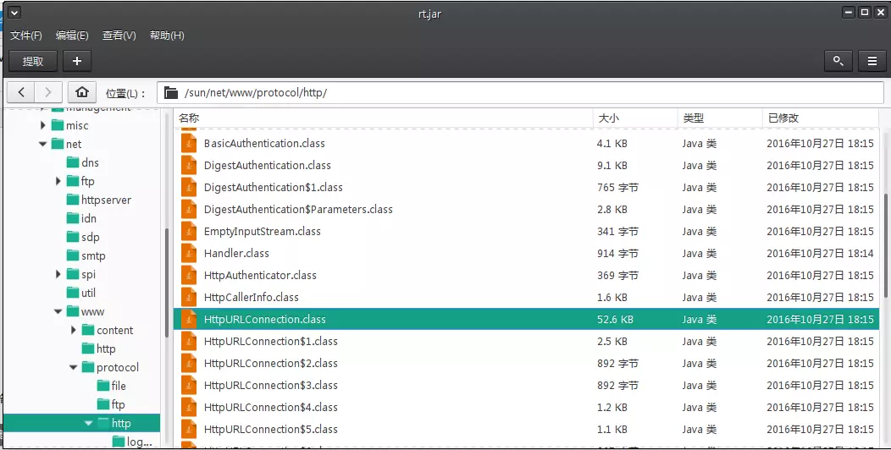

# 背景
最近给以前写的一个刷流量的爬虫/工具增加动态切换代理的功能。

这个工具基于Java开发，使用了HtmlUnit库模拟浏览器进行访问，并加载页面中所有的JS以触发第三方监控。其实可以抓第三方监控的请求，然后再直接模拟这些请求，但这样就缺乏通用性，即不同的网站需要单独针对抓请求分析，所以选择了直接模拟浏览器加载JS的方法。

而最近新需求要求增加使用代理模拟多地访问的功能，所以：
1. 先是写了个简单的Python爬虫爬各种免费代理的网站，一一验证可用性并放入数据库中备用；
2. 而后发现这样抓到的代理很少，一直维持50个左右可用的，而且经常返回403错误，不能满足刷流量工具的需求，所以购买了某收费代理；
3. 在使用收费代理的过程中，发现通过很多宣称高可靠的代理进行访问时依然返回403错误码，结果是大量代理不可用。

# 问题分析
首先，Python抓回来的代理是经过Python的Requests库检验的，确认可以通过其进行网页访问才放入数据库的；而购买的代理宣称高可靠的也是有自己的检测的，而且可以看到他们的检验时间跟我的使用时间一般只相差几分钟，应该不会有大量代理在这几分钟之内失效。

所以怀疑是HtmlUnit的问题。HtmlUnit库可以选择使用不同的浏览器类型/版本（根据官网文档，这些不同的浏览器的区别是JS的解析方法和User-Agent、HTTP请求头），我们首先尝试了所有HtmlUnit支持的浏览器类型/版本，发现还是有大量的代理在使用时返回403错误码。

再思考为什么会返回403，要么就是请求头有问题，要么我们的IP被封了。但我们的IP应该没干过什么坏事，不会轻易被列入黑名单吧，所以还是往请求头的方向去想，毕竟爬虫的话出问题也经常是因为请求头有问题，异于常规的访问。所以我们尝试了很多User-Agent，发现还是不行。

最后考虑到抓包分析。直接用WireShark进行抓包，筛选HTTP包，分别截取Python的Requests库和Java的HtmlUnit去使用同一个代理访问同一个网页的请求包，如下。
Python的Requests库使用代理访问产生的HTTP请求包：
```bash
Hypertext Transfer Protocol
    GET http://www.***.com/test/index.htm HTTP/1.1\r\n
        [Expert Info (Chat/Sequence): GET http://www.***.com/test/index.htm HTTP/1.1\r\n]
[GET http://www.***.com/test/index.htm HTTP/1.1\r\n]
[Severity level: Chat]
[Group: Sequence]
        Request Method: GET
        Request URI: http://www.***.com/test/index.htm
        Request Version: HTTP/1.1
    Host: www.***.com\r\n
    Connection: keep-alive\r\n
    Accept-Encoding: gzip, deflate\r\n
    Accept: */*\r\n
    User-Agent: python-requests/2.12.2\r\n
    \r\n
    [Full request URI: http://www.***.com/test/index.htm]
    [HTTP request 1/1]
```
而HtmlUnit产生的包：
```bash
Hypertext Transfer Protocol
    GET http://www.***.com/test/index.htm HTTP/1.1\r\n
        [Expert Info (Chat/Sequence): GET http://www.***.com/test/index.htm HTTP/1.1\r\n]
[GET http://www.***.com/test/index.htm HTTP/1.1\r\n]
[Severity level: Chat]
[Group: Sequence]
        Request Method: GET
        Request URI: http://www.***.com/test/index.htm
        Request Version: HTTP/1.1
    Host: www.***.com\r\n
    User-Agent: Mozilla/5.0 (Windows NT 10.0; WOW64) AppleWebKit/537.36 (KHTML, like Gecko) Chrome/54.0.2840.99 Safari/537.36\r\n
    Accept: */*\r\n
    Accept-Language: en-US\r\n
    Accept-Encoding: gzip, deflate\r\n
    Proxy-Connection: keep-alive\r\n
    \r\n
    [Full request URI: http://www.***.com/test/index.htm]
    [HTTP request 1/1]
```
可以看到，Requests使用的User-Agent是python-requests，竟然也没被拦截，而HtmlUnit使用真实浏览器的User-Agent却返回403，看来跟User-Agent无关；事实上，我们尝试将HtmlUnit的User-Agent设置为与Requests一样，再去访问，一样得到403。

然后仔细看HTTP请求头，不难发现，唯一的区别在于python-requests使用了一个Connection的字段，这个大家都比较熟悉，是要求远程服务器启用长连接的；而HtmlUnit没有Connection字段，取而代之的是Proxy-Connection字段，明显与代理有关。那么问题出在这个HTTP请求头字段上面？？？

# Proxy-Connection是什么
通过Google我们发现Proxy-Connection是为了兼容不同HTTP协议版本而产生的一个字段，可以参考这篇文章：  
[Http 请求头中的 Proxy-Connection](https://imququ.com/post/the-proxy-connection-header-in-http-request.html)  
大概意思就是如果使用代理服务的时候，还是发送Connection字段，那么一些旧的代理服务器不能处理这个字段而直接转发给目标服务器，最后目标服务器可能同意开启长连接，而代理服务器却没有正确地响应建立长连接，最后导致不能正常访问；所以才在使用代理的时候，使用Proxy-Connection替代Connection，让远程服务器区分对待。

总而言之，使用代理服务器的时候，请求头使用Proxy-Connection字段是符合HTTP协议的。也就是说其实HtmlUnit的处理是正确的，而Requests的处理反而是不符合HTTP协议的？

# HtmlUnit中去除Proxy-Connection字段
不管谁对谁错，就目前状况而言，似乎使用了Proxy-Connection就是会让代理服务器返回403，或许是因为这些代理服务器不希望开启长连接？（毕竟很多代理服务器隔一小段时间就要切换端口之类的，比较被人长时间占用），所以我们的目标变成使用HtmlUnit发送请求的时候去除HTTP请求头的Proxy-Connection字段。

## removeRequestHeader()
HtmlUnit的核心类WebClient有方法
```java
removeRequestHeader(String name)
```
可以删除请求头的字段。不过经过尝试，调用了
```java
removeRequestHeader("Proxy-Connection")
```
之后，发出的请求还是带有Proxy-Connection字段。

## WebRequest.removeAdditionalHeader()
于是尝试别的方法，在访问页面的时候再删除请求头：
```java
WebRequest request = new WebRequest(new URL("**********"));
request.removeAdditionalHeader("Proxy-Connection");
request.setAdditionalHeader("Connection", "Keep-Alive");
HtmlPage page1 = webClient.getPage(request);
```
依然不行。

## 查看源码
查看了HtmlUnit源码（在此不贴出来了），发现我们调用其方法处理Header，所处理的只不过是一个额外的Map，不管增加和删除都是在这个Map里面处理的，最后的Header是这个额外的Map和预定义的一些Header结合在一起。但是在源码中也没有发现Proxy-Connection字段的处理（如判断当前使用代理，则用Proxy-Connection字段取代Connection字段等逻辑）。

仔细观察，其实HtmlUnit底层是调用了JDK的**sun.net.www.protocol.http.HttpURLConnection** 进行访问的，我们再看HttpURLConnection的源码，发现有两处：
```java
private void writeRequests() throws IOException {
    …………
    if(this.http.usingProxy && this.tunnelState() != HttpURLConnection.TunnelState.TUNNELING) {
        this.requests.setIfNotSet("Proxy-Connection", "keep-alive");
    } else {
        this.requests.setIfNotSet("Connection", "keep-alive");
    }
    …………
}
```
```java
private void sendCONNECTRequest() throws IOException {
    …………
    if(this.http.getHttpKeepAliveSet()) {
        this.requests.setIfNotSet("Proxy-Connection", "keep-alive");
    }
    …………
}
```
原来是在这里面处理的！！！！

## 编译rt.jar
**sun.net.www.protocol.http.HttpURLConnection** 是在JRE的rt.jar中的核心类，不能随便修改。
所以我们提取出HttpURLConnection，反编译，注释掉Proxy-Connection相关语句，重新编译，替换rt.jar中的响应class文件：  
  
重新测试，发现发出的请求还是带有Proxy-Connection字段！！！！

# Python验证
从另一个角度来验证：对于HtmlUnit使用会返回403的代理，在Python的Requests中使用，并在HTTP请求头加上Proxy-Connection字段。Python代码比较简单，执行时输入需要验证的IP和端口就行：
```python
#coding:utf-8                                                                                                                     
import requests
import json
import sys
ip = sys.argv[1]
port = sys.argv[2]
header ={'Proxy-Connection':'Keep-Alive'}
proxies={
    'http':'http://%s:%s'%(ip,port),
    'https':'http://%s:%s'%(ip,port)
}
r = requests.get('http://www.***.com/test/index.htm',proxies=proxies,headers=header)
r.encoding='utf-8'
print r.text
~                                   
```
果然，控制台输出“Access not allowed!”。将“headers=header”去掉之后就能正常输出页面内容。  
因此可以确认是Proxy-Connection字段导致的问题。

# 目前结论
1. 对于某些代理服务器，使用时请求头不能有Proxy-Connection字段；
2. 在家里跑这个工具，却基本没有返回403错误…………看来还有可能是办公室IP被列入黑名单了……
3. 对于Java开发，要选择不适用sun的HttpUrlConnection的html测试工具/模拟浏览器了；看了Selenium的源码，没有用这个类，准备试下。

