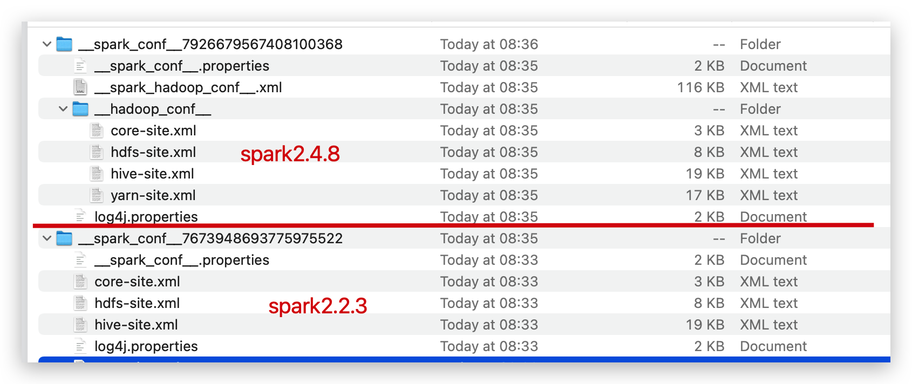
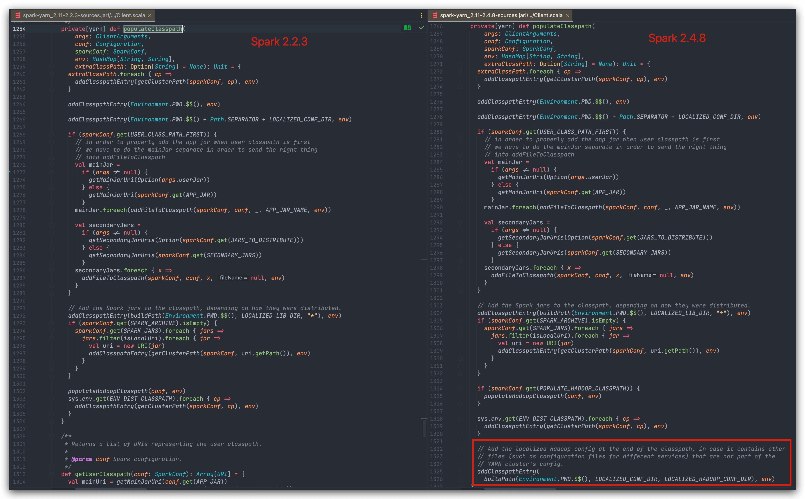

# 背景

去年写过一篇 [跨Yarn集群提交spark任务](/2021/12/04/跨Yarn集群提交spark任务/) ，是在Spark2.2基础上做的动态提交外部Yarn集群。这里“动态”指不事先将 `*-site.xml` 打入jar包，而是执行任务时根据配置按需提交到对应集群；而“外部”集群是相对jar包中（如果已有）的 `*-site.xml` 对应的集群以外的集群，也是在“动态”提交的context中定义的，可以理解为提交到任意网络互通的集群。

简单回顾下，主要做了两件事情：

1. 创建SparkContext前，将外部集群的 `*-site.xml` 放入classpath，如 `$PWD` 。
2. 创建SparkContext前，`HADOOP_CONF_DIR` 和 `YARN_CONF_DIR` 环境变量改为外部集群 `*-site.xml` 配置文件所在位置；由于启动java程序后不能直接修改环境变量，在实现上使用了黑魔法。

时隔半年终于重拾博客，显然又被坑了，没错，之前的方法在Spark2.4里行不通了。

# 问题、原因分析、及解决方案

## Spark2.4中的报错

在原来代码基础上，升级Spark为2.4.8，执行提交到外部集群的任务，提交到Yarn的AM报错如下：

```log
Container id: container_e36_1650338235135_41710_02_000001
Exit code: 1
Container exited with a non-zero exit code 1. Error file: prelaunch.err.
Last 4096 bytes of prelaunch.err :
Last 4096 bytes of stderr :
Exception in thread "main" java.lang.IllegalArgumentException: java.net.UnknownHostException: channel
	at org.apache.hadoop.security.SecurityUtil.buildTokenService(SecurityUtil.java:374)
	at org.apache.hadoop.hdfs.NameNodeProxies.createNonHAProxy(NameNodeProxies.java:312)
	at org.apache.hadoop.hdfs.NameNodeProxies.createProxy(NameNodeProxies.java:178)
	at org.apache.hadoop.hdfs.DFSClient.<init>(DFSClient.java:665)
	at org.apache.hadoop.hdfs.DFSClient.<init>(DFSClient.java:601)
	at org.apache.hadoop.hdfs.DistributedFileSystem.initialize(DistributedFileSystem.java:148)
	at org.apache.hadoop.fs.FileSystem.createFileSystem(FileSystem.java:2619)
	at org.apache.hadoop.fs.FileSystem.access$200(FileSystem.java:91)
	at org.apache.hadoop.fs.FileSystem$Cache.getInternal(FileSystem.java:2653)
	at org.apache.hadoop.fs.FileSystem$Cache.get(FileSystem.java:2635)
	at org.apache.hadoop.fs.FileSystem.get(FileSystem.java:370)
	at org.apache.spark.deploy.yarn.ApplicationMaster$$anonfun$8$$anonfun$apply$3.apply(ApplicationMaster.scala:219)
	at org.apache.spark.deploy.yarn.ApplicationMaster$$anonfun$8$$anonfun$apply$3.apply(ApplicationMaster.scala:217)
	at scala.Option.foreach(Option.scala:257)
	at org.apache.spark.deploy.yarn.ApplicationMaster$$anonfun$8.apply(ApplicationMaster.scala:217)
	at org.apache.spark.deploy.yarn.ApplicationMaster$$anonfun$8.apply(ApplicationMaster.scala:182)
	at org.apache.spark.deploy.yarn.ApplicationMaster$$anon$3.run(ApplicationMaster.scala:780)
	at java.security.AccessController.doPrivileged(Native Method)
	at javax.security.auth.Subject.doAs(Subject.java:422)
	at org.apache.hadoop.security.UserGroupInformation.doAs(UserGroupInformation.java:1628)
	at org.apache.spark.deploy.yarn.ApplicationMaster.doAsUser(ApplicationMaster.scala:779)
	at org.apache.spark.deploy.yarn.ApplicationMaster.<init>(ApplicationMaster.scala:182)
	at org.apache.spark.deploy.yarn.ApplicationMaster$.main(ApplicationMaster.scala:803)
	at org.apache.spark.deploy.yarn.ExecutorLauncher$.main(ApplicationMaster.scala:834)
	at org.apache.spark.deploy.yarn.ExecutorLauncher.main(ApplicationMaster.scala)
Caused by: java.net.UnknownHostException: xxx
	... 25 more
```

其中 `xxx` 是外部集群的集群名（`dfs.nameservices` 配置）。

## 直接原因分析
仔细观察异常的调用栈，调用到了 `NameNodeProxies.createNonHAProxy` ，而我们的集群是HA的，显然是读取到的配置不对了。

看到这个类，阅读过hadoop源码的应该都知道，这是创建 `DFSClient` 的时候，会先读取 `dfs.client.failover.proxy.provider.{hdfs路径对应host}` 配置（取值是一个 `FailoverProxyProvider` 具体实现的全限定类名），反射出Class对象并实例化，然后创建对应的HAProxy；而如果配置为空，则认为NameNode没有开启HA，直接将hdfs路径当作普通host来进行读取，如果实际上这个host是一个HA的nameservices名，不存在这个host，则会报上面的错误。

所以可以确定，是AM读取不到正确的hdfs配置导致的。那么是为什么呢？

仔细观察AM的日志，`launch_container.sh` 里面：

```bash
#………………
export HADOOP_YARN_HOME=${HADOOP_YARN_HOME:-"/usr/hdp/2.6.5.0-292/hadoop-yarn"}
export CLASSPATH="$PWD:$PWD/__spark_conf__:$PWD/__spark_libs__/*:$HADOOP_CONF_DIR:$HADOOP_CONF_DIR:$PWD/__spark_conf__/__hadoop_conf__"
export SPARK_CONF_DIR="/opt/package/spark-2.4.8-bin-hadoop2.6/conf"
#………………
```

同时注意到 directory.info 记录的目录结构：

```bash
ls -l:
total 32
-rw-r--r-- 1 yarn hadoop   71 May 12 21:18 container_tokens
-rwx------ 1 yarn hadoop  712 May 12 21:18 default_container_executor_session.sh
-rwx------ 1 yarn hadoop  766 May 12 21:18 default_container_executor.sh
-rwx------ 1 yarn hadoop 5787 May 12 21:18 launch_container.sh
lrwxrwxrwx 1 yarn hadoop   80 May 12 21:18 __spark_conf__ -> /path/to/filecache/29549/__spark_conf__.zip
drwxr-xr-x 2 yarn hadoop 4096 May 12 21:18 __spark_libs__
drwx--x--- 2 yarn hadoop 4096 May 12 21:18 tmp
find -L . -maxdepth 5 -ls:
204734730    4 drwx--x---   4 yarn     hadoop       4096 May 12 21:18 .
204734738    4 -rwx------   1 yarn     hadoop        766 May 12 21:18 ./default_container_executor.sh
204734734    8 -rwx------   1 yarn     hadoop       5787 May 12 21:18 ./launch_container.sh
204734733    4 -rw-r--r--   1 yarn     hadoop         12 May 12 21:18 ./.container_tokens.crc
204734741    4 drwxr-xr-x   2 yarn     hadoop       4096 May 12 21:18 ./__spark_libs__
105382561 555832 -r-xr-xr-x   1 yarn     hadoop   569170427 May 12 21:18 ./__spark_libs__/mySparkApp.jar
204734731    4 drwx--x---   2 yarn     hadoop       4096 May 12 21:18 ./tmp
204734735    4 -rw-r--r--   1 yarn     hadoop         56 May 12 21:18 ./.launch_container.sh.crc
204734739    4 -rw-r--r--   1 yarn     hadoop         16 May 12 21:18 ./.default_container_executor.sh.crc
204734732    4 -rw-r--r--   1 yarn     hadoop         71 May 12 21:18 ./container_tokens
204734736    4 -rwx------   1 yarn     hadoop        712 May 12 21:18 ./default_container_executor_session.sh
204734737    4 -rw-r--r--   1 yarn     hadoop         16 May 12 21:18 ./.default_container_executor_session.sh.crc
105120101    4 drwx------   3 yarn     hadoop       4096 May 12 21:18 ./__spark_conf__
105120108    4 -r-x------   1 yarn     hadoop       3063 May 12 21:18 ./__spark_conf__/__spark_conf__.properties
105120107  120 -r-x------   1 yarn     hadoop     120306 May 12 21:18 ./__spark_conf__/__spark_hadoop_conf__.xml
105120102    4 drwx------   2 yarn     hadoop       4096 May 12 21:18 ./__spark_conf__/__hadoop_conf__
105120103   20 -r-x------   1 yarn     hadoop      19814 May 12 21:18 ./__spark_conf__/__hadoop_conf__/yarn-site.xml
105120104    8 -r-x------   1 yarn     hadoop       4282 May 12 21:18 ./__spark_conf__/__hadoop_conf__/core-site.xml
105120106   20 -r-x------   1 yarn     hadoop      19567 May 12 21:18 ./__spark_conf__/__hadoop_conf__/hive-site.xml
105120105   12 -r-x------   1 yarn     hadoop       8312 May 12 21:18 ./__spark_conf__/__hadoop_conf__/hdfs-site.xml
broken symlinks(find -L . -maxdepth 5 -type l -ls):
```

`./__spark_conf__/__hadoop_conf__/` 里面是外部集群配置文件，而 `./__spark_libs__/mySparkApp.jar` 是spark应用的jar，里面已经有原集群的配置文件。按 `CLASSPATH` 定义的顺序，`Configuration` 读取默认资源 `core-site.xml` 、 `hdfs-site.xml` （由`HdfsConfiguration`静态代码块加入）的时候，优先从 `./__spark_libs__/mySparkApp.jar` 读取了，而真正要用的外部集群配置，由于在 `CLASSPATH` 中位置较后，不会被加载到。

## 解决方案

知道问题的原因后，根据 `CLASSPATH` 定义的顺序：

- `$PWD` 里面的文件无法控制，跳过
- `$PWD/__spark_conf__` 目录里面是Driver的SparkConf内容 `__spark_conf__.properties` ，及所有hadoop相关配置整合到一起的的 `__spark_hadoop_conf__.xml` ，也是无法控制的。注意这个 `__spark_hadoop_conf__.xml` 里面虽然已经由Driver打入了外部集群的配置，但由于文件名不是 `hdfs-site.xml` ，不会被 `Configuration` 加载的。
- `$PWD/__spark_libs__/*` 这里面就是我们的jar包，目前里面有原集群的配置文件，这其实也违反了 [12-Factor 的 Config](https://12factor.net/config) 。
- 中间两个忽略
- `$PWD/__spark_conf__/__hadoop_conf__` 就是外部集群配置文件所在

那么解决方案也很简单了：

```log
spark应用jar包里不要放任何 `*-site.xml` 配置文件
```

考虑到我们的Spark应用是用maven的shade插件打包的，可以配置为跳过这些xml即可：

```xml
<plugin>
    <groupId>org.apache.maven.plugins</groupId>
    <artifactId>maven-shade-plugin</artifactId>
    <executions>
        <execution>
            <phase>package</phase>
            <goals>
                <goal>shade</goal>
            </goals>
            <configuration>
                <filters>
                    <filter>
                        <artifact>*:*</artifact>
                        <excludes>
                            <exclude>yarn-site.xml</exclude>
                            <exclude>hdfs-site.xml</exclude>
                            <exclude>core-site.xml</exclude>
                            <exclude>hbase-site.xml</exclude>
                            <exclude>hive-site.xml</exclude>
                            <exclude>kms-site.xml</exclude>
                            <exclude>mapred-site.xml</exclude>
                        </excludes>
                    </filter>
                </filters>
            </configuration>
        </execution>
    </executions>
</plugin>
```

重新打包、运行任务，顺利执行。

# Spark2.2 与 Spark2.4 Yarn-Client 模式提交任务差异

## AM的classpath、目录结构差异

问题解决了，那么为什么Spark2.2升级Spark2.4之后就有这样的问题呢？从上面的分析，不难猜测到是AM的 `CLASSPATH` 变了。随便找一个Spark2.2提交的任务也可以看到：

```bash
### launch_container.sh
export CLASSPATH="$PWD:$PWD/__spark_conf__:$PWD/__spark_libs__/*:$HADOOP_CONF_DIR:$HADOOP_CONF_DIR"
# 对比 Spark2.4的：
#export CLASSPATH="$PWD:$PWD/__spark_conf__:$PWD/__spark_libs__/*:$HADOOP_CONF_DIR:$HADOOP_CONF_DIR:$PWD/__spark_conf__/__hadoop_conf__"

### directory.info
find -L . -maxdepth 5 -ls:
6554176    4 drwx--x---   4 yarn     hadoop       4096 May 13 11:31 .
6554177    4 -rw-r--r--   1 yarn     hadoop         69 May 13 11:31 ./container_tokens
6554182    4 -rw-r--r--   1 yarn     hadoop         16 May 13 11:31 ./.default_container_executor_session.sh.crc
6816116    4 drwxr-xr-x   2 yarn     hadoop       4096 May 13 11:31 ./__spark_libs__
32768042 559764 -r-xr-xr-x   1 yarn     hadoop   573191196 May 13 10:44 ./__spark_libs__/titanServEtl.jar
6554180    4 -rw-r--r--   1 yarn     hadoop         52 May 13 11:31 ./.launch_container.sh.crc
31457924    4 drwx------   2 yarn     hadoop       4096 May 13 11:31 ./__spark_conf__
31457928   20 -r-x------   1 yarn     hadoop      19371 May 13 11:31 ./__spark_conf__/hive-site.xml
31457926    4 -r-x------   1 yarn     hadoop       3064 May 13 11:31 ./__spark_conf__/core-site.xml
31457925   20 -r-x------   1 yarn     hadoop      17378 May 13 11:31 ./__spark_conf__/yarn-site.xml
31457929    4 -r-x------   1 yarn     hadoop       2473 May 13 11:31 ./__spark_conf__/__spark_conf__.properties
31457927    8 -r-x------   1 yarn     hadoop       8009 May 13 11:31 ./__spark_conf__/hdfs-site.xml
```

可以看到，Spark2.4对比Spark2.2:

- AM 执行任务的目录：
    - 将 `*-site.xml` 配置文件独立放入了 `./__spark_conf__/__hadoop_conf__` 目录，而非原来的 `./__spark_conf__/` 目录
    - 多了一个 `./__spark_conf__/__spark_hadoop_conf__.xml` 文件，存放了所有hadoop相关配置
- CLASSPATH 环境变量里将存放 `*-site.xml` 配置文件的 `$PWD/__spark_conf__/__hadoop_conf__` 目录放到了最后面。

以上两个原因共同导致了本文的错误发生。

附目录对比截图：  



## Spark源码里的体现

上篇博客里提到Spark的yarn-client模式是通过 `YarnClientSchedulerBackend` 处理的。  
其 `start()` 方法会调用 `org.apache.spark.deploy.yarn.Client` 的 `submitApplication()` 方法提交Yarn AM。  
`submitApplication()` 调用 `createContainerLaunchContext` 构造ContainerLaunchContext对应的上下文，构建的启动Yarn AM的任务命令cmds，里面比较重要的有两步:

1. 调用 `setupLaunchEnv()` 构造环境变量，其中我们关心的 `CLASSPATH` 是在 `populateClasspath()` 方法里处理的；
2. 调用 `prepareLocalResources()` 准备Yarn AM需要的一些资源，包括调用 `createConfArchive()` 创建 `__spark_conf__.zip` ，里面解压出来就是上面所讨论的AM 目录结构里面的 `./__spark_conf__/` 目录

### populateClasspath()

对比两个版本的 `populateClasspath()` 方法，注意差异在最后：  



参考注释：

```java
// Add the localized Hadoop config at the end of the classpath, in case it contains other
// files (such as configuration files for different services) that are not part of the
// YARN cluster's config.
```

是为了防止将其他非Yarn集群配置的文件也引入了。

### createConfArchive()

这个代码略多，挑一些重点的讲讲，以Spark2.4为基准。

[SPARK-23630](https://issues.apache.org/jira/browse/SPARK-23630) 增加了一个用于测试的环境变量 `SPARK_TEST_HADOOP_CONF_DIR` ，该环境变量指定的目录里面的配置文件也会被打进去 `__spark_conf__.zip` 。

```scala
// SPARK-23630: during testing, Spark scripts filter out hadoop conf dirs so that user's
// environments do not interfere with tests. This allows a special env variable during
// tests so that custom conf dirs can be used by unit tests.
val confDirs = Seq("HADOOP_CONF_DIR", "YARN_CONF_DIR") ++
    (if (Utils.isTesting) Seq("SPARK_TEST_HADOOP_CONF_DIR") else Nil)
```

hadoop配置文件独立出来，放在 `__hadoop_conf__` 目录。

```scala
// Save the Hadoop config files under a separate directory in the archive. This directory
// is appended to the classpath so that the cluster-provided configuration takes precedence.
confStream.putNextEntry(new ZipEntry(s"$LOCALIZED_HADOOP_CONF_DIR/"))
confStream.closeEntry()
hadoopConfFiles.foreach { case (name, file) =>
    if (file.canRead()) {
        confStream.putNextEntry(new ZipEntry(s"$LOCALIZED_HADOOP_CONF_DIR/$name"))
        Files.copy(file, confStream)
        confStream.closeEntry()
    }
}
```

增加了一个 `__spark_hadoop_conf__.xml` 存放所有hadoop配置。

```scala
//Client 里面的代码
private val hadoopConf = new YarnConfiguration(SparkHadoopUtil.newConfiguration(sparkConf))

//createConfArchive() 里面的代码
// Save the YARN configuration into a separate file that will be overlayed on top of the
// cluster's Hadoop conf.
confStream.putNextEntry(new ZipEntry(SparkHadoopUtil.SPARK_HADOOP_CONF_FILE))
hadoopConf.writeXml(confStream)
confStream.closeEntry()
```